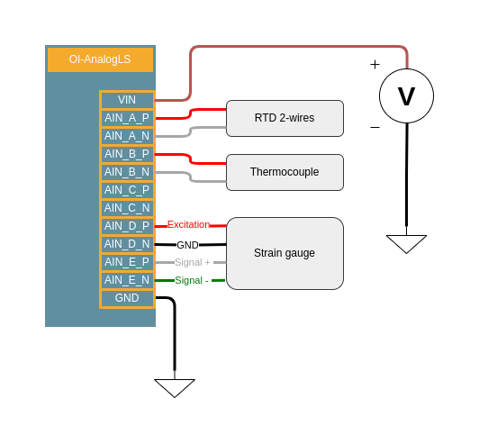

.. _ainls_s:

Analog Inputs Low Signal
========================

Description
-----------

This feature is present on all several modules:

* :ref:`OI-AnalogLS` (x10)

The Analog Input Low Signal (AINLS) functionality provides high-precision signal acquisition for various sensor types including thermocouples, 
RTDs (Resistance Temperature Detectors), and strain gauges. 
It delivers exceptional resolution for low-level signal detection and processing.

Key features:

* 16-bit resolution, corresponding to 76 μV (with gain = 1) or as low as 0.6 μV (with gain = 128)
* 10 analog inputs configurable as 5 differential analog input pairs
* Integrated current generator for exciting passive sensors like 2-wire or 3-wire RTDs
* Programmable Gain with settings from 1 to 128

For sensors like RTDs, a constant current source is necessary. To limit acquisition errors, the excitation current flows through a precision resistor, 
and the voltage across this resistor serves as the reference voltage for the digitization stage (ratiometric measurement).

When measuring differential pairs, the maximum voltage range is ±2.5V. Using the integrated programmable gain (with gains from 1 to 128), 
the maximum voltage range can be reduced to ±20mV. Using gain amplification for very low voltage signals increases precision while maintaining resolution.

Voltage Requirements:

* When gain is disabled: Each analog input must be between -50mV and 5.05V relative to ground
* When gain is 1 to 16: Input voltage range must be from (150mV + Vdiff,max * (Gain-1) / 2) to (4.85V – Vdiff,max * (Gain-1) / 2)
* When gain is 32 to 128: Input voltage range must be from (150mV + 15.5 * Vdiff,max) to (4.85V – 15.5 * Vdiff,max)

The Analog Input Low Signal functionality integrates a matrix that establishes connections in the excitation multiplexers and sensor terminal block. 
These connections are physically implemented on the board and cannot be controlled through software.

The matrix is optimized to allow simultaneous reading of:

* 5 thermocouples, or
* 5 RTDs with 2 wires, or
* 3 RTDs with 3 wires, or
* 4 strain gauges excited by voltage, or
* 2 strain gauges excited by current

Reading different types of sensors simultaneously is possible if the sensor assignment on the terminal block is compatible with the existing matrix.

Connection example:
~~~~~~~~~~~~~~~~~~~

|

Characteristics
---------------

.. list-table:: Analog inputs LS specifications
   :widths: 33 33 33
   :header-rows: 1
   :align: center

   * - Characteristic
     - Value
     - Remark
   * - Resolution
     - 16-bit
     -
   * - Input voltage range
     - ±2.5V (differential)
     -
   * - Gain range
     - 1 to 128
     -
   * - Sampling rate
     - Up to 4kSPS
     -
   * - Supported sensors
     - Thermocouples, RTDs (2-wire and 3-wire), Strain gauges
     -
   * - Number of channels
     - 5 differential channels
     -

Code examples
-------------

Example: Reading RTD, Thermocouple and Strain Gauge Simultaneously
~~~~~~~~~~~~~~~~~~~~~~~~~~~~~~~~~~~~~~~~~~~~~~~~~~~~~~~~~~~~~~~~~~

.. literalinclude:: ../../examples/AINSensor.cpp
    :language: cpp

Example 1: Reading a PT1000 RTD sensor
~~~~~~~~~~~~~~~~~~~~~~~~~~~~~~~~~~~~~~

.. literalinclude:: ../../examples/RTD.cpp
    :language: cpp

Example 2: Reading a Type K Thermocouple
~~~~~~~~~~~~~~~~~~~~~~~~~~~~~~~~~~~~~~~~

.. literalinclude:: ../../examples/Thermocouple.cpp
    :language: cpp

Example 3: Reading a Strain Gauge
~~~~~~~~~~~~~~~~~~~~~~~~~~~~~~~~~

.. literalinclude:: ../../examples/StrainGauge.cpp
    :language: cpp

Software API
------------

AnalogInputsLS Class
~~~~~~~~~~~~~~~~~~~~

.. doxygenclass:: AnalogInputsLS
   :members:

RTD Class
~~~~~~~~~

.. doxygenclass:: RTD
   :members:

Raw Sensor Class
~~~~~~~~~~~~~~~~

.. doxygenclass:: RawSensor
  :members:

Thermocouple Class
~~~~~~~~~~~~~~~~~~

.. doxygenclass:: Thermocouple
   :members:

Strain gauge Class
~~~~~~~~~~~~~~~~~~

.. doxygenclass:: StrainGauge
   :members:

Available Sensor Types
~~~~~~~~~~~~~~~~~~~~~~

.. list-table:: Supported Sensor Types
   :widths: 30 70
   :header-rows: 1
   :align: center

   * - Sensor Type
     - Description
   * - RTD_PT100
     - Platinum RTD with 100Ω resistance at 0°C
   * - RTD_PT1000
     - Platinum RTD with 1000Ω resistance at 0°C
   * - THERMOCOUPLE_B
     - Type B thermocouple (250°C to 1820°C)
   * - THERMOCOUPLE_E
     - Type E thermocouple (-200°C to 1000°C)
   * - THERMOCOUPLE_J
     - Type J thermocouple (-210°C to 1200°C)
   * - THERMOCOUPLE_K
     - Type K thermocouple (-270°C to 1372°C)
   * - THERMOCOUPLE_N
     - Type N thermocouple (-200°C to 1200°C)
   * - THERMOCOUPLE_R
     - Type R thermocouple (-50°C to 1768°C)
   * - THERMOCOUPLE_S
     - Type S thermocouple (-50°C to 1768°C)
   * - THERMOCOUPLE_T
     - Type T thermocouple (-200°C to 400°C)
   * - STRAIN_GAUGE
     - Strain gauge sensor