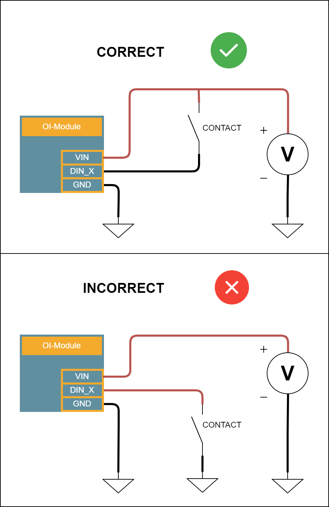

.. _din_s:

Digital Input
=============

Description
-----------

Digital inputs are standard input which are available on several modules:

* :ref:`OI-Core<OI-Core>`/:ref:`OI-CoreLite<OI-CoreLite>` (x4)
* :ref:`OI-Discrete` (x10)
* :ref:`OI-Mixed` (x4)
* :ref:`OI-Stepper` (x4)

**Main characteristics**

* The input level is compatible with 3.3V and 5V levels, as well as industrial levels (12V, 24V), up to 30V.
* The voltage level on all digital inputs is independent of the power supply. This means you can read the value of a 24V or a 3.3V sensor when the system is supplied with 12V.
* A Schmitt trigger comparator with a hysteresis of 1V is used on all inputs to improve immunity to input noise.
* An analog input filter with a response time of 45kHz is enabled on all entries to filter noise.
* If left floating, the input value will always be '0'.
* Inputs are compatible with both PNP sensors and push-pull sensors.

.. warning:: You cannot use NPN sensors with digital inputs.

|

Characteristics
---------------

.. list-table:: Digital inputs specifications
   :widths: 33 33 33
   :header-rows: 1
   :align: center

   * - Requirements
     - Value
     - Remark
   * - Minimum Voltage Input HIGH
     - 3V
     - above this value, a logic '1' is guaranteed
   * - Maximum Voltage Input LOW
     - 2V
     - below this value, a logic '0' is guaranteed
   * - Maximum voltage
     - 30V
     - 
   * - Impedance
     - 4.8kOhms
     - 
   * - Sampling frequency
     - 20kHz
     - See note 1 for OI-Core

.. note:: Note 1: On OI-Core and OI-CoreLite modules, the maximum input frequency is 1kHz.

Code examples
-------------

The example code above demonstrates how to read the value of an input on an :ref:`OI-Core<OI-Core>` module.

.. literalinclude:: ../../examples/DINReadCore.cpp
    :language: cpp

This one, shows you how to use interrupt on an :ref:`OI-Discrete` module.

.. literalinclude:: ../../examples/DINReadDiscreteInterrupt.cpp
    :language: cpp

Software API
------------

.. doxygenclass:: DigitalInputsInterface
   :members:

