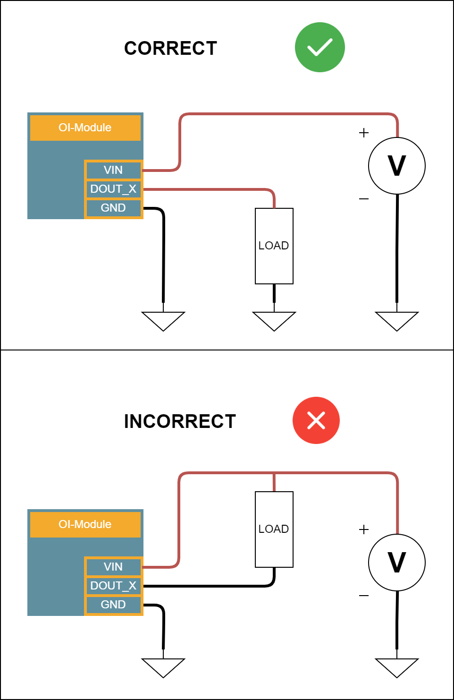

.. _dout_s:

Digital Output
==============

Description
-----------

Digital output are standard high-side switch which are available on several modules:

* :ref:`OI-Core<OI-Core>`/:ref:`OI-CoreLite<OI-CoreLite>` (x4)
* :ref:`OI-Discrete` (x8)
* :ref:`OI-Mixed` (x4)

**Main characteristics**

* High continuous current: capable of handling up to 4A continuously.
* High peak current: supports peaks of up to 8A.
* Voltage depends on the power voltage of the module: The output voltage aligns with the Vin pin voltage (with a drop of 0.4V to 0.4 caused by internal diode).
* Reverse Blocking: Safeguards against reverse current flow.
* Current Readback Functionality: Allows measurement of current on each output (refer to note 1 for :ref:`OI-Core<OI-Core>`/:ref:`OI-CoreLite<OI-CoreLite>`).
* No Floating State: Outputs maintain stability without being left in a floating state, ensuring proper operation.

.. note::
  Digital outputs are designed to source current to the load. You cannot sink current. Check the example below.

|

Characteristics
---------------

.. list-table:: Digital outputs specifications
   :widths: 33 33 33
   :header-rows: 1

   * - Requirements
     - Type
     - Value
   * - Voltage output high at 0.5A
     - Vcc - 0.4V
     - 
   * - Voltage output high at 5A
     - Vcc - 0.6V
     - 
   * - Maximum voltage
     - 30V
     - 
   * - Maximum current (for each output)
     - 4A
     - 
   * - Maximum current (total)
     - 8A
     - See note 1 for OI-Core
   * - Peak current (for each output)
     - 5A
     - for 1s maximum
   * - Maximum Switching frequency
     - 10kHz
     - 

.. note:: 
  Note 1: On :ref:`OI-Core<OI-Core>` and :ref:`OI-CoreLite<OI-CoreLite>` modules, the maximum current on all output is 6A.

.. note:: 
  On all modules, you can read the value of the current on each output as an analog value. 
  On :ref:`OI-Core<OI-Core>`/:ref:`OI-CoreLite<OI-CoreLite>`, you can only get an indication to know if the current is above 4A (getDigitalCurrent will return '1') or below 4A (getDigitalCurrent will return '0').

Code examples
-------------

The example code above demonstrates how to set the value of an output on an :ref:`OI-Core<OI-Core>` module.

.. literalinclude:: ../../examples/DOUTCore.cpp
    :language: cpp

The example code above demonstrates how to set the value of an output on an :ref:`OI-Discrete` module. 
It also shows how to read the current on an output.

.. literalinclude:: ../../examples/DOUTSensorDiscrete.cpp
    :language: cpp

If you want to get current on :ref:`OI-Core<OI-Core>`, you will get '0' is current is below 4A and '1' if current is above 4A.

.. literalinclude:: ../../examples/DOUTSensorCore.cpp
    :language: cpp

Software API
------------

.. doxygenclass:: DigitalOutputs
   :members: