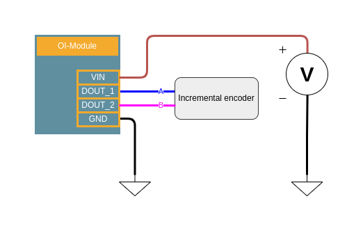

.. _encoder_s:

Incremental Encoder
===================

Description
-----------

On all modules equipped with at least two :ref:`Digital inputs (DIN)<din_s>`, it is possible to acquire signals from an incremental quadrature encoder using two channels, A and B.
A software API allows you to read the number of revolutions, speed, angle, and pulse count.

| Currently, reading the Z (index) signal is not supported by default. If needed, you can implement your own code to handle the Z signal alongside A and B.
| The A and B signals are often provided as differential lines; connecting only the positive terminal will work. 
| However, for improved robustness—especially with long cables, it is recommended to use a differential line receiver before connecting the signals to the module.

.. warning::
  Digital inputs include a low-pass analog filter with a cutoff frequency of 45 kHz. As a result, the maximum encoder frequency is limited. High-frequency or high-resolution encoders, or systems spinning very fast, may exceed this limit and not be read reliably.

|

Characteristics
---------------

.. list-table:: Encoder specifications
   :widths: 33 33 33
   :header-rows: 1
   :align: center

   * - Requirements
     - Value
     - Remark
   * - Voltage
     - 5 - 30V
     - 
   * - Maximum number of encoders
     - 2
     - 

Code examples
-------------

The example code below demonstrates how to use an encoder with the OI-Stepper module:

.. literalinclude:: ../../../components/openindus/examples/Encoder.cpp
    :language: cpp

Software API
------------

.. doxygenclass:: Encoder
    :members:
