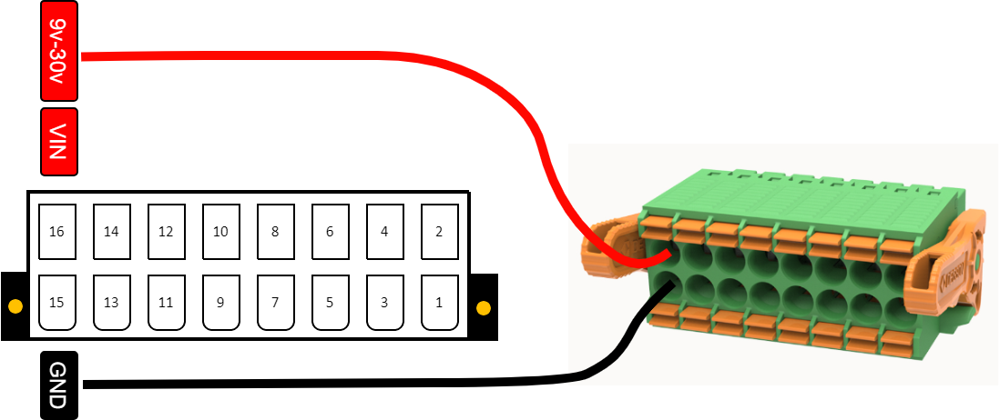

.. _power_s:

Power supply
============

All OpenIndus' module can be powered by the terminal block with a voltage between 9VDC and 30VDC.
Connect your power supply positive to pin 16 (VIN) and your ground to pin 15 as follow :

|

Maximum current on each pin of the header block is 8A. You must ensure that your system wiring is well dimensioned in accordance with the power you are using.

You can power a module through its USB port for uploading code and testing, but the outputs will not function.

A module can power other modules through the rail if they are plugged into the same physical rail; you do not need to power all modules individually. 

Additionally, you can power modules with different voltages.
For example, if you need to power one :ref:`OI-Discrete` with 12V and another one with 24V, you can do so. In this case, the voltage on the rail will be the higher one (24V). 
If you want a voltage on the rail of 12V, you can switch off the power to the 24V :ref:`OI-Discrete` with the command. This allows you to use a 12V system with one module powered by 24V.

.. note:: 
    This does not apply to :ref:`OI-RelayHP`, which utilizes a different terminal block for managing 230VAC. 
    For :ref:`OI-RelayHP`, you need to use other modules to power it through the rail.

.. note:: 
    Some modules, such as :ref:`OI-Discrete`, feature a secondary input for voltage (pins 13 and 14). 
    This is convenient for chaining modules together or for increasing input power (on :ref:`OI-Stepper`). However, keep in mind that you must not exceed 8A per pin.