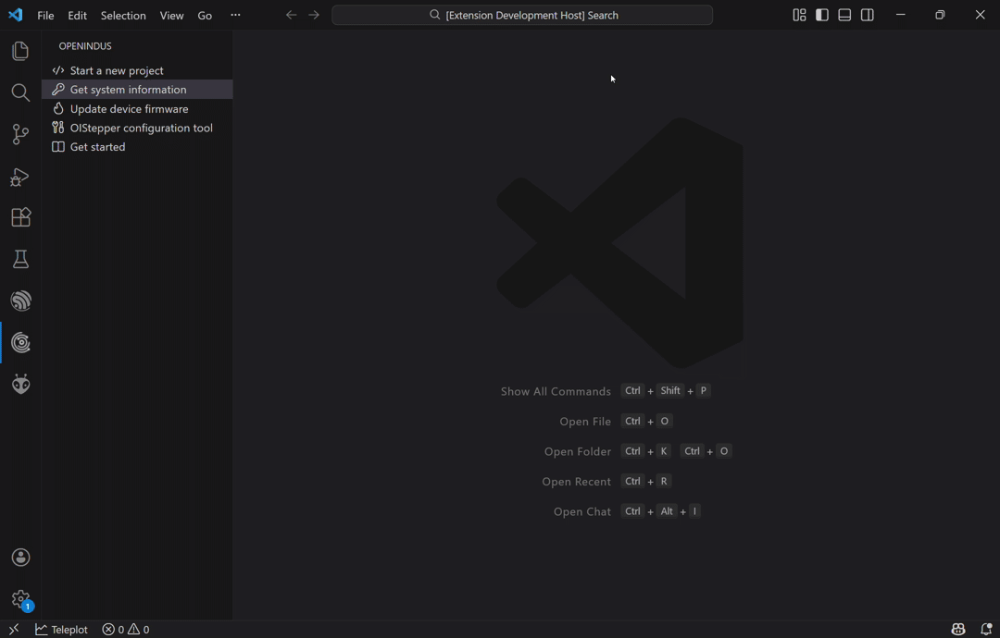
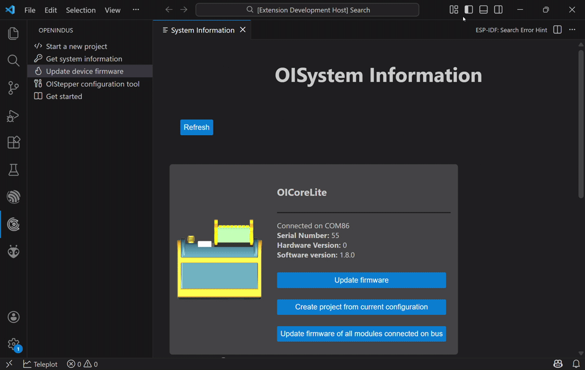

.. _firmware_update-index:

Firmware Update
===============

The OpenIndus VSCode extension is a tool used to update OpenIndus modules. 
It allows you to retrieve information from a system connected via USB and update the firmware of each module.

Getting System Information
--------------------------

The command `"Get system information"` provides details about the connected system:
    - The master module, including its serial number and firmware version
    - All slave modules connected to the master, with their respective information

    Example: OI-CoreLite master with OI-Stepper and OI-Discrete as slaves

.. tip::
    You can create a project directly from this view by initializing the modules currently connected to your system.

Updating Device Firmware
------------------------

Modules can be updated using the `"Update device firmware"` command. If the current code is already compatible, the module type will be detected automatically. 
You will need to select the firmware version. The version of slave modules must match the version used for the master code.

.. figure:: ../_static/gif/update_device_firmware.gif
    :width: 800
    :alt: Update device firmware
    :align: center

    Example: Updating an OI-Stepper

.. tip::
    When you receive your modules, we recommend updating their firmware to the latest version.

Updating All Slave Devices on the Bus
-------------------------------------

From the Get System Information view, you can launch a global update of the system. 
This command will update all modules connected to the master (without updating the master, which should contain the client code). 
After the update, you can verify that all module versions have been updated as expected.

    Example: Updating all slave modules on the bus