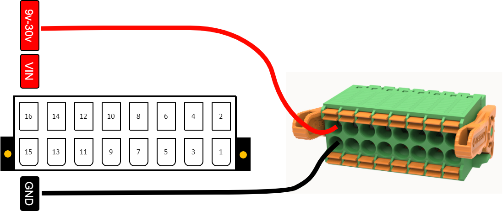

.. _hardware_setup-index:

Hardware Setup
==============

This guide will help you set up your OpenIndus module hardware, including system assembly, terminal block wiring, and power supply configuration.

System Assembly
---------------

The OpenIndus system uses a communication rail for exchanging data between modules.

Rail Types
**********

There are four types of rails, depending on your needs and the OpenIndus kit you have:

- Start rail: only one USB-C connector at its tail
- Middle rail: two USB-C connectors
- End rail: one USB-C connector at its head
- Single rail: no USB-C connector (for standalone use)

.. image:: ../_static/system_rail.png
    :width: 500
    :alt: Rail system
    :align: center

Connecting Rails with USB-C Cables
***********************************

To connect multiple rails together:

1. Identify the USB-C connectors on each rail (start and/or end).
2. Use the provided USB-C cables to connect the tail of one rail to the head of the next rail.
3. Continue chaining rails as needed for your system configuration.

.. warning:: 
    USB-C cables are provided with our products to connect your rails. 
    Please use only these cables, as they are specifically designed for this purpose.

.. danger:: 
    Do not connect OpenIndus rails to a computer or any other devices that are not OpenIndus products. 
    We deny any responsibility in case of damage.

Plugging Modules onto Rails
****************************

Once your rails are assembled and connected, you can plug your OpenIndus modules onto them.

.. note::
    An image showing how to plug modules onto rails will be added soon.

1. Align the module with the rail connector.
2. Firmly press the module onto the rail until it clicks into place.
3. Ensure the module is securely attached before powering the system.

.. note::
    Modules communicate through the rail system, so proper connection is essential for system operation.

Terminal Block Wiring
---------------------

All OpenIndus kits include terminal blocks to make wiring your system easy.

.. image:: ../_static/animation_bornier.gif
    :width: 400
    :alt: Plugging terminal block to device
    :align: center

|

It is a 16-contact board connector with a pitch of 3.5 mm. 
It supports wire cross-sections from 0.2 mm² up to 1.5 mm².

.. warning:: 
    Do not use wire ferrules with these terminal blocks. 
    Ferrules with insulating collars do not fit properly in the connector, and ferrules without insulating collars get stuck inside the terminal mechanism. 
    The terminal blocks are designed for bare wire connections only.

Wiring steps:

1. Strip the wire insulation over a length of 7 to 8 mm.
2. Press the spring of the terminal block using a flat-head screwdriver, then insert the stripped wire until it is securely held.

Make sure no copper strands are exposed outside the terminal block and that the wire is firmly held.

Power Supply
------------

All OpenIndus modules can be powered through the terminal block with a voltage between 9 VDC and 30 VDC (typically 24 VDC).

.. warning:: 
    Always disconnect power before wiring or modifying connections. Work in a safe environment and follow electrical safety standards.

Power Supply Requirements
*************************

.. list-table:: 
   :widths: 30 70
   :header-rows: 1

   * - Specification
     - Value
   * - Voltage
     - 9 VDC to 30 VDC
   * - Current per pin
     - Maximum 8 A per terminal block pin
   * - Protection
     - Short-circuit and overload protection recommended

.. warning::
    The maximum current on each pin of the terminal block is 8 A. You must ensure that your system wiring is properly dimensioned according to the power you are using.

Wiring the Power Supply
************************

Each OpenIndus module has dedicated terminals for power supply connection on the terminal block:

1. **Locate the power terminals** on your module: pin 16 (VIN) for positive and pin 15 (GND) for ground.
2. **Strip the wire** insulation over a length of 7 to 8 mm.
3. **Connect the positive wire** (VIN) to **pin 16** of the terminal block.
4. **Connect the ground wire** (GND) to **pin 15** of the terminal block.

|

.. warning:: 
    Do not use wire ferrules with these terminal blocks. 
    Ferrules with insulating collars do not fit properly in the connector, and ferrules without insulating collars get stuck inside the terminal mechanism. 
    The terminal blocks are designed for bare wire connections only.

USB Power
*********

You can power a module through its USB port for uploading code and testing, but the outputs will not function properly. USB power is only suitable for programming purposes.

Powering Multiple Modules
**************************

When using multiple modules on a rail:

* **Different voltages**: You can power modules with different voltages. For example, if you need to power one :ref:`OI-Discrete` with 12 V and another one with 24 V, the voltage on the rail will be the higher one (24 V).
* **Voltage control**: If you want a lower voltage on the rail (e.g., 12 V), you can switch off the power to the higher voltage module (24 V) using software commands.
* **Shared power**: A module can power other modules through the rail if they are plugged into the same physical rail. However, modules that are not powered through their terminal block cannot deliver power.

.. warning:: 
    We strongly recommend powering all modules via the terminal block for a safe and robust industrial system. Shared power should be used only for specific cases.

.. note:: 
    This does not apply to :ref:`OI-RelayHP`, which utilizes a different terminal block for managing 230 VAC. 
    For :ref:`OI-RelayHP`, you need to use other modules to power it through the rail.

Secondary Power Input
*********************

Some modules, such as :ref:`OI-Discrete` and :ref:`OI-Stepper`, feature a secondary input for voltage (pins 13 and 14 on the terminal block). 

This secondary input is convenient for:

* **Chaining modules together**: Distribute power to multiple modules.
* **Increasing input power**: Useful for modules with higher power requirements, like :ref:`OI-Stepper`.

.. warning::
    You must not exceed 8 A per pin when using the secondary power input.
