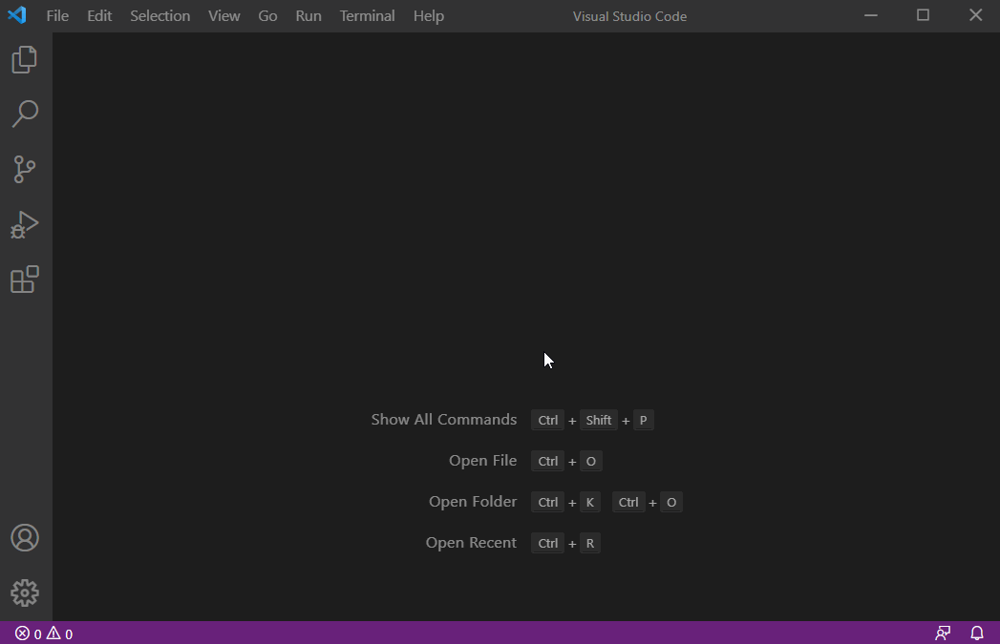
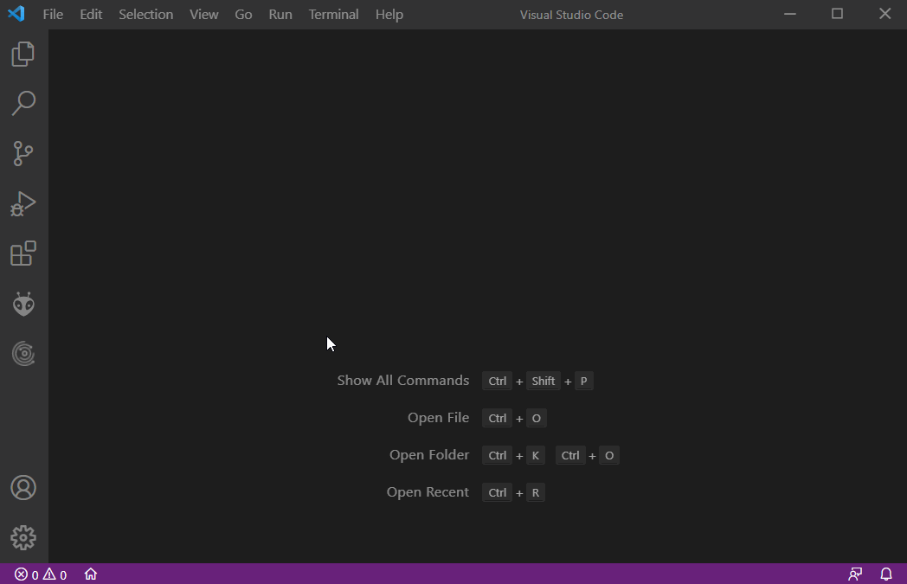
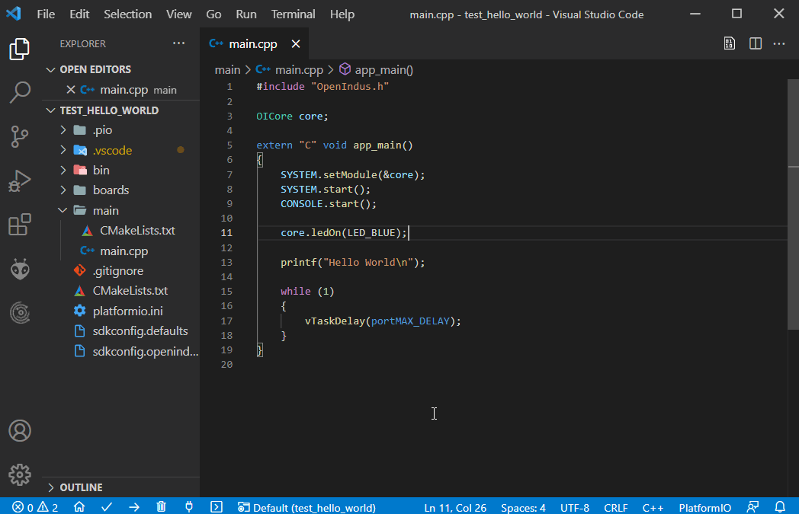
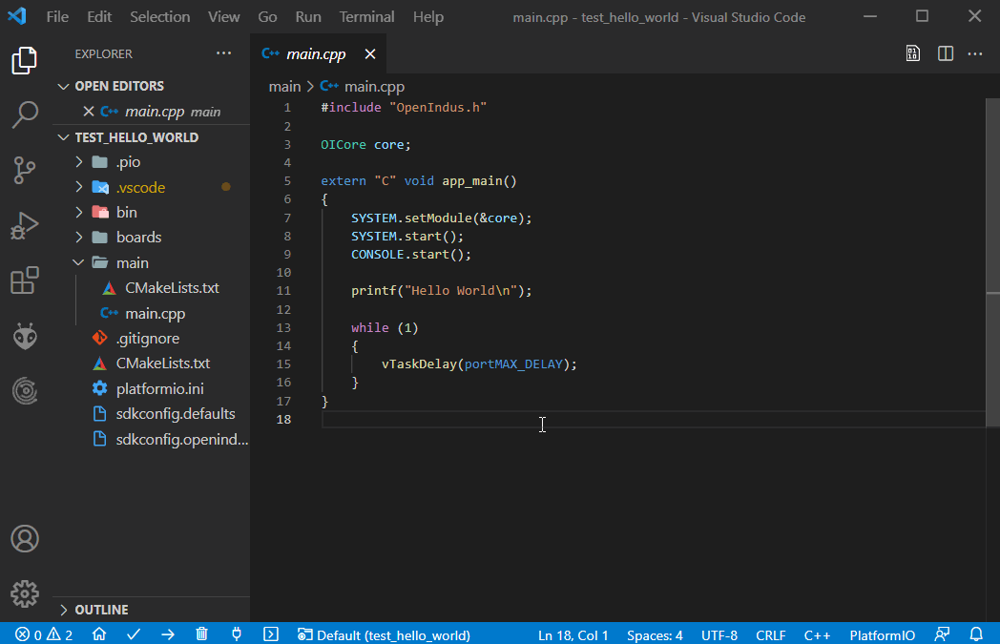
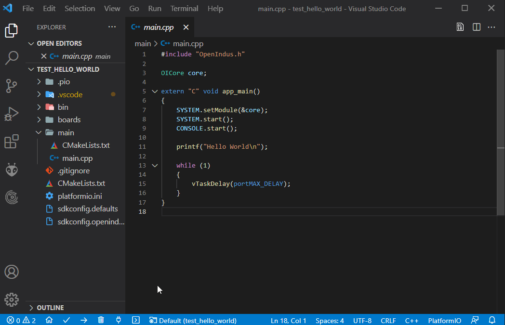

.. _get_started-index:

Launch your project !
=====================

This documentation will help you to understand how OpenIndus modules work and intend to make your development easy. 
You will find how to set up the environment and how to start coding. 
A description is available for each module in the hardware and the software section of this documentation. Pin-outs, APIs and libraries are explained.
Complete example are available to show you how our system works.

.. note:: This documentation is based on the latest stable version of OpenIndus software. This documentation will change with future improvements. 

What You Need
-------------

Hardware:

Before reading the doc you will need one or two things.

| - An OpenIndus development kit. 
| - USB cables : USB A / USB B for Core/CoreLite modules.
| - USB cables : USB A / micro USB B for other modules.

Software:

All devices are based on ESP32 chips by Espressif. You will need toolchain, build tools and the correct framework to use our modules.
We have created a *VSCode Extension* to facilitate the creation of projects.
The simple way to have all this is to use Visual Studio Code with PlatformIO extension. You will find in the `Environment Installation`_ section the guide to install everything you need.

Environment Installation
------------------------

Visual Studio Code
******************
To begin with, install Visual Studio Code. It will be the IDE to develop with our modules.
VSCode is supported on Windows, Linux and Mac. Please check the `installation link <https://code.visualstudio.com>`_.

Install OpenIndus VSCode Extension
**********************************
Once you have installed VSCode, you will be able to add `OpenIndus extension`.
1. Open VSCode Package Manager and search for OpenIndus extension. 

Click on **Install** button. 
The first time it can takes several minutes because VSCode will also install PlatformIO.
PlatformIO is a powerful tools which will allow you to have a build system for a great number of boards including ours, without external dependencies.
If you want more information please check `PlatformIO documentation <https://docs.platformio.org/en/latest/what-is-platformio.html>`_. 

Begin with your first project
-----------------------------

.. warning:: The project example shown below is based on `esp-idf <https://docs.espressif.com/projects/esp-idf/en/latest/esp32/>`_, it is the default framework used for the chip which is inside our devices. We are working on adding Arduino on top of it, if you want to use it, please contact us.

Start a new project
*******************
At this point, you have all you need to begin your first program.

* Click on the OpenIndus logo on the left bar
* Click on create a new project.
* Choose the device you will program
* Choose a root folder for your application
* Choose a name for your application
* Wait while the project is been created

.. warning:: First time you create a project, PlatformIO will automatically install the toolchain and Espressif libraries. This can take a while depending on your internet connection (several minutes).

Build your project
********************
Click on the build button on the bottom bar to build your project. First time you build a project, all sources files from Espressif library are built, don't worry it is a normal behaviour. Next build will be faster.

.. warning:: If you get an error message saying *"command 'platformio-ide.build' not found"* it is because PlatformIO is not ready yet. Wait until the end of the process (you can see it running on the bottom status bar).

Upload your project
*******************
Plug the device you want to upload to your computer with an USB cable.
Windows should detect the chip and automatically download the driver. If you cannot see your device in the device manager, please download manually the driver from this link: `Silicon Labs driver <https://www.silabs.com/developers/usb-to-uart-bridge-vcp-drivers>`_.
Then click on the upload button on the bottom bar. 

.. warning:: If you have only one device plug into your computer, PlatformIO should detect it automatically. If you have several devices, specify the COM port in the :ref:`platformio.ini<platformioini-label>` file.

.. note:: You do not need to click on the build button before upload, PlatformIO will detect if the project has to be build again before uploading.

Monitor your project
********************
After a successful upload, click on the monitor button on the bottom bar to see the log output of your device.

Start coding
------------
Now you are ready to create your own projects !

Change the led color
********************
You can change the default code in the :ref:`main.cpp<maincpp-label>` file. For example, if you want the turn on the LED in BLUE, change the program by:

.. code-block:: cpp

    #include "OpenIndus.h"

    OICore core;

    extern "C" void app_main()
    {
        System.setModule(&core);
        System.start();
        Console.start();
        
        core.ledOn(LED_BLUE);

        printf("Hello World\n");

        while (1)
        {
            vTaskDelay(portMAX_DELAY);
        }
    }

Add slave devices
*****************

We are now going to an OIDiscrete as a slave device in your code. For that you need to connect on the same bus a OICore/OICoreLite and an OIDiscrete.
Modify the :ref:`main.cpp<maincpp-label>` file as follow:

.. code-block:: cpp

    #include "OpenIndus.h"

    OICore core;
    OIDiscrete discrete(1); // add an OIDiscrete with ID 1

    extern "C" void app_main()
    {
        System.setModule(&core);
        System.setSubModule(&discrete);
        System.start();
        Console.start();

        printf("Hello World\n");

        // Set the STOR1 of the OIDiscrete to HIGH
        discrete.digitalWrite(STOR1, HIGH);

        while (1)
        {
            vTaskDelay(portMAX_DELAY);
        }
    }

Understand the structure of a project
-------------------------------------

.. _maincpp-label:

main.cpp
********
This is where you have to edit the code for creating your custom application. 
Of course you can create others `.cpp` files to organize your code if it became more complex.

.. _platformioini-label:

"platformio.ini"
****************
This is the file where you can find all the configuration for PlatformIO. 
You can change some settings like the COM port.

"CMakeLists.txt"
****************
Theses files contains directives for the CMake tools. They are required by the system to build your project but you don't have to change them.

".pio" folder
*************
This is the folder where PlatformIO puts all the compile files and the binaries. 
You can also found in this folder the OpenIndus Library sources files which are automatically downloaded y PlatformIO.

"boards" folder
***************
This folder contains definitions of the different OpenIndus boards.

"bin" folder
************
This folder contains binaries used for flashing devices on the bus.