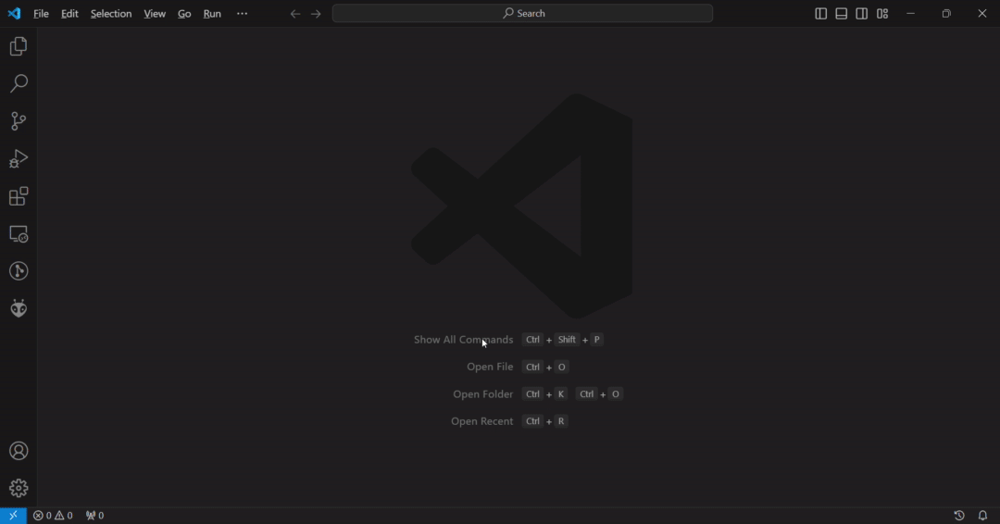
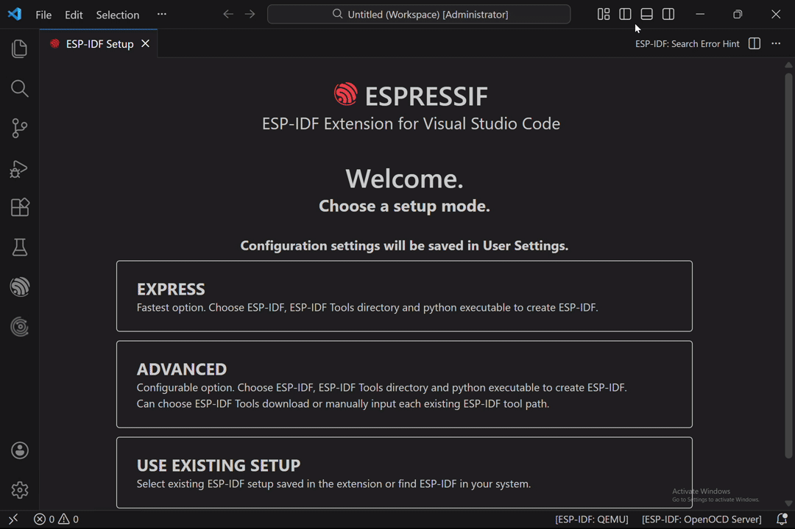
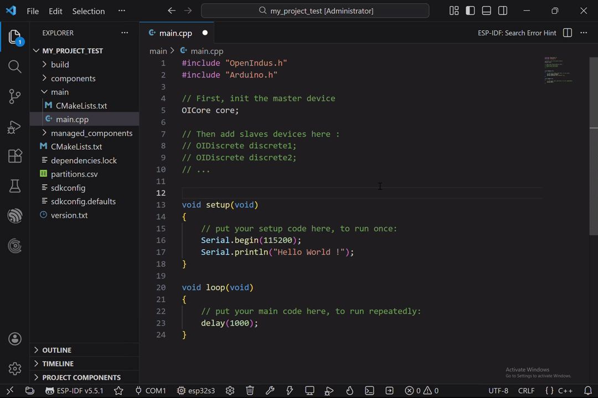
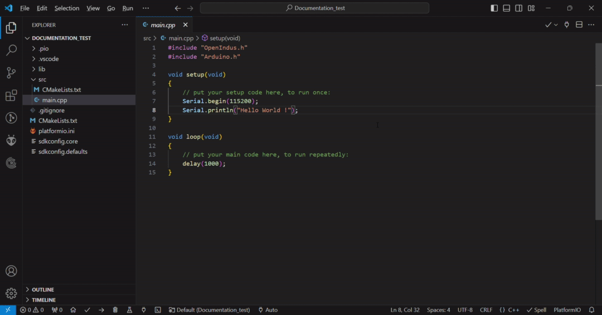
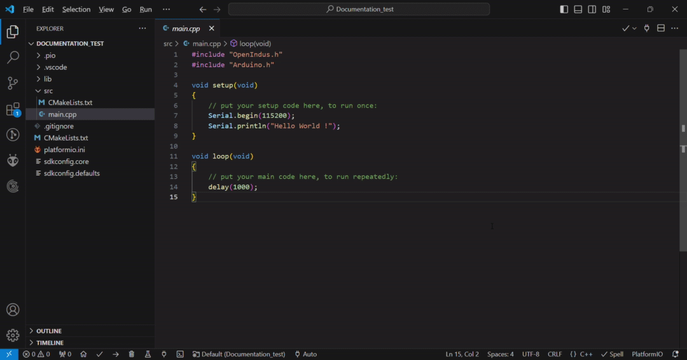
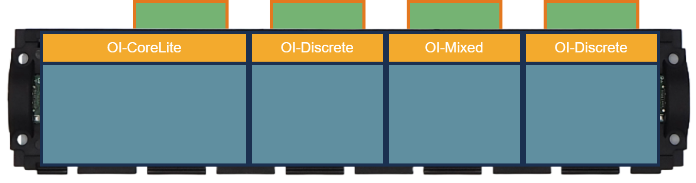
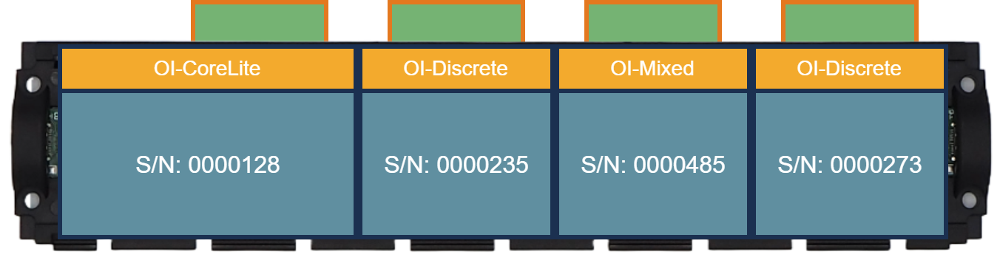

.. _get_started-index:

Launch your project !
=====================

This guide is designed to simplify your understanding of OpenIndus modules and streamline your development process. 
It provides step-by-step instructions for setting up the environment and initiating coding. 

You'll discover detailed descriptions of each module in the "modules" section, along with specifications for every function in the "functions" section. 
Furthermore, the "projects" section contains comprehensive code examples that demonstrate how our system operates.

.. note:: This documentation is based on the latest stable version of the OpenIndus software. It will be updated to reflect future improvements.

Let's start by understanding how OpenIndus' modules work.

Each module embeds specific hardware functions. The idea is to gather all the modules you need for your system.

For systems with multiple modules, a rail is required to interconnect them. In such setups, one module operates as the "master," while the others are designated as "slaves." 
This setup means that programming is only required for the master module; other modules do not need individual programming. 

.. note:: Currently, the "master" module must be either an :ref:`OI-Core<OI-Core>` or :ref:`OI-CoreLite<OI-CoreLite>`, but we are actively working to enable the use of any module as a "master."

For single-module setups, no rail is needed, and programming can be directly done on the module itself, which is then referred to as a "standalone" module.

Understanding these distinctions is crucial when initiating a new project, as you'll have the option to choose between "master," "standalone," and "slave" configurations.

All our modules utilize Espressif chips and can be programmed using Arduino. If you're familiar with Arduino programming, you'll find it seamless. 
If not, don't worry; programming with Arduino is straightforward, and this guide will walk you through it step by step.

The easiest way to set up everything is by using Visual Studio Code with the OpenIndus and PlatformIO extensions. 
You'll find a comprehensive installation guide in the `Environment Installation`_ section.

Environment Installation
------------------------

Visual Studio Code
******************

To begin with, install Visual Studio Code. It will be the IDE to develop with our modules.
VSCode is supported on Windows, Linux and Mac. Please check the `installation link <https://code.visualstudio.com>`_.

.. _get_started_oivscodeextension:

Install OpenIndus VSCode Extension
**********************************

Once you have installed VSCode, you'll be able to add the OpenIndus extension.
This extension will add some commands to VSCode, such as creating a new project or retrieving information about connected modules.

* Open the **Extension** panel
* Search for **OpenIndus**
* Click on **Install** button

|

The first time it can takes several minutes because VSCode will also install ESP-IDF.

Configure ESP-IDF Extension
***************************

ESP-IDF extension is the official vscode tool to compile, flash and monitor your code. At the first installation, you need to configure it.
The official documentation can be found here : `ESP-IDF official documentation<https://docs.espressif.com/projects/vscode-esp-idf-extension/en/latest/>`_.

In this section, you will found a guide to install with default paramters. Depending on you internet connection, it can take  some minutes to download and install all ressources (compler, libraries, examples, ...). 
But d'ont worry, once configured you won't need to do it everytime.

The page to configure ESP-IDF extension should be automaticcaly oppen at launch (if no, click on the ESP-IDF logo on le left side pannel and in the "Advanced" section, click on "Configure ESP-ISD Expension").

On the configuration page, do the following :
* Select "Express"
* Select the last ESP-IDF version (currently v5.5.1)
* You can customize the installtion folder
* Launch the installation and wait for it to complete

|

.. info:: ESP-IDF Extension download and configure all packages necessary (toolchain, uploader, monitor tool, ...).

Begin with your first project
-----------------------------

Start a new project
*******************

At this point, you have all you need to begin your first program.

* Click on the OpenIndus logo on the left bar
* Click on **create a new project**.
* Choose the device you will program. We recommend to start by programming on an :ref:`OI-Core<OI-Core>` or an :ref:`OI-CoreLite<OI-CoreLite>`.
* Choose a root folder for your application.
* Choose a name for your application.
* Choose the 'type' of project. If you have a system with several modules, choose 'master' and if you have a system with only one module, choose 'standalone'.
* Choose if you want to use the Arduino Libraries (cecommended) or only the ESP-IDF framework (for advanced users).
* Wait while the project is been created. A new folder will open up with your new project!

.. image:: ../_static/gif/create_project_idf.gif
    :width: 800
    :alt: Create a project
    :align: center

|

Build your project
********************

The created project prints 'Hello World!' to the serial port. You can find the main code in src/main.cpp. 
If you are familiar with Arduino, you will recognize the 'setup' and 'loop' functions.

Before uploading this code to the console, you will have to build this code.
Click on the build button on the bottom bar to build your project. 

|

.. note:: First time you build a project, all sources files from Espressif library are downloaded and built, don't worry it is a normal behaviour. Next build will be faster.

Upload your project
*******************

Plug the device you want to upload to your computer with an USB cable.
Windows should detect the chip and automatically download the driver. If you cannot see your device in the device manager, please download manually the driver from this link: `Silicon Labs driver <https://www.silabs.com/developers/usb-to-uart-bridge-vcp-drivers>`_.

Then click on the upload button on the bottom bar. 

|

.. warning:: If you have only one device plug into your computer, PlatformIO should detect it automatically. If you have several devices, select the good one by changing from 'Auto' to the wanted COM port.

.. note:: You do not need to click on the build button before upload, PlatformIO will detect if the project has to be build again before uploading.

Monitor your project
********************

After a successful upload, click on the monitor button on the bottom bar to see the log output of your device.

|

.. _start_coding-index:

Start coding
------------

Now you are ready to create your own projects !

Read Digital Input
******************

You can change the default code in the main.cpp file. 
Below is an example of reading the value of Digital Input 1 and printing the result to the serial monitor every second.

.. code-block:: cpp

    #include "OpenIndus.h"
    #include "Arduino.h"

    // First, init the master device
    OICore core;

    void setup(void)
    {
        // put your setup code here, to run once:
        Serial.begin(115200);
        Serial.println("Hello World !");
    }

    void loop(void)
    {
        // put your main code here, to run repeatedly:
        Serial.print("Value of Digital Input 1 is ");
        Serial.println(core.digitalRead(DIN_1));
        delay(1000);
    }

Add one slave devices
*********************

We are now going to an :ref:`OI-Discrete` as a slave device in your code. For that you need to connect on the same bus a Core/CoreLite and an Discrete.
Modify the main.cpp file as follow:

.. code-block:: cpp

    #include "OpenIndus.h"
    #include "Arduino.h"

    // First, init the master device
    OICore core;

    // Then add slave device here :
    OIDiscrete discrete;

    void setup(void)
    {
        // put your setup code here, to run once:
        Serial.begin(115200);
        Serial.println("Hello World !");
    }

    void loop(void)
    {
        // put your main code here, to run repeatedly:
        Serial.print("Value of Digital Input 1 of OI-Discrete is ");
        Serial.println(discrete.digitalRead(DIN_1));
        delay(1000);
    }

Add several slaves devices (with auto ID)
*****************************************

If you want to add several slaves devices, you have to add them in the code in the same order as they are mounted on the rail.

For example, if you have the following hardware configuration:

|

You need to instantiate board in the following order:

.. code-block:: cpp

    OIDiscrete discrete1();  
    OIMixed mixed1();
    OIDiscrete discrete2();  

Here is a full example code for the configuration above:

.. code-block:: cpp

    #include "OpenIndus.h"
    #include "Arduino.h"

    // First, init the master device
    OICore core;

    // Then add slave device here :
    OIDiscrete discrete1();  
    OIMixed mixed1();
    OIDiscrete discrete2();  

    void setup(void)
    {
        // put your setup code here, to run once:
        Serial.begin(115200);
        Serial.println("Hello World !");
    }

    void loop(void)
    {
        // put your main code here, to run repeatedly:
        Serial.print("Value of Digital Input 1 of OI-Discrete 1 is ");
        Serial.println(discrete1.digitalRead(DIN_1));
        Serial.print("Value of Digital Input 1 of OI-Discrete 2 is ");
        Serial.println(discrete2.digitalRead(DIN_1));
        Serial.print("Value of Digital Input 1 of OI-Mixed 1 is ");
        Serial.println(mixed1.digitalRead(DIN_1));
        delay(1000);
    }

Add several slaves devices (with serial number)
***********************************************

An alternative way of adding slave devices is to instantiate them with serial number.

|

With the configuration above, you can instantiate modules as follow without caring about the order:

.. code-block:: cpp

    OIDiscrete discrete1(0000128);
    OIDiscrete discrete2(0000273);
    OIMixed mixed1(0000235);

.. note:: 
    This way of instantiate is not scalable. If you change one module, the part number will be different and you will have to update your code. 
    The advantage is that you can place your module where you want on the rail.

Add external library to the code
--------------------------------

One of the main advantage of using pio is the wide range of library compatible with OpenIndus modules which is supported. It can helps you to quickly implements functions in your code.

To add a library, use the libraries tool from PlatformIO:

* Open PlatformIO Home
* Click on the "Libraries" panel
* Search for a library 
* Select a library
* Click on "Add to project"
* Select the project
* Click on "Add"

.. note::
    Most or libraries compatible with "framework:arduino" and "platform:espressif32" will work with :ref:`OI-Core<OI-Core>` module
