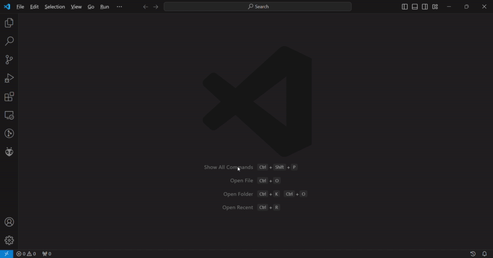

.. _get_started-index:

Launch your project
===================

OpenIndus Modules Overview
---------------------------

Let's start by understanding how OpenIndus modules work.

Each module contains specific hardware functions. The idea is to gather all the modules you need for your system.

For systems with multiple modules, a rail is required to interconnect them. In such setups, one module operates as the "master," while the others are designated as "slaves." 
This means that programming is only required for the master module; other modules do not need individual programming.

.. note:: Currently, the "master" module must be either an :ref:`OI-Core<OI-Core>` or :ref:`OI-CoreLite<OI-CoreLite>`, but we are actively working to enable the use of any module as a "master."

For single-module setups, no rail is needed, and programming can be done directly on the module itself, which is then referred to as a "standalone" module.

Understanding these distinctions is crucial when starting a new project, as you'll have the option to choose between "master," "standalone," and "slave" configurations.

All our modules use Espressif chips and can be programmed using Arduino. If you're familiar with Arduino programming, you'll find it seamless. 
If not, don't worry; programming with Arduino is straightforward, and this guide will walk you through it step by step.

The easiest way to set up everything is by using Visual Studio Code with the OpenIndus extension, along with the ESP-IDF extensions. 
You'll find a comprehensive installation guide in the `Environment Installation`_ section.

Environment Installation
------------------------

Visual Studio Code
******************

To begin, install Visual Studio Code. It will be the IDE used to develop with our modules.
VSCode is supported on Windows, Linux, and macOS. Please check the `installation link <https://code.visualstudio.com>`_.

.. _get_started_oivscodeextension:

Install OpenIndus VSCode Extension
**********************************

Once you have installed VSCode, you can add the OpenIndus extension.
This extension will add commands to VSCode, such as creating a new project or retrieving information about connected modules.

* Open the **Extension** panel
* Search for **OpenIndus**
* Click on **Install** button

|

.. note::
    The first time, it can take several minutes because VSCode will also install ESP-IDF.

Configure ESP-IDF Extension
***************************

The ESP-IDF extension is the official VSCode tool to compile, flash, and monitor your code. At the first installation, you need to configure it.
The official documentation can be found here: `ESP-IDF official documentation <https://docs.espressif.com/projects/vscode-esp-idf-extension/en/latest/>`_.

In this section, you will find a guide to install with default parameters. Depending on your internet connection, it can take some minutes to download and install all resources (compiler, libraries, examples, ...). 
But don't worry, once configured you won't need to do it every time.

The page to configure the ESP-IDF extension should open automatically at launch (if not, click on the ESP-IDF logo on the left side panel and in the "Advanced" section, click on "Configure ESP-IDF Extension").

On the configuration page, do the following:

* Select "Express"
* Select the latest ESP-IDF version (currently v5.5.1)
* You can customize the installation folder
* Launch the installation and wait for it to complete

.. image:: ../_static/gif/configure_idf.gif
    :width: 800
    :alt: ESP-IDF recommended configuration
    :align: center

|

.. note:: ESP-IDF Extension downloads and configures all packages necessary (toolchain, uploader, monitor tool, ...).

Begin with your first project
-----------------------------

Start a new project
*******************

At this point, you have everything you need to begin your first program.

1. Click on the OpenIndus logo on the left bar
2. Click on **create a new project**.
3. Choose the device you will program. We recommend starting by programming on an :ref:`OI-Core<OI-Core>` or an :ref:`OI-CoreLite<OI-CoreLite>`.
4. Choose a root folder for your application.
5. Choose a name for your application.
6. Choose the 'type' of project. If you have a system with several modules, choose 'master' and if you have a system with only one module, choose 'standalone'.
7. Choose if you want to use the Arduino Libraries (recommended) or only the ESP-IDF framework (for advanced users).
8. Wait while the project is created. A new folder will open with your new project!

.. image:: ../_static/gif/create_project_idf.gif
    :width: 800
    :alt: Create a project
    :align: center

|

Build your project
*******************

The created project prints 'Hello World!' to the serial port. You can find the main code in src/main.cpp. 
If you are familiar with Arduino, you will recognize the 'setup' and 'loop' functions.

Before uploading this code to the device, you will have to build it.
Click on the build button on the bottom bar to build your project. 

.. image:: ../_static/gif/build_project_idf.gif
    :width: 800
    :alt: Build a project
    :align: center

|

.. note:: The first time you build a project, all source files from Espressif library are downloaded and built, don't worry it is normal behavior. Next builds will be faster.

Upload your project
*******************

Plug the device you want to program into your computer with a USB cable.
Windows should detect the chip and automatically download the driver. If you cannot see your device in the device manager, please manually download the driver from this link: `Silicon Labs driver <https://www.silabs.com/developers/usb-to-uart-bridge-vcp-drivers>`_.

You have to select the correct COM port by clicking the "Select port to use" button in the bottom bar.
Then you can upload the program to your device with the "Flash Device" button in the bottom bar. You must choose "UART" if asked for the flashing method.

.. image:: ../_static/gif/upload_project_idf.gif
    :width: 800
    :alt: Upload a project
    :align: center

|

.. note:: You do not need to click on the build button before uploading; ESP-IDF will detect if the project needs to be built again before uploading.

Monitor your project
********************

After a successful upload, click on the "Monitor device" button in the bottom bar to see the log output from your device.

.. image:: ../_static/gif/monitor_project_idf.gif
    :width: 800
    :alt: Monitor a project
    :align: center

|

.. _start_coding-index:

Start coding
------------

Now you are ready to create your own projects!

Read Digital Input
******************

You can change the default code in the main.cpp file. 
Below is an example of reading the value of Digital Input 1 and printing the result to the serial monitor every second.

.. code-block:: cpp

    #include "OpenIndus.h"
    #include "Arduino.h"

    // First, init the master device
    OICore core;

    void setup(void)
    {
        // put your setup code here, to run once:
        Serial.begin(115200);
        Serial.println("Hello World !");
    }

    void loop(void)
    {
        // put your main code here, to run repeatedly:
        Serial.print("Value of Digital Input 1 is ");
        Serial.println(core.digitalRead(DIN_1));
        delay(1000);
    }

Add one slave device
********************

We are now going to add an :ref:`OI-Discrete` as a slave device in your code. For that, you need to connect a Core/CoreLite and a Discrete on the same bus.
Modify the main.cpp file as follows:

.. code-block:: cpp

    #include "OpenIndus.h"
    #include "Arduino.h"

    // First, init the master device
    OICore core;

    // Then add slave device here:
    OIDiscrete discrete;

    void setup(void)
    {
        // put your setup code here, to run once:
        Serial.begin(115200);
        Serial.println("Hello World !");
    }

    void loop(void)
    {
        // put your main code here, to run repeatedly:
        Serial.print("Value of Digital Input 1 of OI-Discrete is ");
        Serial.println(discrete.digitalRead(DIN_1));
        delay(1000);
    }

Add several slave devices (with auto ID)
*****************************************

If you want to add several slave devices, you have to add them in the code in the same order as they are mounted on the rail.

For example, if you have the following hardware configuration:

.. image:: ../_static/rail_example_auto_id.png
    :width: 800
    :alt: Example rail configuration
    :align: center

|

You need to instantiate the boards in the following order:

.. code-block:: cpp

    OIDiscrete discrete1();  
    OIMixed mixed1();
    OIDiscrete discrete2();  

Here is a full example code for the configuration above:

.. code-block:: cpp

    #include "OpenIndus.h"
    #include "Arduino.h"

    // First, init the master device
    OICore core;

    // Then add slave device here:
    OIDiscrete discrete1();  
    OIMixed mixed1();
    OIDiscrete discrete2();  

    void setup(void)
    {
        // put your setup code here, to run once:
        Serial.begin(115200);
        Serial.println("Hello World !");
    }

    void loop(void)
    {
        // put your main code here, to run repeatedly:
        Serial.print("Value of Digital Input 1 of OI-Discrete 1 is ");
        Serial.println(discrete1.digitalRead(DIN_1));
        Serial.print("Value of Digital Input 1 of OI-Discrete 2 is ");
        Serial.println(discrete2.digitalRead(DIN_1));
        Serial.print("Value of Digital Input 1 of OI-Mixed 1 is ");
        Serial.println(mixed1.digitalRead(DIN_1));
        delay(1000);
    }

Add several slave devices (with serial number)
***********************************************

An alternative way of adding slave devices is to instantiate them with a serial number.

.. image:: ../_static/rail_example_sn.png
    :width: 800
    :alt: Example rail configuration
    :align: center

|

With the configuration above, you can instantiate modules as follows without caring about the order:

.. code-block:: cpp

    OIDiscrete discrete1(0000128);
    OIDiscrete discrete2(0000273);
    OIMixed mixed1(0000235);

.. note:: 
    This way of instantiation is not scalable. If you change one module, the serial number will be different and you will have to update your code. 
    The advantage is that you can place your module wherever you want on the rail.
