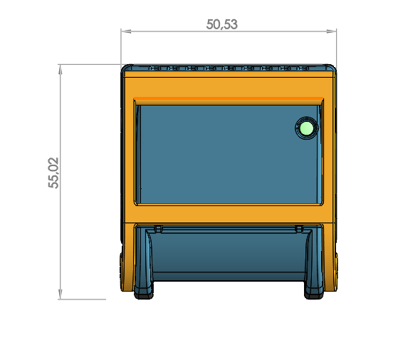

.. _mechanical_s:

Mechanicals specifications
==========================

Description
-----------

This section present mechanicals specifications of all packages.

.. note:: All dimensions are in millimeters.

Packages
---------------

BOI12
*****

This package is used for OIDiscrete and OIMixed modules.

BOI13
*****
This package is used for OIStepper and OICoreLite modules.

BOI23
*****
This package is used for OICore module.

OIRail
******
