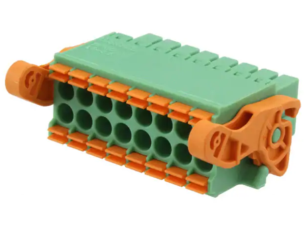
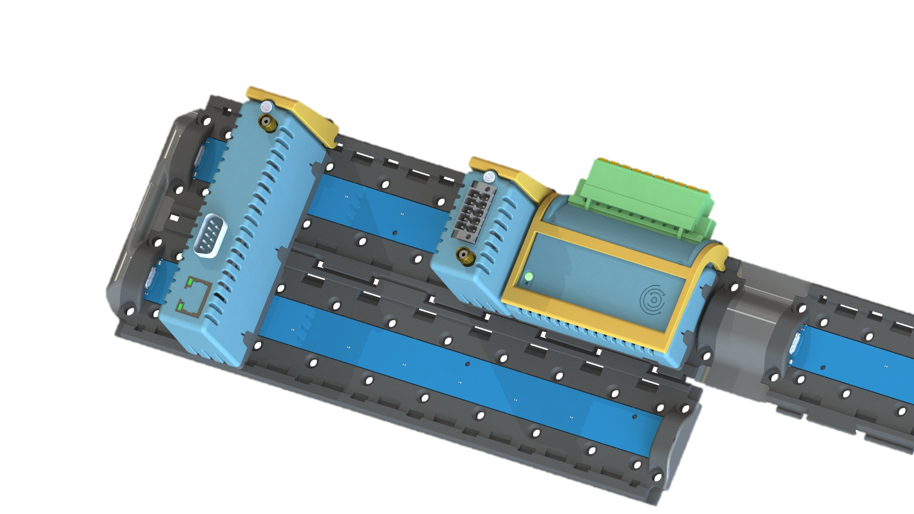

.. _usage_s:

OpenIndus System Generic Usage
==============================

Description
-----------

OpenIndus system is modular and allow you great flexibility. This section guide you to build your own system safely and efficiently with OpenIndus modules.

System usage
------------

1. How to wire your system ?
****************************

In all OpenIndus kits we provide you terminal blocks to wire your system easily.

It is a 16 contacts board connector with a pitch of 3.5mm. It support wire cross section from 0.2mm² up to 1.5mm².
You will need a flat-head screwdriver to release or lock wires.

.. list-table:: Ferrules specifications
   :widths: 55 45
   :header-rows: 1

   * - **Ferrules type**
     - Values
   * - **Ferrules without insulating collar**
     - Cross section: 0.25 mm²; Length: 7 mm 
   * - 
     - Cross section: 0.34 mm²; Length: 7 mm 
   * - 
     - Cross section: 0.5 mm²; Length: 8 mm ... 10 mm 
   * - 
     - Cross section: 0.75 mm²; Length: 8 mm ... 10 mm 
   * - 
     - Cross section: 1 mm²; Length: 8 mm ... 10 mm 
   * - 
     - Cross section: 1.5 mm²; Length: 10 mm 

   * - **Ferrules with insulating collar**
     - Cross section: 0.14 mm²; Length: 8 mm
   * - 
     - Cross section: 0.25 mm²; Length: 8 mm ... 10 mm
   * - 
     - Cross section: 0.34 mm²; Length: 8 mm ... 10 mm
   * - 
     - Cross section: 0.5 mm²; Length: 8 mm ... 10 mm
   * - 
     - Cross section: 0.75 mm²; Length: 10 mm

This specifications follow DIN 46228‑4 standard.

| The 0.75 mm² ferrule is to be inserted parallel to the groove of the spring opener.
| You will need a crimping pliers that match the dimensions on the table above.

2. How to put modules on rails 
******************************

OpenIndus system use rails for communications between modules. You may wonder how to connect modules and rails together.

| There are four type of rails depending on your needs and the OpenIndus kit you have:

Rails designed to be chained : 

- Head rail with only one USB-C connector at its tail. 
- Middle rail with two USB-C connectors
- End rail with one USB-C at its head.

.. warning:: USB-C wires are provided with our products to connect your rails. Please use only those wires because they are specific for this usage.

.. DANGER:: Please do not connect OpenIndus rails to a computer or any other devices that do not belong to OpenIndus products. We deny any responsabilities in case of damages.

Single rail :

- Rail with no USB-C connector.

3. Modules auto set ID
********************** 

If you don't want to think about your boards IDs, OpenIndus system offer an auto ID feature. To enable this feature please refer to TBD section. 
Please see :ref:`OIConsole section<OIconsole>` and :ref:`Set ID section of OpenIndus Graphical Tool<setid-index>` to learn the two ways to set your own IDs.

.. warning:: Auto ID would not work if you chain more than 10 rails. 

4. LED colors and blinking specifications
*****************************************

All module has its own LED that gives you information about module state.

.. list-table:: LED indications
   :widths: 33 33 33 
   :header-rows: 1

   * - LED color
     - LED blinking speed
     - Information
   * - Blue
     - 1Hz
     - Default : Module has started
   * - Green
     - 1Hz
     - Module has started and is connected on rail
   * - White
     - 5Hz
     - Module is being programmed
   * - Yellow
     - 1Hz
     - Unexpected event
   * - Red
     - 1Hz
     - Critical error 

.. warning:: Please do not change LED specifications without consulting us.
  
