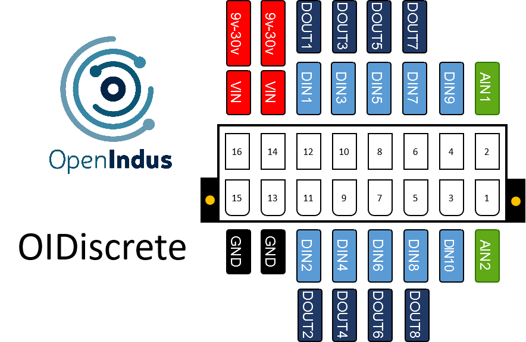

.. _OIdiscrete_s:

OIDiscrete - Module to control logical inputs and outputs
=========================================================

Description
-----------

OIDiscrete is a digital inputs/outputs module. 
The following table show you the module specifications. 

.. list-table:: OIDiscrete module hardware characteristics
   :widths: 65 35
   :header-rows: 1

   * - Specifications
     - Value
   * - CPU
     - ESP32-S2
   * - Digital inputs
     - 10
   * - Analog inputs 0-30V
     - 1
   * - Digital outputs with current sensors
     - 8
   * - Interfaces
     - USB micro B (programming)
   * - Supply Voltage
     - 9-30V
   * - Consumption (all outputs disabled)
     - < 0.5W
   * - Temperature range
     - -20 °C... +70°C
   * - Package
     - BOI12 (50.47x53.81x27mm)

Pinout
------

The pinout of the module is as follow : 

