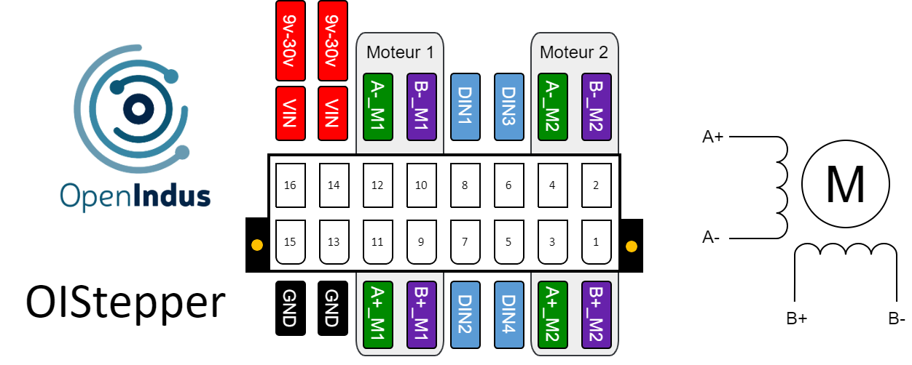

.. _OIstepper_s:

OIStepper - Module to control stepper motor
===========================================

Description
-----------

OIStepper is the module to drive stepper motor. You can drive up to 2 motors with this module. 
The following table show you the module specifications. 

.. list-table:: OIStepper module hardware characteristics
   :widths: 65 35
   :header-rows: 1

   * - Specifications
     - Value
   * - CPU
     - ESP32-S2
   * - Digital inputs
     - 4
   * - Motor outputs
     - 2 (300W)
   * - Digital outputs
     - 0
   * - Interfaces
     - USB micro B 
   * - Supply Voltage
     - 9-30V
   * - Consumption (all outputs disabled)
     - < 0.5W
   * - Temperature range
     - -20 °C... +50°C
   * - Package
     - BOI13 (75.97x53.81x27mm)

Pinout
------

The pinout of the module is as follow : 

