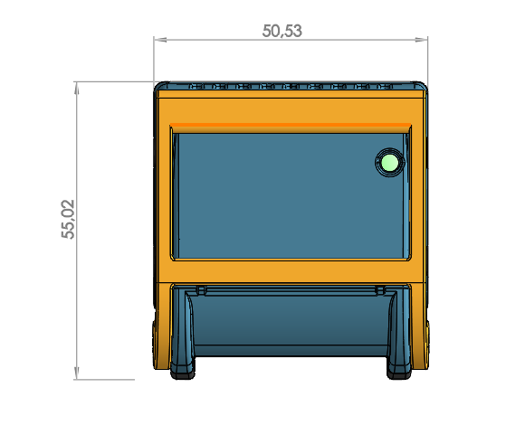

.. _mechanical_s:

Mechanical Specifications
==========================

Description
-----------

This section presents the mechanical specifications of all packages.

.. note:: All dimensions are in millimeters.

Packages
--------

.. _boi12_s:

BOI12
*****

This package is used for OI-Discrete, OI-Mixed, and OIAnalogLS modules.

.. tip::
   **STEP file download:**
   
   `BOI12 OI-Discrete - OI-Mixed - OI-AnalogLS.STEP <https://github.com/openindus/oi-mechanical/raw/main/BOI%2012%20OI-Discrete%20-%20Mixed%20-%20AnalogLS.STEP>`_

.. _boi13_s:

BOI13
*****

This package is used for OI-Stepper, OI-DC, OI-RelayLP, OI-RelayHP, and OI-CoreLite modules.

.. image:: ../_static/stepper_meca.png
	:width: 400
	:alt: Mechanical view
	:align: center

.. tip::
   **STEP file download:**
   
   * `BOI13 OI-Stepper - DC - RelayLP.STEP <https://github.com/openindus/oi-mechanical/raw/main/BOI%2013%20OI-Stepper%20-%20DC%20-%20RelayLP.STEP>`_
   * `BOI13 OI-RelayHP.STEP <https://github.com/openindus/oi-mechanical/raw/main/BOI%2013%20OI-RelayHP.STEP>`_
   * `BOI13 OI-CoreLite.STEP <https://github.com/openindus/oi-mechanical/raw/main/BOI%2013%20OI-CoreLite.STEP>`_

.. _boi23_s:

BOI23
*****

This package is used for OI-Core module.

.. image:: ../_static/core_meca.png
	:width: 400
	:alt: Mechanical view
	:align: center

.. tip::
   **STEP file download:**
   
   `BOI23 OI-Core no 4G.STEP <https://github.com/openindus/oi-mechanical/raw/main/BOI%2023%20OI-Core%20no%204G.STEP>`_

.. _rail_s:

Rail
****

This section presents the mechanical specifications of the DIN rail used for mounting the modules.

.. image:: ../_static/rail_meca.png
    :width: 400
    :alt: Mechanical view
    :align: center

.. tip::
   **STEP file download:**

   `DIN Rail.STEP <https://github.com/openindus/oi-mechanical/raw/main/Rail%209U.STEP>`_
