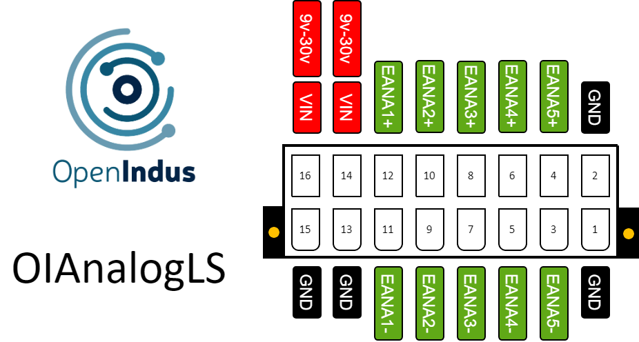

.. _OI-AnalogLS:

OI-AnalogLS
===========

Description
-----------

The OI-AnalogLS module is analog input module designed to interface discrete sensors such as PT100, PT100, thermocouples, Wheatstone bridge, strain gauge, ...

**Key Features:**

* Analog inputs: There are 5 differential inputs available for reading low-voltage signals.
* Multiple configurations: Excitation in voltage or current, as well as biasing voltage, are available, providing the possibility to connect various sensors to OI-AnalogLS.
* Precision: With its 16-bit ADC, all inputs offer great precision, allowing the OI-AnalogLS to be used in demanding situations. Furthermore, all inputs are filtered to reject common-mode noise as well as differential-mode noise.

**Compact Design:**
The module comes in a compact BOI12 package, saving space in control cabinets. 
It's easy to install, with up to four modules fitting on a single rail. 
This scalability makes it simple to expand the system based on specific needs.

.. note::
  The OI-AnalogLS module functions either as a standalone unit (with user code injected directly) or as a slave unit (with user code executed on a Master module,
  receiving commands via the communication bus).

Pinout
------

The pinout of the module is as follow : 

|

Functions
---------

Below are the specifications for the OI-AnalogLS module. Click on the links in the function table to explore its I/O details, including access to code examples and programming APIs.

.. list-table:: OI-AnalogLS module hardware characteristics
   :widths: 55 45
   :align: center

   * - :ref:`Power Supply Voltage <power_s>`
     - 9..30V DC
   * - :ref:`Analog intputs low signals <ainls_s>`
     - 10 (5 differential)
   * - CPU
     - ESP32-S3 (8MB)
   * - Programming interface
     - USB micro B
   * - Consumption (all outputs disabled)
     - < 1W
   * - Temperature range
     - -20 °C... +70°C
   * - Package
     - BOI12 (50.47x53.81x27mm)
