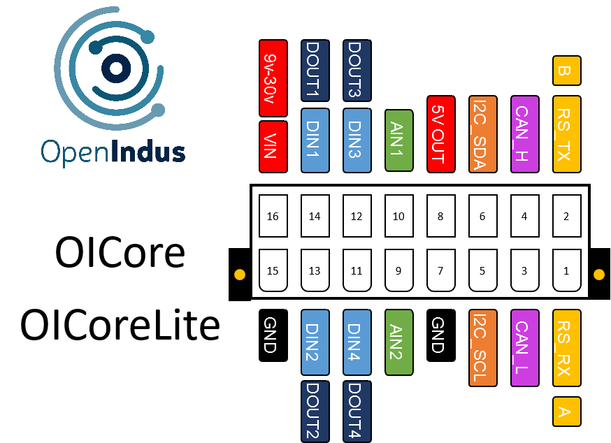

.. _OI-Core:
.. _OI-CoreLite:

OI-Core & OI-CoreLite
=====================

Description
-----------

The OI-Core acts as the main module, directing all other modules by sending them commands. 
If your system has multiple modules, this is the one you need to program, and you don't have to worry about adding software to other modules.

The OI-Core module comes in two versions:

* OI-CoreLite: A simple but powerful control unit in a small BOI13 package.
* OI-Core: A more advanced version with USB Host and Ethernet features in BOI23 package.

**Key Features:**

* Wired Connections: Facilitates communication with other equipment through RS232/RS485, CAN, or I2C interfaces.
* Wireless connectivity: Supports Bluetooth 5 and Wi-Fi 802.11 b/g/n
* Digital Inputs: Provides 4 digital input channels, facilitating the connection of external sensors, switches, or other digital devices.
* Digital Outputs: Features 4 channels for controlling external devices or actuators via digital signals.
* Analog Inputs: Additionally, the module includes 2 analog input channels, allowing for the processing of continuous voltage. 
  These analog inputs are not suitable for reading low-impedance sensors but are convenient for reading power supply voltage or conditioned analog signals.
* MicroSD card slot: Allows for convenient data storage.
* (OI-Core only) Network connectivity: Offers Ethernet capability.
* (OI-Core only) USB Host interface: Useful for extending system capability; you can connect various equipment such as USB sticks, cameras, joysticks, mouses, and more.

Pinout
------

The pinout is common for OI-Core and OI-CoreLite and is as follow : 

|
| Digital inputs and outputs are mapped on the same physical pin.
| RS232 and RS485 are on the same pins. You can not use them all at once.
| **RS_TX** and **RS_RX** stand for RS232 configuration.
| **A** and **B** stand for RS485.

Functions
---------

Below are the specifications for the OI-Core module. Click on the links in the function table to explore its I/O details, including access to code examples and programming APIs.

.. list-table:: OI-Core module hardware characteristics
   :widths: 55 45
   :align: center

   * - Power Supply Voltage
     - 9..30V DC
   * - **I/O**
     - 
   * - :ref:`Digital inputs (DIN) <din_s>`
     - 4
   * - :ref:`Digital output (DOUT) <dout_s>`
     - 4
   * - :ref:`Analog inputs 0-30V (AIN) <ain0-30_s>`
     - 2
   * - 5V Output (500mA)
     - 1
   * - **Field bus**
     - 
   * - :ref:`CAN (50kbps - 1 Mbps) <can_s>`
     - 1 
   * - :ref:`RS232/RS485 <rs232-485_s>`
     - 1 (Half-Duplex)
   * - **Interfaces**
     -
   * - :ref:`Wifi 802.11 b/g/n 2.4 GHz <wifi_s>`
     - 1
   * - :ref:`Bluetooth 5 <bluetooth_s>`
     - 1
   * - :ref:`I2C (5V Compatible) <i2cttl_s>`
     - 1
   * - :ref:`µSD Card Holder <sdcard_s>`
     - 1
   * - :ref:`USB Host 2.0 <usbhost_s>`
     - 1 (OI-Core only)
   * - :ref:`Ethernet 10BaseT/100BaseTX <ethernet_s>`
     - 1 (OI-Core only)
   * - **Others**
     -
   * - :ref:`RTC <rtc_s>`
     - 1
   * - CPU
     - ESP32-S3 (8MB)
   * - Programming interface
     - USB micro B
   * - Consumption (all outputs disabled)
     - < 1W
   * - Temperature range
     - -20 °C... +70°C
   * - Package OI-Core
     - BOI23 (??x??x??mm)
   * - Package OI-CoreLite
     - BOI13 (75.97x53.81x27mm)

.. _Core_pinout_s: