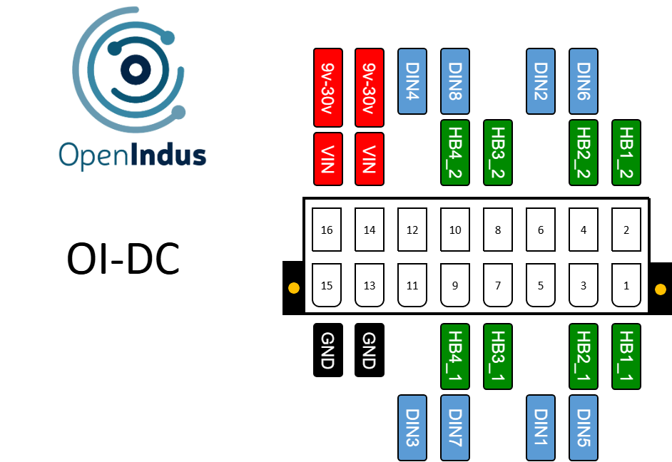

.. _OI-Dc:

OI-Dc
=====

Description
-----------

The OI-Dc module is a versatile motor control module designed to drive DC motors in various industrial automation applications. 
With its compact form factor and comprehensive array of motor drivers and digital inputs, it offers flexibility and efficiency in motion control systems.

**Key Features:**

* Motor Control: The module provides four independent DC motor drivers, enabling precise control of motor speed and direction.
* Digital Inputs: It includes 8 digital input channels, facilitating the connection of external sensors, switches, or encoders, which are commonly used in motor control applications.
* Current Monitoring: Each motor driver includes current sensing capability for monitoring motor load and implementing overcurrent protection.
* Bidirectional Control: The module supports bidirectional motor control with variable speed control through PWM (Pulse Width Modulation).

**Compact Design:**
The module comes in a compact BOI13 package, saving space in control cabinets. 
It's easy to install, with up to three modules fitting on a single rail. 
This scalability makes it simple to expand the system based on specific needs.

.. note::
  The OI-Dc module can be programmed directly with your user code, or controlled remotely from an :ref:`OI-Core<OI-Core>`/:ref:`OI-CoreLite<OI-CoreLite>` module via the communication bus.

Pinout
------

The pinout of the module is as follow : 

|

.. image:: ../_static/rendu_realiste_bornier.jpg
    :width: 400
    :alt: Terminal block pinout
    :align: center

|

Functions
---------

Below are the specifications for the OI-Dc module. Click on the links in the function table to explore its I/O details, including access to code examples and programming APIs.

.. list-table:: OI-Dc module hardware characteristics
   :widths: 55 45
   :align: center

   * - Power Supply Voltage
     - 9..30V DC
   * - :ref:`DC motor drivers <motordc_s>`
     - 4
   * - :ref:`Digital inputs (DIN) <din_s>`
     - 8
   * - CPU
     - ESP32-S3 (8MB)
   * - Programming interface
     - USB micro B
   * - Consumption (all outputs disabled)
     - < 1W
   * - Temperature range
     - -20 °C... +70°C
   * - Package
     - BOI13 (75.97x53.81x27mm)
