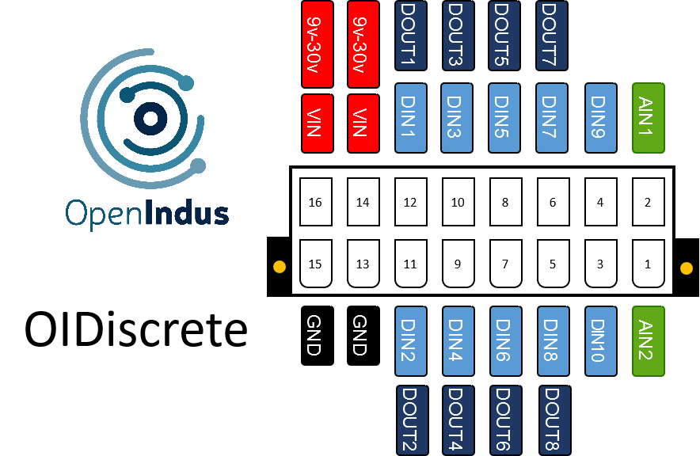
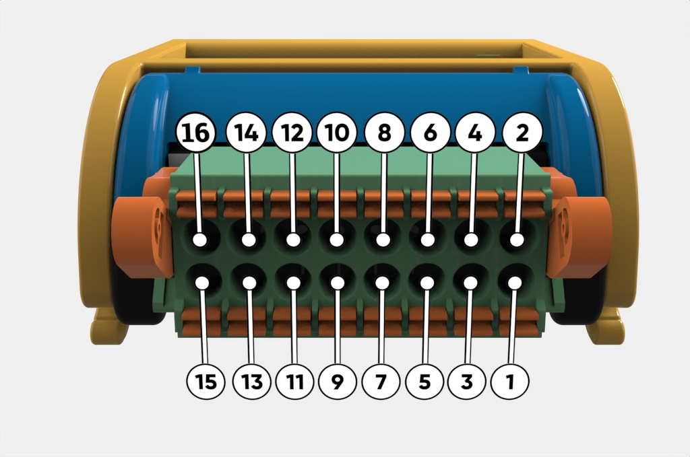

.. _OI-Discrete:

OI-Discrete
===========

Description
-----------

The OI-Discrete module is a versatile input/output (I/O) module designed to facilitate digital signal processing within various industrial applications. 

**Key Features:**

* Digital Inputs: The module provides 10 digital input channels, facilitating the connection of external sensors, switches, or other digital devices.
* Digital Outputs: With 8 digital output channels, the module enables control of external devices or actuators through digital signals.
* Analog Inputs: Additionally, the module includes 2 analog input channels, allowing for the processing of continuous voltage. 
  These analog inputs are not suitable for reading low-impedance sensors but are convenient for reading power supply voltage or conditioned analog signals.

**Compact Design:**
The module comes in a compact BOI12 package, saving space in control cabinets. 
It's easy to install, with up to four modules fitting on a single rail. 
This scalability makes it simple to expand the system based on specific needs.

.. note::
  The OI-Discrete module functions either as a standalone unit (with user code injected directly) or as a slave unit (with user code executed on a Master module, 
  receiving commands via the communication bus).

Pinout
------

The pinout of the module is as follow : 

|

|

.. note:: The Digital Input [1-8] and Digital Output [1-8] share the same physical pin mapping. This is convenient for reading back the value of an output.

Functions
---------

Below are the specifications for the OI-Discrete module. Click on the links in the function table to explore its I/O details, including access to code examples and programming APIs.

.. list-table:: OI-Discrete module hardware characteristics
   :widths: 55 45
   :align: center

   * - Power Supply Voltage
     - 9..30V DC
   * - :ref:`Digital inputs (DIN) <din_s>`
     - 10
   * - :ref:`Digital output (DOUT) <dout_s>`
     - 8
   * - :ref:`Analog inputs 0-30V (AIN) <ain0-30_s>`
     - 2
   * - CPU
     - ESP32-S3 (8MB)
   * - Programming interface
     - USB micro B
   * - Consumption (all outputs disabled)
     - < 1W
   * - Temperature range
     - -20 °C... +70°C
   * - Package
     - BOI12 (50.47x53.81x27mm)

