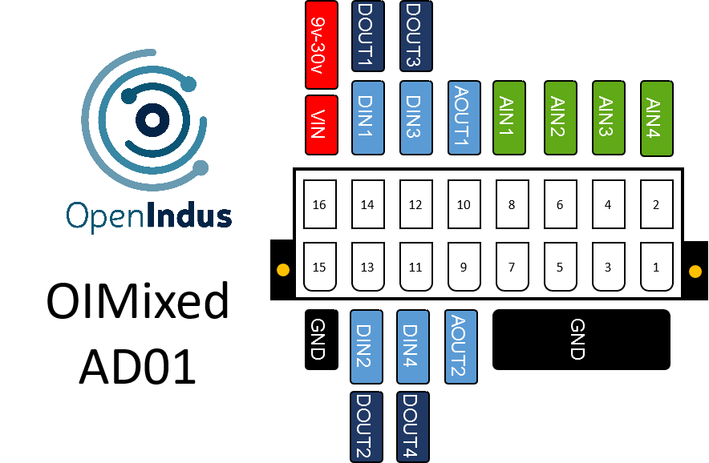

.. _OI-Mixed:

OI-Mixed
========

Description
-----------

The OI-Mixed module is a versatile input/output (I/O) module designed to facilitate both digital and analog signal processing within various industrial applications. 
With its compact form factor and comprehensive array of inputs and outputs, it offers flexibility and efficiency in system integration.

**Key Features:**

* Digital Outputs: The module provides four digital outputs, enabling the control of external devices or actuators through digital signals.
* Digital Inputs: It includes four digital inputs, allowing the module to receive binary signals from external sources.
* Analog Inputs: Featuring four analog input channels, the module is capable of processing continuous voltage or current signals from sensors or transducers.
* Analog Outputs: Additionally, the module offers two analog output channels, enabling the generation of voltage or current signals to drive compatible devices.

**Versatility:**
The OI-Mixed Module is particularly well-suited for interfacing with sensors utilizing the 4-20mA current loop standard, as well as those employing the 0-10V voltage range. 
This versatility ensures compatibility with diverse sensor configurations commonly found in industrial environments.

**Compact Design:**
The module comes in a compact BOI12 package, saving space in control cabinets. 
It's easy to install, with up to four modules fitting on a single rail. 
This scalability makes it simple to expand the system based on specific needs.

.. note::
  The OI-Mixed module functions either as a standalone unit (with user code injected directly) or as a slave unit (with user code executed on a Master module,
  receiving commands via the communication bus).

Pinout
------

The pinout of the module is as follow : 

|

Functions
---------

Below are the specifications for the OI-Mixed module. Click on the links in the function table to explore its I/O details, including access to code examples and programming APIs.

.. list-table:: OI-Mixed module hardware characteristics
   :widths: 55 45
   :align: center

   * - :ref:`Power Supply Voltage <power_s>`
     - 9..30V DC
   * - :ref:`Digital inputs (DIN) <din_s>`
     - 4
   * - :ref:`Digital output (DOUT) <dout_s>`
     - 4
   * - :ref:`Analog inputs 0-10V/4-20mA (AIN) <ain0-10_s>`
     - 4
   * - :ref:`Analog outputs 0-10V/4-20mA (AOUT) <aout0-10_s>`
     - 2
   * - CPU
     - ESP32-S3 (8MB)
   * - Programming interface
     - USB micro B
   * - Consumption (all outputs disabled)
     - < 1W
   * - Temperature range
     - -20 °C... +70°C
   * - Package
     - BOI12 (50.47x53.81x27mm)