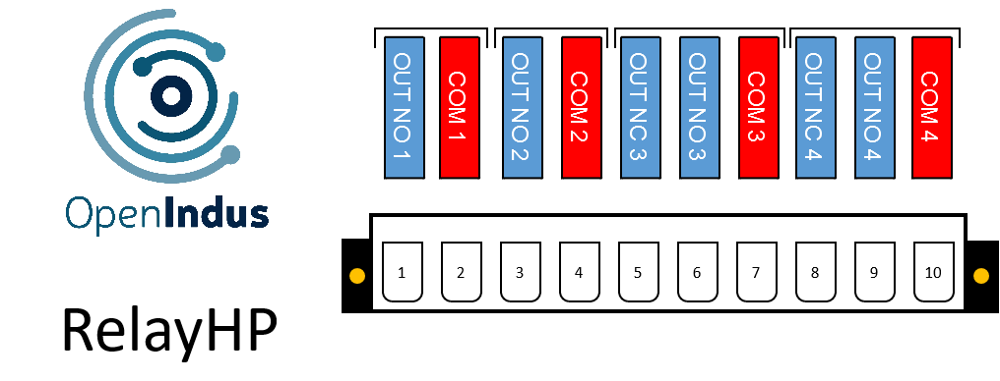

.. _OI-RelayHP:

OI-RelayHP
==========

Description
-----------

The OI-RelayHP (HP indicating high power) module is a relay module designed to handle mains AC voltage (230VAC) as well as DC voltage (30VDC) with a maximum current rating of up to 6A.
Its versatile configuration and compatibility make it suitable for various applications requiring relay-based switching.

**Key Features:**

* Four Channels: The module features four relay channels, divided into two configurations:
  * Two channels with Normally Open (NO) contacts.
  * Two channels with a combination of Normally Open (NO) and Normally Closed (NC) contacts.
* Compatibility: OI-RelayHP is optimized for handling dry contacts and power applications, making it suitable for a wide range of industrial settings.
* High Power Handling: With its ability to manage mains AC voltage up to 230VAC and currents of up to 6A, the module is capable of handling high-power loads effectively.
* Small Package: Housed in a compact package format known as BOI13, the module offers space-efficient installation. 
  This design enables users to mount up to three modules on a single rail, enhancing scalability and flexibility in system configuration.

.. warning::
  To segregate the primary voltage and logic supply voltages, the OI-RelayHP module lacks a supply pin on the header block. 
  Consequently, it can only be utilized as a slave unit, wherein user code is executed on a Master module, and commands are transmitted via the communication bus.

Pinout
------

The pinout of the module is as follow : 

|

Functions
---------

Below are the specifications for the OI-RelayHP module. Click on the links in the function table to explore its I/O details, including access to code examples and programming APIs.

.. list-table:: OI-RelayHP module hardware characteristics
   :widths: 55 45
   :align: center

   * - :ref:`Relay outputs <mechanicalrelay_s>`
     - 2 NO and 2 NO+NC
   * - CPU
     - ESP32-S3 (8MB)
   * - Programming interface
     - USB micro B
   * - Consumption (all outputs disabled)
     - < 1W
   * - Temperature range
     - -20 °C... +70°C
   * - Package
     - BOI13 (75.97x53.81x27mm)

