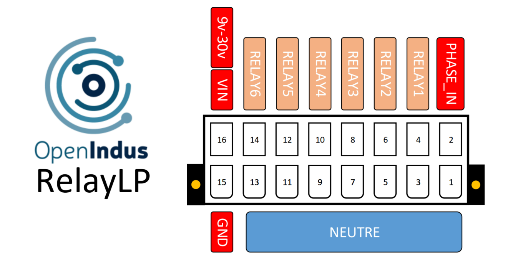

.. _OI-RelayLP:

OI-RelayLP
==========

Description
-----------

The OI-RelayLP (LP indicating low power) module is a static-relay module designed to handle mains AC voltage (230VAC) with a maximum current rating of up to 1A.
Its versatile configuration and compatibility make it suitable for various applications requiring static relay-based switching.

Pinout
------

The pinout of the module is as follow : 

|

Functions
---------

.. list-table:: OI-RelayLP module hardware characteristics
   :widths: 55 45
   :align: center
   
   * - :ref:`Power Supply Voltage <power_s>`
     - 9..30V DC
   * - :ref:`Static Relay outputs <staticrelay_s>`
     - 6
   * - CPU
     - ESP32-S3 (8MB)
   * - Programming interface
     - USB micro B
   * - Consumption (all outputs disabled)
     - < 1W
   * - Temperature range
     - -20 °C... +70°C
   * - Package
     - BOI13 (75.97x53.81x27mm)