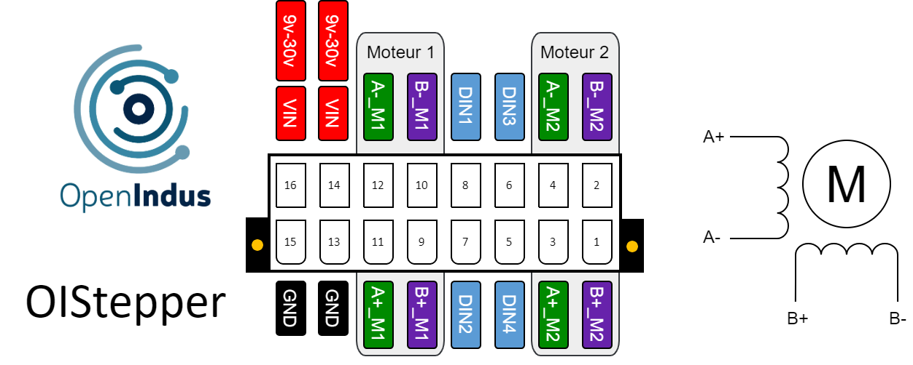

.. _OI-Stepper:

OI-Stepper
==========

Description
-----------

The OIStepper module is the OpenIndus product card designed to control 2 stepper motors with a maximum size of NEMA 24.

**Key Features:**

* Compatibility: The module is designed to control two stepper motors of NEMA 24 size or smaller.
* Current Handling: Each output powering a motor phase can withstand a nominal current of 4.2A RMS a maximum current of 6A peak.
* Digital Inputs: The module provides 4 digital input channels, facilitating the connection of external sensors or switches, such as end-of-travel sensors, which are widely used in systems equipped with stepper motors.

The OIStepper module provides precise control and efficient management of stepper motors, making it ideal for various industrial automation applications requiring reliable motion control.

.. note::
  The OI-Stepper module functions either as a standalone unit (with user code injected directly) or as a slave unit (with user code executed on a Master module,
  receiving commands via the communication bus).

Pinout
------

The pinout of the module is as follow : 

|

.. image:: ../_static/rendu_realiste_bornier.jpg
    :width: 400
    :alt: Terminal block pinout
    :align: center

|

Functions
---------

Below are the specifications for the OI-Stepper module. Click on the links in the function table to explore its I/O details, including access to code examples and programming APIs.

.. list-table:: OI-Stepper module hardware characteristics
   :widths: 55 45
   :align: center

   * - Power Supply Voltage
     - 9..30V DC
   * - :ref:`Stepper motor driver <motorstepper_s>`
     - 2
   * - :ref:`Digital inputs (DIN) <din_s>`
     - 4
   * - CPU
     - ESP32-S3 (8MB)
   * - Programming interface
     - USB micro B
   * - Consumption (all outputs disabled)
     - < 1W
   * - Temperature range
     - -20 °C... +70°C
   * - Package
     - BOI13 (75.97x53.81x27mm)