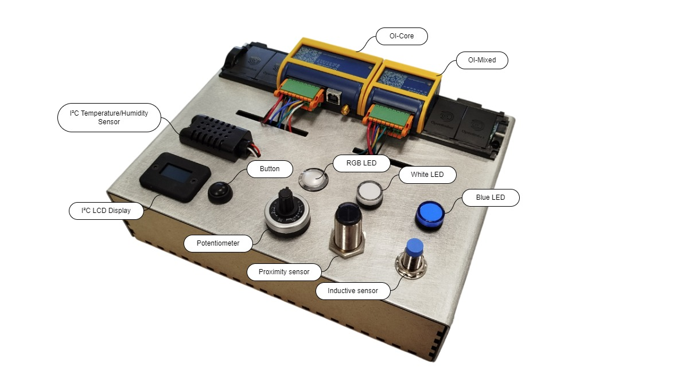
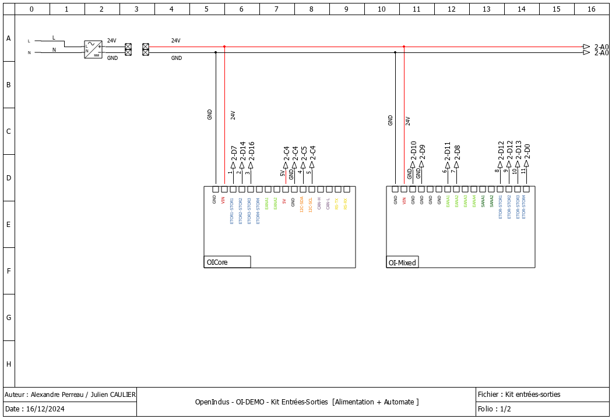
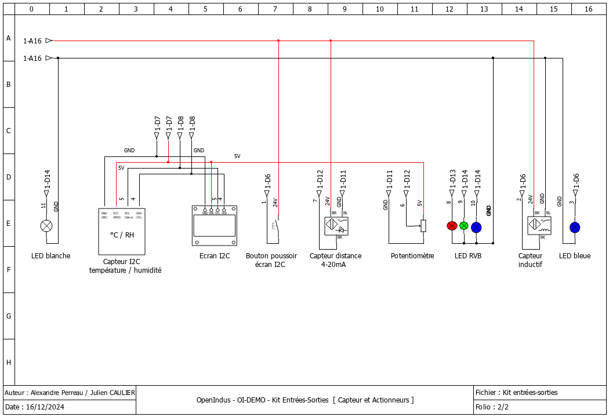

.. _OI-DEMO Input-Output:

OI-DEMO Input/Output
====================

Goals
-----
* Introducing :ref:`Environment Installation<get_started_oivscodeextension>`
* Introducing Openindus modules : :ref:`OI-Core<OI-Core>` and :ref:`OI-Mixed<oi-mixed>`
* Read values from I²C sensor
* Diplay info on I²C display
* Manage input events with tasks and interrupts
* Read analog voltages
* Drive an RGB Led with PWM outputs
* Drive Leds with outputs

Requirements
------------
* Visual Studio Code
* VSCode Openindus extension (Recommanded)
* SiliconLabs USB Driver installed (CP2102N - USB<->UART)
* Understanding :ref:`Start coding<start_coding-index>` chapter

------------

Description
-----------

Wiring diagrams
---------------

Demo IO kit is wired as described below : 

------------

Source code details
-------------------

* Libraries declaration

    First, include all libraries needed for each sensor or output devices.

    .. code-block:: cpp

        // Peripherals libs
        #include "Adafruit_I2CDevice.h"
        #include "Adafruit_GFX.h"
        #include "Adafruit_SSD1306.h"
        #include "Adafruit_Sensor.h"
        #include "Fonts/FreeMono9pt7b.h"
        #include "Adafruit_AM2320.h"

------------

* OI Modules instances

    .. code-block:: cpp

        // First, init the master device
        OICore core;

        // Then add slaves devices here :
        OIMixed mixed1;

    These lines should be automatically created while using OpenIndus extension.
    It creates instances for each OI Module found on the OI-Rail.

------------

* Variables / constants declaration

    .. code-block:: cpp

        // Declarations for button debounce function
        hw_timer_t * timer = NULL;
        unsigned long lastDebounceTime;
        bool debounceexpired = true;
        #define DEBOUNCEDELAY   200

    For the button debounce function, we need a timer (hw_timer_t) and variables to use it.
    See below.

    .. code-block:: cpp

        // Declarations for PWM : RGB led and white led
        #define PWM_MAX_VAL     16384 // 14 bits resolution

    PWM_MAX_VAL define the max value for PWM functions (RGB and Led outputs)

    .. code-block:: cpp

        // Declarations for LCD display
        #define SCREEN_WIDTH    128 // OLED display width, in pixels
        #define SCREEN_HEIGHT   64 // OLED display height, in pixels
        // Declaration for an SSD1306 display connected to I2C (SDA, SCL pins)
        #define OLED_RESET      -1 // Reset pin # (or -1 if sharing Arduino reset pin)
        #define SCREEN_ADDRESS  0x3D ///< See datasheet for Address; 0x3D for 128x64, 0x3C for 128x32

        // declare LCD display
        Adafruit_SSD1306 display(SCREEN_WIDTH, SCREEN_HEIGHT, &Wire, OLED_RESET);
        // declare humidity and temperature sensor
        Adafruit_AM2320 th_sensor = Adafruit_AM2320();
        // Declare semaphore
        SemaphoreHandle_t xMutex = NULL;
    

    Constants declarations are about size of the LCD Display.
    For SCREEN_ADDRESS, please refer to LCD Display datasheet.

    .. code-block:: cpp

        // declare humidity and temperature sensor
        Adafruit_AM2320 th_sensor = Adafruit_AM2320();

    Create an instance of temperature and humidity sensor.

------------

* **Setup()** function

    This function is executed once at startup. Initialisations have to be done here.

    .. code-block:: cpp

        Serial.begin(115200);

    Initialise serial interface (USB) at 115200 bauds. Debug message will be displayed on a terminal software configured à 115200 bauds 8-N-1 (8 bits, Parity Even, 1 stop bit).

    .. code-block:: cpp
     
        // SSD1306_SWITCHCAPVCC = generate display voltage from 3.3V internally
        if(!display.begin(SSD1306_SWITCHCAPVCC, 0x3C)) 
        { 
            Serial.println(F("SSD1306 allocation failed"));
            for(;;); // Don't proceed, loop forever
        }

    LCD Display has to generate its own 3.3V, initialise internal register with this setup.

    .. code-block:: cpp
     
        // Show initial display buffer contents on the screen --
        // the library initializes this with an Adafruit splash screen.
        display.setFont((const GFXfont *)&FreeMono9pt7b);
        display.display();
        delay(2000); // Pause for 2 seconds
        // Clear the buffer
        display.clearDisplay();

    Set Font to use while displaying text.
    Then clear screen after Adafruit logo sequence (2 seconds long).

    .. code-block:: cpp
     
        // set AIN_1 to analog mode with voltage measure (potentiometer)
        mixed1.analogInputMode(AIN_1, AIN_MODE_VOLTAGE);
        mixed1.analogInputVoltageRange(AIN_1, AIN_VOLTAGE_RANGE_0_5V12 );
        // set AIN_2 to analog mode with current measure (proximity sensor)
        mixed1.analogInputMode(AIN_2, AIN_MODE_CURRENT);

    Initialize analog inputs :

        - **OI-Mixed[AIN1]** is wired to the potentiometer so we specify this input as an analog voltage mode.
        - As potentiometer is supply by 5V, **OI-Mixed[AIN1]** is set to a range from 0 - 5.12V to get full scale resolution of ADC. 

        - **OI-Mixed[AIN2]** is wired to 4-20mA sensor (proximity sensor), so we specify this input as an current input.

    .. code-block:: cpp
     
        // set PWM outputs for RGB led
        mixed1.outputMode(DOUT_1, DOUT_MODE_PWM );   // Red Led
        mixed1.outputMode(DOUT_2, DOUT_MODE_PWM );   // Green led
        mixed1.outputMode(DOUT_3, DOUT_MODE_PWM );   // Blue led
    
    Set PWM ouputs for RGB LED : **OI-Mixed[DOUT_x]**. Each led of the RGB LED is driven by a PWM to set luminosity of each color individualy.

    .. code-block:: cpp
             
        // set PWM frequency
        mixed1.setPWMFrequency(DOUT_1, 100);
        mixed1.setPWMFrequency(DOUT_2, 100);
        mixed1.setPWMFrequency(DOUT_3, 100);

    Set frequency of each PWM output. For RGB led, 100 Hz will be enough to avoir retinal persistence.

    .. code-block:: cpp
        
        // set all RGB leds off
        mixed1.setPWMDutyCycle(DOUT_1, 0);
        mixed1.setPWMDutyCycle(DOUT_2, 0);
        mixed1.setPWMDutyCycle(DOUT_3, 0);

    By default, set cycle to 0 to shutdown RGB leds at startup.

    .. code-block:: cpp
        
        // set PWM outputs for white led
        mixed1.outputMode(DOUT_4, DOUT_MODE_PWM );
        // set PWM frequency
        mixed1.setPWMFrequency(DOUT_4, 100);
        // set white led off
        mixed1.setPWMDutyCycle(DOUT_4, 0);

    Proceed to same configuration for the white Led wired on **OI-Mixed[DOUT_4]**.

    .. code-block:: cpp
     
        core.attachInterrupt(DIN_1, displaymodechange, RISING_MODE, NULL );

    This function configures an interrupt : a rising event on **OI-Core[DIN_1]** will call **displaymodechange()** function.

    .. code-block:: cpp
     
        core.attachInterrupt(DIN_2, blue_led, CHANGE_MODE, NULL );

    This function configures an interrupt : a rising or falling event on **OI-Core[DIN_2]** will call **blue_led()** function.

    .. code-block:: cpp

        xTaskCreate(measuredistance, "Measure distance", 20000, NULL, 1, NULL);

    This function create a task **measuredistance()** that runs in parallel of **Loop()** function. Its priority is set to 1.

    .. code-block:: cpp
     
        xTaskCreate(rgb_pot, "rgb_pot", 10000, NULL, 2, NULL);

    This function create a task **rgb_pot()** that runs in parallel of **Loop()** function. Its priority is set to 2, that is an higher priority than **measuredistance()**.

    .. code-block:: cpp
     
        Serial.println(F("Setup done."));

    When everything is initialized, we can send a debug message.
    

------------

* **Loop()** function

    .. code-block:: cpp
     
        void loop(void)
        {

            switch(display_mode)
            {
                case 0 :
                default:
                    displaytemperature();
                    break;
                
                case 1 :
                    displayhumidity();
                    break;

                case 2 :
                    displaydistance();
                    break;   
            }

            delay(100);
        }

    The main function is looping on the management of the rolling menu that changes display content on each button action.
    Interrupt function attached to the button event incremets 'display_mode' variable.

    'delay(100)' is strongly recommended in the loop() function to let operating system execute its own task.

------------

* **Others functions called in Setup() and Loop() functions**

    * displaytemperature()

        .. code-block:: cpp

            void displaytemperature(void) 
            {
                display.clearDisplay();
                display.setTextSize(1);         
                display.setTextColor(WHITE);  
                display.setCursor(0,25);          
                display.println(F("Temperature: "));
                display.setCursor(25,45);
                display.print(th_sensor.readTemperature(), 2);
                display.println(F(" °C"));
                display.display();
            }

        This function is called periodically in the Loop() function.
        Temperature is get from sensor and displayed on LCD.

    * displayhumidity()

        .. code-block:: cpp

            void displayhumidity(void) 
            {
                display.clearDisplay();
                display.setTextSize(1);             
                display.setTextColor(WHITE);        
                display.setCursor(15,25);             
                display.println(F("Humidite: "));
                display.setCursor(25,45);
                display.print(th_sensor.readHumidity(), 2);
                display.println(F(" %"));
                display.display();
            }

        This function is called periodically in the Loop() function.
        Humidity is get from sensor and displayed on LCD.

    * displaydistance()

        .. code-block:: cpp

            void displaydistance(void)
            {
                display.clearDisplay();
                display.setTextSize(1);             
                display.setTextColor(WHITE);        
                display.setCursor(15,25);   
            
                display.println(F("Distance: "));

                // meandistance is computed periodically in measuredistance()
                if (meandistance <= 10)
                {
                    display.setCursor(25,45);
                    display.println(F(" < 10 mm"));
                    meandistance = 10;
                }
                else if (meandistance >= 100)
                {
                    display.setCursor(25,45);
                    display.println(F(" > 100 mm"));
                    meandistance = 100;
                }
                else
                {
                    display.setCursor(25,45);
                    display.print(meandistance, 2);
                    display.println(F(" mm"));
                }
                display.display();
            }

        This function is called periodically in the **Loop(**) function.

        **meandistance** is get from a global variable and displayed on LCD.

        **meandistance** is computed by :ref:`measuredistance()<measuredistance-index>` that is a task dedicated to this measure.

    .. _measuredistance-index:

    * measuredistance()

        .. code-block:: cpp

            void measuredistance(void*)
            {
                int nSAMPLES = 10;
                std::vector<float> rdist;
                rdist.resize(nSAMPLES);

                // infinite loop for capturing distance
                while(1)
                {
                    // acquire multiple values of distance
                    for(int i=0; i < nSAMPLES; i++)
                    {
                        rdist[i] = 5.625 * mixed1.analogReadMilliAmp(AIN_2) - 12.5;  
                        delay(5);
                    }

                    // compute mean distance over multiple samples
                    std::sort(rdist.begin(), rdist.end());
                    size_t size = rdist.size();
                    if (size % 2 == 0) 
                    {
                        // store result in global variable, may be use in  displaydistance()
                        meandistance =  (rdist[size / 2 - 1] + rdist[size / 2]) / 2.0;
                    } 
                    else 
                    {
                        // store result in global variable, may be use in  displaydistance()
                        meandistance = rdist[size / 2];
                    }

                    // set out of range value to 0-100
                    if (meandistance > 100)
                    {
                        meandistance = 100; 
                    }
                    else if (meandistance < 10)
                    {
                        meandistance = 10; 
                    }
                    
                    // PWM duty cycle resolution is 2^14 . remapping is reversed to increase luminosity while decreasing distance (led is off when distance is > 100 mm)
                    // remap meandistance to 0-16384 pwm range
                    int pwmwhiteled = map(meandistance, 10, 100, PWM_MAX_VAL, 0);
                    // adjust white led intensity
                    mixed1.setPWMDutyCycle(DOUT_4, pwmwhiteled);
                    
                    delay(5);
                }
            }

        This function compute median value of distance over 100 acquisitions in an infinite loop (**while(1)**).

        .. code-block:: cpp

            // acquire multiple values of distance
            for(int i=0; i < nSAMPLES; i++)
            {
                rdist[i] = 5.625 * mixed1.analogReadMilliAmp(AIN_2) - 12.5;  
                delay(5);
            }

        With this code, a table a 100 values is filled with an analog read of OI-mixed[AIN_2] input.
        Analog read is converter to millimeter with a formula.

        .. code-block:: cpp

            // compute mean distance over multiple samples
            std::sort(rdist.begin(), rdist.end());
            size_t size = rdist.size();
            if (size % 2 == 0) 
            {
                // store result in global variable, may be use in  displaydistance()
                meandistance =  (rdist[size / 2 - 1] + rdist[size / 2]) / 2.0;
            } 
            else 
            {
                // store result in global variable, may be use in  displaydistance()
                meandistance = rdist[size / 2];
            }

        A median value is better than a mean value because it cancels errors from sensor.
        *The median is the value in the middle of a data set, meaning that 50% of data points have a value smaller or equal to the median and 50% of data points have a value higher or equal to the median.*
        To compute the median value, an easy method consist to sort values of a table and read the value in the middle of this table.

        .. code-block:: cpp        

            // set out of range value to 0-100
            if (meandistance > 100)
            {
                meandistance = 100; 
            }
            else if (meandistance < 10)
            {
                meandistance = 10; 
            }

        Proximity sensor has a measure range given for 10mm to 100 mm. To stay in this range where sensor has garanted measure, we limit value to this range.

        .. code-block:: cpp   

            // PWM duty cycle resolution is 2^14 . remapping is reversed to increase luminosity while decreasing distance (led is off when distance is > 100 mm)
            // remap meandistance to 0-16384 pwm range
            int pwmwhiteled = map(meandistance, 10, 100, PWM_MAX_VAL, 0);
            // adjust white led intensity
            mixed1.setPWMDutyCycle(DOUT_4, pwmwhiteled);
            
            delay(5);

        After median value is computed, the white led PWM output is update to adjuste luminosity.
        The lower distance, the lower luminosity.
        **map()** function is useful to convert a range value to an other one.
        In this code we convert [10-100] range to [16384-0] (PWM_MAX_VAL) range. It allows to convert distance to PWM equivalent value and inverting value.

        

    * displaymodechange()

        .. code-block:: cpp

            void displaymodechange(void*)
            {
                // if debounce time is expired
                if( (millis() - lastDebounceTime) >= DEBOUNCEDELAY)
                {
                    // we can enable again new event
                    debounceexpired = true;
                }

                // if debounce time is expired, we can accept a new button event
                if (debounceexpired == true)
                {
                    // same timestamp of event
                    lastDebounceTime = millis();
                    // reset debounceexpired flag
                    debounceexpired = false;
                    // update display mode
                    display_mode++;
                    if (display_mode >= 3)
                    {
                        display_mode = 0;
                    }
                }
            }

        **displaymodechange()** is called on every rising event of push button.
        This button has to change the value of **display_mode** variable in order to change value displayed on LCD.

        Mechanical buttons make electricals bounces that can cause unwanted multiple detections. To avoid these unwanted detection, we can add a debounce function.
        This debounce function use **millis()** (milliseconds elapsed since startup). 
        At the first rising event of button, we store **millis()** in a variable.
        Since the debounce time is not elapsed , we do not consider a rising event as a new event.

    * blue_led()

        .. code-block:: cpp

            void blue_led(void*)
            {
                static int inductive_sensor;
                inductive_sensor = core.digitalRead(DIN_2);
                if (inductive_sensor == 1)
                {
                    core.digitalWrite(DOUT_3, HIGH);
                }
                else
                {
                    core.digitalWrite(DOUT_3, LOW);
                }
            }

        **blue_led()** is called on every change of magnetic sensor state.
        This function set blue led ouput (OI-Mixed[DOUT_3]) following inductive sensor output state (OI-Mixed[DIN_2]).

    * rgb_pot()

        .. code-block:: cpp

            void rgb_pot(void*)
            {
                // Values for each pin of the RGB LED.
                int currentColorValueRed = 0;
                int currentColorValueGreen = 0 ;
                int currentColorValueBlue = 0 ;
                int potPinValue;

                while(1)
                {
                    // read potentiometer value (0 - 4096)
                    // and convert it to a RGB range (0 - PWM_MAX_VAL).
                    potPinValue = map(mixed1.analogRead(AIN_1), 0, 4096, 0, PWM_MAX_VAL);

                    // Explanation of the code can be found on this link :
                    // https://electronics.stackexchange.com/questions/240185/controlling-color-and-brightness-of-rgb-led-strip-using-one-potentiometer
                    // Note: 1/6th of 255 is 42.5

                    if (potPinValue <= (PWM_MAX_VAL * 1/6)) 
                    {
                        currentColorValueRed = PWM_MAX_VAL;
                        currentColorValueGreen = potPinValue * 6;
                        currentColorValueBlue = 0;
                    }
                
                    if ((potPinValue > (PWM_MAX_VAL * 1/6)) && (potPinValue <= (PWM_MAX_VAL * 2/6))) 
                    {
                        currentColorValueRed = PWM_MAX_VAL - (potPinValue - (PWM_MAX_VAL * 1/6)) * 6;
                        currentColorValueGreen = PWM_MAX_VAL;
                        currentColorValueBlue = 0;
                    }
                
                    if ((potPinValue > (PWM_MAX_VAL * 2/6)) && (potPinValue <= (PWM_MAX_VAL * 3/6))) 
                    {
                        currentColorValueRed = 0;
                        currentColorValueGreen = PWM_MAX_VAL;
                        currentColorValueBlue = (potPinValue - (PWM_MAX_VAL * 2/6)) * 6;
                    }
                
                    if ((potPinValue > (PWM_MAX_VAL * 3/6)) && (potPinValue <= (PWM_MAX_VAL * 4/6))) 
                    {
                        currentColorValueRed = 0;
                        currentColorValueGreen = PWM_MAX_VAL - (potPinValue - (PWM_MAX_VAL * 3/6)) * 6;
                        currentColorValueBlue = PWM_MAX_VAL;
                    }
                
                    if ((potPinValue > (PWM_MAX_VAL* 4/6)) && (potPinValue <= (PWM_MAX_VAL* 5/6))) 
                    {
                        currentColorValueRed = (potPinValue - (PWM_MAX_VAL* 4/6)) * 6;
                        currentColorValueGreen = 0;
                        currentColorValueBlue = PWM_MAX_VAL;
                    }
                    
                    if ((potPinValue > (PWM_MAX_VAL* 5/6)) && (potPinValue <= (PWM_MAX_VAL* 6/6))) 
                    {
                        currentColorValueRed = PWM_MAX_VAL;
                        currentColorValueGreen = 0;
                        currentColorValueBlue = PWM_MAX_VAL - (potPinValue - (PWM_MAX_VAL* 5/6)) * 6;
                    }
                
                    // adjust RGB colors following measured potentiometer value
                    mixed1.setPWMDutyCycle(DOUT_1, currentColorValueRed);
                    mixed1.setPWMDutyCycle(DOUT_2, currentColorValueGreen);
                    mixed1.setPWMDutyCycle(DOUT_3, currentColorValueBlue);
                    delay(50);
                }
            }

        **rgb_pot()** is a task that run in an infinite loop.
        This loop update RGB leds color following position of the potentiometer.

        potentiometer value is read on OI-Mixed[AIN_1] input.
        This analog value [0-4096] is converted with **map()** function into PWM range value [0-16384].

        To drive each color (Red, Green and Blue) from a single value, the principle is to convert into six quadrants as presented in the figure below.

        **potPinValue** value is divided in a sixth and then each RGB value is affected to a value as described in the figure.

        .. image:: ../_static/rgb.png

Source code (full)
-------------------
.. code-block:: cpp

    #include "OpenIndus.h"
    #include "Arduino.h"

    // Peripherals libs
    #include "Adafruit_I2CDevice.h"
    #include "Adafruit_GFX.h"
    #include "Adafruit_SSD1306.h"
    #include "Adafruit_Sensor.h"
    #include "Fonts/FreeMono9pt7b.h"
    #include "Adafruit_AM2320.h"

    // First, init the master device
    OICore core;

    // Then add slaves devices here :
    OIMixed mixed1;

    // Declarations for button debounce function
    hw_timer_t * timer = NULL;
    unsigned long lastDebounceTime;
    bool debounceexpired = true;
    #define DEBOUNCEDELAY   200

    // Declarations for PWM : RGB led and white led
    #define PWM_MAX_VAL     16384 // 14 bits resolution

    // Declarations for LCD display
    #define SCREEN_WIDTH    128 // OLED display width, in pixels
    #define SCREEN_HEIGHT   64 // OLED display height, in pixels
    // Declaration for an SSD1306 display connected to I2C (SDA, SCL pins)
    #define OLED_RESET      -1 // Reset pin # (or -1 if sharing Arduino reset pin)
    #define SCREEN_ADDRESS  0x3D ///< See datasheet for Address; 0x3D for 128x64, 0x3C for 128x32

    // declare LCD display
    Adafruit_SSD1306 display(SCREEN_WIDTH, SCREEN_HEIGHT, &Wire, OLED_RESET);
    // declare humidity and temperature sensor
    Adafruit_AM2320 th_sensor = Adafruit_AM2320();

    // Variable that store current mode
    int display_mode = 0;
    // Declare globle variable for proximity sensor
    float meandistance;

    void displaymodechange(void*)
    {
        // if debounce time is expired
        if( (millis() - lastDebounceTime) >= DEBOUNCEDELAY)
        {
            // we can enable again new event
            debounceexpired = true;
        }

        // if debounce time is expired, we can accept a new button event
        if (debounceexpired == true)
        {
            // same timestamp of event
            lastDebounceTime = millis();
            // reset debounceexpired flag
            debounceexpired = false;
            // update display mode
            display_mode++;
            if (display_mode >= 3)
            {
                display_mode = 0;
            }
        }
    }

    void blue_led(void*)
    {
        static int inductive_sensor;
        inductive_sensor = core.digitalRead(DIN_2);
        if (inductive_sensor == 1)
        {
            core.digitalWrite(DOUT_3, HIGH);
        }
        else
        {
            core.digitalWrite(DOUT_3, LOW);
        }
    }

    void displaytemperature(void) 
    {
        display.clearDisplay();
        display.setTextSize(1);         
        display.setTextColor(WHITE);  
        display.setCursor(0,25);          
        display.println(F("Temperature: "));
        display.setCursor(25,45);
        display.print(th_sensor.readTemperature(), 2);
        display.println(F(" °C"));
        display.display();
    }

    void displayhumidity(void) 
    {
        display.clearDisplay();
        display.setTextSize(1);             
        display.setTextColor(WHITE);        
        display.setCursor(15,25);             
        display.println(F("Humidite: "));
        display.setCursor(25,45);
        display.print(th_sensor.readHumidity(), 2);
        display.println(F(" %"));
        display.display();
    }

    void measuredistance(void*)
    {
        int nSAMPLES = 10;
        std::vector<float> rdist;
        rdist.resize(nSAMPLES);

        // infinite loop for capturing distance
        while(1)
        {
            // acquire multiple values of distance
            for(int i=0; i < nSAMPLES; i++)
            {
                rdist[i] = 5.625 * mixed1.analogReadMilliAmp(AIN_2) - 12.5;  
                delay(5);
            }

            // compute mean distance over multiple samples
            std::sort(rdist.begin(), rdist.end());
            size_t size = rdist.size();
            if (size % 2 == 0) 
            {
                // store result in global variable, may be use in  displaydistance()
                meandistance =  (rdist[size / 2 - 1] + rdist[size / 2]) / 2.0;
            } 
            else 
            {
                // store result in global variable, may be use in  displaydistance()
                meandistance = rdist[size / 2];
            }

            // set out of range value to 0-100
            if (meandistance > 100)
            {
                meandistance = 100; 
            }
            else if (meandistance < 10)
            {
                meandistance = 10; 
            }
            
            // PWM duty cycle resolution is 2^14 . remapping is reversed to increase luminosity while decreasing distance (led is off when distance is > 100 mm)
            // remap meandistance to 0-16384 pwm range
            int pwmwhiteled = map(meandistance, 10, 100, PWM_MAX_VAL, 0);
            // adjust white led intensity
            mixed1.setPWMDutyCycle(DOUT_4, pwmwhiteled);
            
            delay(5);
        }
    }

    void displaydistance(void)
    {
        display.clearDisplay();
        display.setTextSize(1);             
        display.setTextColor(WHITE);        
        display.setCursor(15,25);   
    
        display.println(F("Distance: "));

        // meandistance is computed periodically in measuredistance()
        if (meandistance <= 10)
        {
            display.setCursor(25,45);
            display.println(F(" < 10 mm"));
            meandistance = 10;
        }
        else if (meandistance >= 100)
        {
            display.setCursor(25,45);
            display.println(F(" > 100 mm"));
            meandistance = 100;
        }
        else
        {
            display.setCursor(25,45);
            display.print(meandistance, 2);
            display.println(F(" mm"));
        }
        display.display();
    }

    void rgb_pot(void*)
    {
        // Values for each pin of the RGB LED.
        int currentColorValueRed = 0;
        int currentColorValueGreen = 0 ;
        int currentColorValueBlue = 0 ;
        int potPinValue;

        while(1)
        {
            // read potentiometer value (0 - 4096)
            // and convert it to a RGB range (0 - PWM_MAX_VAL).
            potPinValue = map(mixed1.analogRead(AIN_1), 0, 4096, 0, PWM_MAX_VAL);

            // Explanation of the code can be found on this link :
            // https://electronics.stackexchange.com/questions/240185/controlling-color-and-brightness-of-rgb-led-strip-using-one-potentiometer
            // Note: 1/6th of 255 is 42.5

            if (potPinValue <= (PWM_MAX_VAL * 1/6)) 
            {
                currentColorValueRed = PWM_MAX_VAL;
                currentColorValueGreen = potPinValue * 6;
                currentColorValueBlue = 0;
            }
        
            if ((potPinValue > (PWM_MAX_VAL * 1/6)) && (potPinValue <= (PWM_MAX_VAL * 2/6))) 
            {
                currentColorValueRed = PWM_MAX_VAL - (potPinValue - (PWM_MAX_VAL * 1/6)) * 6;
                currentColorValueGreen = PWM_MAX_VAL;
                currentColorValueBlue = 0;
            }
        
            if ((potPinValue > (PWM_MAX_VAL * 2/6)) && (potPinValue <= (PWM_MAX_VAL * 3/6))) 
            {
                currentColorValueRed = 0;
                currentColorValueGreen = PWM_MAX_VAL;
                currentColorValueBlue = (potPinValue - (PWM_MAX_VAL * 2/6)) * 6;
            }
        
            if ((potPinValue > (PWM_MAX_VAL * 3/6)) && (potPinValue <= (PWM_MAX_VAL * 4/6))) 
            {
                currentColorValueRed = 0;
                currentColorValueGreen = PWM_MAX_VAL - (potPinValue - (PWM_MAX_VAL * 3/6)) * 6;
                currentColorValueBlue = PWM_MAX_VAL;
            }
        
            if ((potPinValue > (PWM_MAX_VAL* 4/6)) && (potPinValue <= (PWM_MAX_VAL* 5/6))) 
            {
                currentColorValueRed = (potPinValue - (PWM_MAX_VAL* 4/6)) * 6;
                currentColorValueGreen = 0;
                currentColorValueBlue = PWM_MAX_VAL;
            }
            
            if ((potPinValue > (PWM_MAX_VAL* 5/6)) && (potPinValue <= (PWM_MAX_VAL* 6/6))) 
            {
                currentColorValueRed = PWM_MAX_VAL;
                currentColorValueGreen = 0;
                currentColorValueBlue = PWM_MAX_VAL - (potPinValue - (PWM_MAX_VAL* 5/6)) * 6;
            }
        
            // adjust RGB colors following measured potentiometer value
            mixed1.setPWMDutyCycle(DOUT_1, currentColorValueRed);
            mixed1.setPWMDutyCycle(DOUT_2, currentColorValueGreen);
            mixed1.setPWMDutyCycle(DOUT_3, currentColorValueBlue);
            delay(50);
        }
    }

    void setup(void)
    {
        Serial.begin(115200);

        // SSD1306_SWITCHCAPVCC = generate display voltage from 3.3V internally
        if(!display.begin(SSD1306_SWITCHCAPVCC, 0x3C)) 
        { 
            Serial.println(F("SSD1306 allocation failed"));
            for(;;); // Don't proceed, loop forever
        }

        // Show initial display buffer contents on the screen --
        // the library initializes this with an Adafruit splash screen.
        display.setFont((const GFXfont *)&FreeMono9pt7b);
        display.display();
        delay(2000); // Pause for 2 seconds
        // Clear the buffer
        display.clearDisplay();

        // set AIN_1 to analog mode with voltage measure (potentiometer)
        mixed1.analogInputMode(AIN_1, AIN_MODE_VOLTAGE);
        mixed1.analogInputVoltageRange(AIN_1, AIN_VOLTAGE_RANGE_0_5V12 );
        // set AIN_2 to analog mode with current measure (proximity sensor)
        mixed1.analogInputMode(AIN_2, AIN_MODE_CURRENT);

        // set PWM outputs for RGB led
        mixed1.outputMode(DOUT_1, DOUT_MODE_PWM );   // Red Led
        mixed1.outputMode(DOUT_2, DOUT_MODE_PWM );   // Green led
        mixed1.outputMode(DOUT_3, DOUT_MODE_PWM );   // Blue led
        // set PWM frequency
        mixed1.setPWMFrequency(DOUT_1, 100);
        mixed1.setPWMFrequency(DOUT_2, 100);
        mixed1.setPWMFrequency(DOUT_3, 100);
        // set all RGB leds off
        mixed1.setPWMDutyCycle(DOUT_1, 0);
        mixed1.setPWMDutyCycle(DOUT_2, 0);
        mixed1.setPWMDutyCycle(DOUT_3, 0);

        // set PWM outputs for white led
        mixed1.outputMode(DOUT_4, DOUT_MODE_PWM );
        // set PWM frequency
        mixed1.setPWMFrequency(DOUT_4, 100);
        // set white led off
        mixed1.setPWMDutyCycle(DOUT_4, 0);

        core.attachInterrupt(DIN_1, displaymodechange, RISING_MODE, NULL );
        core.attachInterrupt(DIN_2, blue_led, CHANGE_MODE, NULL );
        xTaskCreate(measuredistance, "Measure distance", 20000, NULL, 1, NULL);
        xTaskCreate(rgb_pot, "rgb_pot", 10000, NULL, 2, NULL);

        Serial.println(F("Setup done."));
    }

    void loop(void)
    {

        switch(display_mode)
        {
            case 0 :
            default:
                displaytemperature();
                break;
            
            case 1 :
                displayhumidity();
                break;

            case 2 :
                displaydistance();
                break;   
        }

        delay(100);
    }

