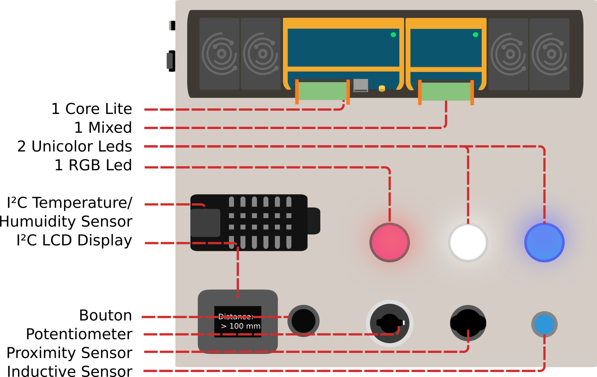
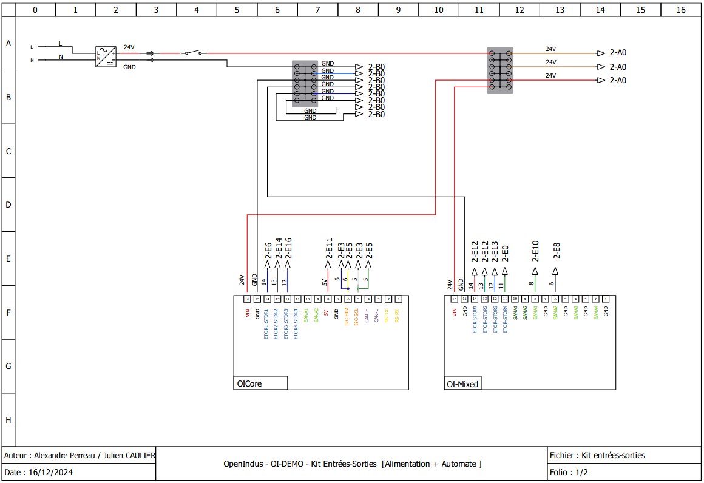
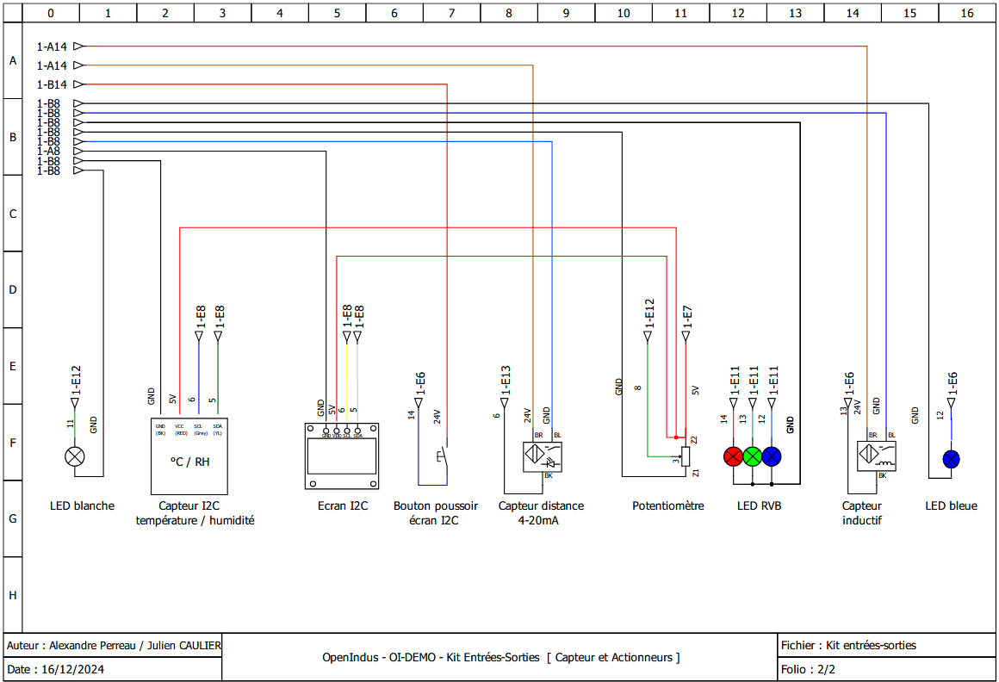

.. _Demo Input-Output Kit:

Demo Input/Output Kit
=====================

1. Introduction
---------------

Who is this tutorial for?
~~~~~~~~~~~~~~~~~~~~~~~~~

This tutorial is intended for developers and makers who want to learn how to use analog and digital
I/O with the **OI-Demo Input/Output** kit. Whether you are new to embedded systems or already
familiar with Arduino-style programming, this guide will walk you through each part of the project
step by step.

Prerequisites
~~~~~~~~~~~~~

* Basic knowledge of C++ and Arduino programming
* A computer with Visual Studio Code installed
* The OpenIndus VS Code extension installed - see :ref:`Environment Installation<get_started_oivscodeextension>`
* SiliconLabs USB driver installed (CP2102N - USB↔UART)
* Familiarity with :ref:`Start coding<start_coding-index>`

What will you learn?
~~~~~~~~~~~~~~~~~~~~

* How to use the :ref:`OI-Core<OI-Core>` and :ref:`OI-Mixed<oi-mixed>` modules together
* How to read values from an I²C temperature and humidity sensor
* How to display information on an I²C OLED screen
* How to manage input events with interrupts and FreeRTOS tasks
* How to read analog voltages and 4-20 mA current signals
* How to drive an RGB LED and a white LED using PWM outputs

------------

2. Discover your kit
--------------------

The Demo Input/Output kit combines sensors and actuators to demonstrate the full range of analog
and digital capabilities of the OI-Mixed module, supervised by an OI-Core master module.

Wiring diagrams
~~~~~~~~~~~~~~~

The Demo IO kit is wired as described in the diagrams below. By following the connections you can
see which pins are used for each sensor or actuator. These pin identifiers will be used throughout
the code examples.

------------

3. Develop your own project
----------------------------

Introduction to OpenIndus IDE
~~~~~~~~~~~~~~~~~~~~~~~~~~~~~~

OpenIndus projects are developed with **Visual Studio Code** and the **OpenIndus extension**.
The extension handles project creation, compilation, and flashing directly from the editor.

Refer to the :ref:`Environment Installation<get_started_oivscodeextension>` guide to set up your
workspace if you have not done so yet.

Introduction to OpenIndus modules programming
~~~~~~~~~~~~~~~~~~~~~~~~~~~~~~~~~~~~~~~~~~~~~

Once the extension is installed and your workspace is set up, you can start writing code for the
Demo Input/Output kit.

In the extension, launch **"Start a new project"**:

* Select OI Core
* Select the parent folder of the project
* Enter the project name (e.g. ``OpenIndus_Demo_IO``)
* Select **"Master"** as the device type
* Choose to use Arduino libraries
* Select the last available version of the OpenIndus library

.. note::
    In the newly created project, edit the ``main/main.cpp`` file to implement the I/O control logic.
    All code examples in this section are excerpts from ``main/main.cpp``. The full source code is
    available at the end of this page.

The OI-Demo Input/Output kit uses two OpenIndus modules on a shared OI-Rail bus:

* :ref:`OI-Core<OI-Core>` — the master controller that manages digital I/O and orchestrates the system
* :ref:`OI-Mixed<oi-mixed>` — provides analog inputs, analog outputs, and digital outputs with PWM capability

In code, each module is declared as a global object. The OpenIndus extension can generate these
declarations automatically by scanning the OI-Rail:

.. code-block:: cpp

    #include "OpenIndus.h"
    #include "Arduino.h"

    // Master device
    OICore core;

    // Slave devices
    OIMixed mixed1;

Third-party Adafruit libraries are also required to drive the I²C display and the temperature/humidity
sensor. Include them at the top of the file:

.. code-block:: cpp

    // Peripherals libs
    #include "Adafruit_I2CDevice.h"
    #include "Adafruit_GFX.h"
    #include "Adafruit_SSD1306.h"
    #include "Adafruit_Sensor.h"
    #include "Fonts/FreeMono9pt7b.h"
    #include "Adafruit_AM2320.h"

Complete example project
~~~~~~~~~~~~~~~~~~~~~~~~~

This section covers the code of the example project in detail, explaining the structure and the
role of each function. The full source code is available at the end of this page.

Project structure
^^^^^^^^^^^^^^^^^

The project is organized around the following functions:

.. list-table::
   :header-rows: 1
   :widths: 30 70

   * - Function
     - Role
   * - ``setup()``
     - Hardware initialization: serial, display, sensor, analog inputs, PWM outputs, interrupts, and FreeRTOS tasks
   * - ``loop()``
     - Arduino main loop: cycles through three display modes (temperature, humidity, distance) every 100 ms
   * - ``displaymodechange()``
     - ISR: increments ``display_mode`` with software debounce when the push button is pressed
   * - ``blue_led()``
     - ISR: mirrors the inductive sensor state (OI-Core DIN_2) directly onto the blue LED output
   * - ``displaytemperature()``
     - Helper: reads temperature from the AM2320 sensor and refreshes the OLED display
   * - ``displayhumidity()``
     - Helper: reads humidity from the AM2320 sensor and refreshes the OLED display
   * - ``displaydistance()``
     - Helper: reads the ``meandistance`` global variable and refreshes the OLED display
   * - ``measuredistance()``
     - FreeRTOS task: continuously acquires distance from the 4-20 mA proximity sensor, computes the median, and adjusts the white LED brightness
   * - ``rgb_pot()``
     - FreeRTOS task: continuously reads the potentiometer and maps its value to RGB LED colors

Source code details
^^^^^^^^^^^^^^^^^^^

* **Global variables and constants**

    .. code-block:: cpp

        // Declarations for button debounce function
        unsigned long lastDebounceTime;
        bool debounceexpired = true;
        #define DEBOUNCEDELAY   200

        // Declarations for PWM : RGB led and white led
        #define PWM_MAX_VAL     16384 // 14 bits resolution

        // Declarations for LCD display
        #define SCREEN_WIDTH    128 // OLED display width, in pixels
        #define SCREEN_HEIGHT   64  // OLED display height, in pixels
        #define OLED_RESET      -1  // Reset pin # (or -1 if sharing Arduino reset pin)
        #define SCREEN_ADDRESS  0x3D ///< 0x3D for 128x64, 0x3C for 128x32

        // declare LCD display
        Adafruit_SSD1306 display(SCREEN_WIDTH, SCREEN_HEIGHT, &Wire, OLED_RESET);
        // declare humidity and temperature sensor
        Adafruit_AM2320 th_sensor = Adafruit_AM2320();

        // Variable that stores the current display mode
        int display_mode = 0;
        // Global variable for the proximity sensor computed distance
        float meandistance;

    ``display_mode`` is an integer cycling between 0, 1 and 2; it is written from the interrupt
    handler ``displaymodechange()`` and read from ``loop()``.

    ``meandistance`` is a global variable shared between the ``measuredistance()`` FreeRTOS task
    (writer) and both ``displaydistance()`` and ``measuredistance()`` (readers). Declaring it
    globally avoids passing pointers between tasks.

    ``PWM_MAX_VAL`` reflects the 14-bit resolution of the OI-Mixed PWM outputs: the maximum duty
    cycle value is $2^{14} = 16384$.

    ``DEBOUNCEDELAY`` defines the minimum time in milliseconds between two accepted button presses,
    to filter out electrical contact bounces.

------------

* **Interrupt handlers**

    * ``displaymodechange()``

        .. code-block:: cpp

            void displaymodechange(void*)
            {
                // if debounce time is expired
                if( (millis() - lastDebounceTime) >= DEBOUNCEDELAY)
                {
                    // we can enable again new event
                    debounceexpired = true;
                }

                // if debounce time is expired, we can accept a new button event
                if (debounceexpired == true)
                {
                    // save timestamp of event
                    lastDebounceTime = millis();
                    // reset debounceexpired flag
                    debounceexpired = false;
                    // update display mode
                    display_mode++;
                    if (display_mode >= 3)
                    {
                        display_mode = 0;
                    }
                }
            }

        ``displaymodechange()`` is called on every rising edge of the push button connected to
        **OI-Core[DIN_1]**. Its role is to advance the ``display_mode`` variable so that the
        ``loop()`` function switches what is shown on the OLED.

        Mechanical buttons produce electrical bounces that can trigger multiple unwanted detections
        within a single physical press. The software debounce implemented here works as follows:

        * On the first rising edge, the current timestamp (``millis()``) is stored in
          ``lastDebounceTime`` and ``debounceexpired`` is set to ``false``.
        * Any subsequent rising edge that arrives within ``DEBOUNCEDELAY`` ms is silently ignored.
        * Once ``DEBOUNCEDELAY`` ms have elapsed, ``debounceexpired`` is set back to ``true`` and
          the next rising edge will be treated as a new valid event.

    * ``blue_led()``

        .. code-block:: cpp

            void blue_led(void*)
            {
                static int inductive_sensor;
                inductive_sensor = core.digitalRead(DIN_2);
                if (inductive_sensor == 1)
                {
                    core.digitalWrite(DOUT_3, HIGH);
                }
                else
                {
                    core.digitalWrite(DOUT_3, LOW);
                }
            }

        ``blue_led()`` is called on every state change of the inductive sensor connected to
        **OI-Core[DIN_2]** (``CHANGE_MODE`` interrupt). It immediately mirrors the sensor state
        onto the blue LED output **OI-Core[DOUT_3]**: the LED is ON when a metal object is
        detected, and OFF otherwise.

        ISRs must be kept as short as possible. This function performs only a single digital read
        and a single digital write, with no blocking calls.

------------

* **Display helper functions**

    These three functions are called from ``loop()`` and each one refreshes the entire OLED screen
    with a different measurement.

    * ``displaytemperature()``

        .. code-block:: cpp

            void displaytemperature(void)
            {
                display.clearDisplay();
                display.setTextSize(1);
                display.setTextColor(WHITE);
                display.setCursor(0,25);
                display.println(F("Temperature: "));
                display.setCursor(25,45);
                display.print(th_sensor.readTemperature(), 2);
                display.println(F(" °C"));
                display.display();
            }

        The AM2320 sensor is queried each time the function is called with
        ``th_sensor.readTemperature()``, which returns a floating-point value in degrees Celsius.
        The result is displayed with two decimal places.

        ``display.clearDisplay()`` erases the framebuffer first, then all drawing calls build the
        new content, and ``display.display()`` pushes the framebuffer to the physical screen in one
        shot to avoid flickering.

    * ``displayhumidity()``

        .. code-block:: cpp

            void displayhumidity(void)
            {
                display.clearDisplay();
                display.setTextSize(1);
                display.setTextColor(WHITE);
                display.setCursor(15,25);
                display.println(F("Humidite: "));
                display.setCursor(25,45);
                display.print(th_sensor.readHumidity(), 2);
                display.println(F(" %"));
                display.display();
            }

        Identical in structure to ``displaytemperature()``, this function queries
        ``th_sensor.readHumidity()`` instead, which returns the relative humidity as a percentage.

    * ``displaydistance()``

        .. code-block:: cpp

            void displaydistance(void)
            {
                display.clearDisplay();
                display.setTextSize(1);
                display.setTextColor(WHITE);
                display.setCursor(15,25);

                display.println(F("Distance: "));

                // meandistance is computed periodically in measuredistance()
                if (meandistance <= 10)
                {
                    display.setCursor(25,45);
                    display.println(F(" < 10 mm"));
                    meandistance = 10;
                }
                else if (meandistance >= 100)
                {
                    display.setCursor(25,45);
                    display.println(F(" > 100 mm"));
                    meandistance = 100;
                }
                else
                {
                    display.setCursor(25,45);
                    display.print(meandistance, 2);
                    display.println(F(" mm"));
                }
                display.display();
            }

        Unlike the two previous helpers, ``displaydistance()`` does **not** perform a sensor read
        itself. Instead it reads the ``meandistance`` global variable, which is continuously
        updated by the ``measuredistance()`` FreeRTOS task running in the background.

        The proximity sensor's guaranteed measurement range is 10 mm to 100 mm. Values outside
        this range are shown as ``< 10 mm`` or ``> 100 mm`` to make it clear to the user that the
        sensor has reached its physical limit.

------------

* **FreeRTOS tasks**

    .. _measuredistance-index:

    * ``measuredistance()``

        .. code-block:: cpp

            void measuredistance(void*)
            {
                int nSAMPLES = 10;
                std::vector<float> rdist;
                rdist.resize(nSAMPLES);

                // infinite loop for capturing distance
                while(1)
                {
                    // acquire multiple values of distance
                    for(int i=0; i < nSAMPLES; i++)
                    {
                        rdist[i] = 5.625 * mixed1.analogReadMilliAmp(AIN_2) - 12.5;
                        delay(5);
                    }

                    // compute median distance over multiple samples
                    std::sort(rdist.begin(), rdist.end());
                    size_t size = rdist.size();
                    if (size % 2 == 0)
                    {
                        meandistance = (rdist[size / 2 - 1] + rdist[size / 2]) / 2.0;
                    }
                    else
                    {
                        meandistance = rdist[size / 2];
                    }

                    // clamp to sensor range
                    if (meandistance > 100)
                    {
                        meandistance = 100;
                    }
                    else if (meandistance < 10)
                    {
                        meandistance = 10;
                    }

                    // remap distance to PWM range (inverted: closer = brighter)
                    int pwmwhiteled = map(meandistance, 10, 100, PWM_MAX_VAL, 0);
                    mixed1.setPWMDutyCycle(DOUT_4, pwmwhiteled);

                    delay(5);
                }
            }

        This task runs in an infinite loop at priority 1 and is responsible for three things:
        acquiring raw distance samples, filtering them, and adjusting the white LED brightness.

        **Acquisition** — the proximity sensor outputs a 4-20 mA current proportional to
        distance. ``analogReadMilliAmp(AIN_2)`` returns the current in milliamps. The
        linear formula converts milliamps to millimeters:

        .. code-block:: cpp

            rdist[i] = 5.625 * mixed1.analogReadMilliAmp(AIN_2) - 12.5;

        Ten samples are collected with a 5 ms pause between each, for a total acquisition window
        of about 50 ms.

        **Filtering** — a median filter is used instead of a simple average because it is
        insensitive to occasional outlier readings from the sensor.
        *The median is the central value of a sorted dataset: 50 % of values are below it and
        50 % are above it.*
        To compute the median, the samples are sorted and the middle element is selected:

        .. code-block:: cpp

            std::sort(rdist.begin(), rdist.end());
            size_t size = rdist.size();
            if (size % 2 == 0)
                meandistance = (rdist[size / 2 - 1] + rdist[size / 2]) / 2.0;
            else
                meandistance = rdist[size / 2];

        **Clamping and PWM update** — the filtered value is clamped to the sensor's guaranteed
        range [10, 100] mm, then remapped to a PWM duty cycle with ``map()``:

        .. code-block:: cpp

            int pwmwhiteled = map(meandistance, 10, 100, PWM_MAX_VAL, 0);
            mixed1.setPWMDutyCycle(DOUT_4, pwmwhiteled);

        The mapping is **inverted**: a distance of 10 mm (closest) produces the maximum duty cycle
        (full brightness), while 100 mm (farthest) produces 0 (LED off). ``map()`` is a utility
        that linearly converts a value from one range to another.

    * ``rgb_pot()``

        .. code-block:: cpp

            void rgb_pot(void*)
            {
                int currentColorValueRed   = 0;
                int currentColorValueGreen = 0;
                int currentColorValueBlue  = 0;
                int potPinValue;

                while(1)
                {
                    potPinValue = map(mixed1.analogRead(AIN_1), 0, 4096, 0, PWM_MAX_VAL);

                    if (potPinValue <= (PWM_MAX_VAL * 1/6))
                    {
                        currentColorValueRed   = PWM_MAX_VAL;
                        currentColorValueGreen = potPinValue * 6;
                        currentColorValueBlue  = 0;
                    }
                    if ((potPinValue > (PWM_MAX_VAL * 1/6)) && (potPinValue <= (PWM_MAX_VAL * 2/6)))
                    {
                        currentColorValueRed   = PWM_MAX_VAL - (potPinValue - (PWM_MAX_VAL * 1/6)) * 6;
                        currentColorValueGreen = PWM_MAX_VAL;
                        currentColorValueBlue  = 0;
                    }
                    if ((potPinValue > (PWM_MAX_VAL * 2/6)) && (potPinValue <= (PWM_MAX_VAL * 3/6)))
                    {
                        currentColorValueRed   = 0;
                        currentColorValueGreen = PWM_MAX_VAL;
                        currentColorValueBlue  = (potPinValue - (PWM_MAX_VAL * 2/6)) * 6;
                    }
                    if ((potPinValue > (PWM_MAX_VAL * 3/6)) && (potPinValue <= (PWM_MAX_VAL * 4/6)))
                    {
                        currentColorValueRed   = 0;
                        currentColorValueGreen = PWM_MAX_VAL - (potPinValue - (PWM_MAX_VAL * 3/6)) * 6;
                        currentColorValueBlue  = PWM_MAX_VAL;
                    }
                    if ((potPinValue > (PWM_MAX_VAL * 4/6)) && (potPinValue <= (PWM_MAX_VAL * 5/6)))
                    {
                        currentColorValueRed   = (potPinValue - (PWM_MAX_VAL * 4/6)) * 6;
                        currentColorValueGreen = 0;
                        currentColorValueBlue  = PWM_MAX_VAL;
                    }
                    if ((potPinValue > (PWM_MAX_VAL * 5/6)) && (potPinValue <= (PWM_MAX_VAL * 6/6)))
                    {
                        currentColorValueRed   = PWM_MAX_VAL;
                        currentColorValueGreen = 0;
                        currentColorValueBlue  = PWM_MAX_VAL - (potPinValue - (PWM_MAX_VAL * 5/6)) * 6;
                    }

                    mixed1.setPWMDutyCycle(DOUT_1, currentColorValueRed);
                    mixed1.setPWMDutyCycle(DOUT_2, currentColorValueGreen);
                    mixed1.setPWMDutyCycle(DOUT_3, currentColorValueBlue);
                    delay(50);
                }
            }

        ``rgb_pot()`` runs in an infinite loop at priority 2 (higher than ``measuredistance()``)
        and maps the potentiometer position to an RGB color.

        The potentiometer is connected to **OI-Mixed[AIN_1]** in voltage mode. ``analogRead()``
        returns a raw ADC value in the range [0, 4096]. This value is first remapped to the PWM
        range [0, ``PWM_MAX_VAL``] using ``map()``:

        .. code-block:: cpp

            potPinValue = map(mixed1.analogRead(AIN_1), 0, 4096, 0, PWM_MAX_VAL);

        The full range is then split into six equal segments. In each segment one color component
        is at its maximum, one is ramping up or down, and one is off. This produces a continuous
        color wheel: red → yellow → green → cyan → blue → magenta → red.

        .. image:: ../_static/rgb.png

        Each ``setPWMDutyCycle()`` call updates the corresponding LED channel output on the
        OI-Mixed module instantly. A 50 ms delay keeps the loop from running faster than necessary
        and yields CPU time to lower-priority tasks.

------------

* **setup()**

    ``setup()`` is executed once at power-on and is responsible for all hardware initialization
    before the main loop starts.

    .. code-block:: cpp

        Serial.begin(115200);

    Opens the USB serial port at 115200 baud. Debug messages will appear in any terminal configured
    for 115200 baud, 8-N-1.

    .. code-block:: cpp

        if(!display.begin(SSD1306_SWITCHCAPVCC, 0x3C))
        {
            Serial.println(F("SSD1306 allocation failed"));
            for(;;); // Don't proceed, loop forever
        }

    Initializes the SSD1306 OLED display. ``SSD1306_SWITCHCAPVCC`` instructs the driver IC to
    generate the display voltage internally from the 3.3 V supply. If initialization fails
    (e.g. wrong I²C address or wiring issue), the program halts with an error message rather than
    silently continuing with a broken display.

    .. code-block:: cpp

        display.setFont((const GFXfont *)&FreeMono9pt7b);
        display.display();
        delay(2000);
        display.clearDisplay();

    Sets the font and shows the Adafruit splash screen for 2 seconds, then clears the buffer ready
    for the application content.

    .. code-block:: cpp

        // set AIN_1 to analog mode with voltage measure (potentiometer)
        mixed1.analogInputMode(AIN_1, AIN_MODE_VOLTAGE);
        mixed1.analogInputVoltageRange(AIN_1, AIN_VOLTAGE_RANGE_0_5V12);
        // set AIN_2 to analog mode with current measure (proximity sensor)
        mixed1.analogInputMode(AIN_2, AIN_MODE_CURRENT);

    Configures the two analog inputs:

    * **OI-Mixed[AIN_1]** is wired to the potentiometer (voltage signal). The range is set to
      0–5.12 V to match the 5 V supply of the potentiometer and use the full ADC resolution.
    * **OI-Mixed[AIN_2]** is wired to the 4-20 mA proximity sensor (current signal).

    .. code-block:: cpp

        // set PWM outputs for RGB led
        mixed1.outputMode(DOUT_1, DOUT_MODE_PWM);   // Red
        mixed1.outputMode(DOUT_2, DOUT_MODE_PWM);   // Green
        mixed1.outputMode(DOUT_3, DOUT_MODE_PWM);   // Blue
        mixed1.setPWMFrequency(DOUT_1, 100);
        mixed1.setPWMFrequency(DOUT_2, 100);
        mixed1.setPWMFrequency(DOUT_3, 100);
        mixed1.setPWMDutyCycle(DOUT_1, 0);
        mixed1.setPWMDutyCycle(DOUT_2, 0);
        mixed1.setPWMDutyCycle(DOUT_3, 0);

    Switches outputs DOUT_1, DOUT_2, and DOUT_3 to PWM mode, sets the PWM frequency to 100 Hz
    (fast enough to avoid visible flicker), and initializes all channels to 0 so the RGB LED
    starts off.

    **outputMode(pin, DOUT_MODE_PWM)** — switches a digital output from its default on/off mode
    to PWM mode.

    **setPWMFrequency(pin, Hz)** — sets the PWM carrier frequency in hertz.

    **setPWMDutyCycle(pin, value)** — sets the duty cycle from 0 (always off) to ``PWM_MAX_VAL``
    (always on).

    .. code-block:: cpp

        // set PWM outputs for white led
        mixed1.outputMode(DOUT_4, DOUT_MODE_PWM);
        mixed1.setPWMFrequency(DOUT_4, 100);
        mixed1.setPWMDutyCycle(DOUT_4, 0);

    The same configuration is applied to DOUT_4, which drives the white LED whose brightness is
    modulated by the proximity sensor distance.

    .. code-block:: cpp

        core.attachInterrupt(DIN_1, displaymodechange, RISING_MODE, NULL);
        core.attachInterrupt(DIN_2, blue_led, CHANGE_MODE, NULL);

    Registers two interrupt callbacks on the OI-Core digital inputs:

    * **DIN_1 / RISING_MODE** — ``displaymodechange()`` is called once on each rising edge of
      the push button signal (button pressed).
    * **DIN_2 / CHANGE_MODE** — ``blue_led()`` is called on every state change of the inductive
      sensor output (both detection and release events).

    .. code-block:: cpp

        xTaskCreate(measuredistance, "Measure distance", 20000, NULL, 1, NULL);
        xTaskCreate(rgb_pot, "rgb_pot", 10000, NULL, 2, NULL);

    Spawns the two background tasks using the FreeRTOS API. Both tasks run concurrently alongside
    ``loop()``. ``rgb_pot`` is given a higher priority (2) than ``measuredistance`` (1) so that
    the color response to the potentiometer feels immediate.

    **xTaskCreate(function, name, stack size, parameter, priority, handle)** — creates a FreeRTOS
    task. The stack size is given in bytes; the values here are generous to accommodate the
    ``std::vector`` and ``std::sort`` calls inside ``measuredistance``.

    .. code-block:: cpp

        Serial.println(F("Setup done."));

    A confirmation message printed when all initialization steps have completed successfully.

------------

* **loop()**

    .. code-block:: cpp

        void loop(void)
        {
            switch(display_mode)
            {
                case 0:
                default:
                    displaytemperature();
                    break;
                case 1:
                    displayhumidity();
                    break;
                case 2:
                    displaydistance();
                    break;
            }
            delay(100);
        }

    ``loop()`` is called repeatedly by the Arduino runtime. Its only responsibility is to refresh
    the OLED display with whichever measurement corresponds to the current ``display_mode``:

    * **Mode 0** — temperature
    * **Mode 1** — humidity
    * **Mode 2** — distance

    ``display_mode`` is incremented by the ``displaymodechange()`` interrupt handler each time the
    push button is pressed, cycling back to 0 after mode 2.

    The ``delay(100)`` at the end of each iteration is important: it yields the CPU to the
    FreeRTOS scheduler so that ``measuredistance()`` and ``rgb_pot()`` get regular execution time.
    Omitting it would starve the background tasks.

------------

Source code (full)
^^^^^^^^^^^^^^^^^^
.. code-block:: cpp

    #include "OpenIndus.h"
    #include "Arduino.h"

    // Peripherals libs
    #include "Adafruit_I2CDevice.h"
    #include "Adafruit_GFX.h"
    #include "Adafruit_SSD1306.h"
    #include "Adafruit_Sensor.h"
    #include "Fonts/FreeMono9pt7b.h"
    #include "Adafruit_AM2320.h"

    // First, init the master device
    OICore core;

    // Then add slaves devices here :
    OIMixed mixed1;

    // Declarations for button debounce function
    hw_timer_t * timer = NULL;
    unsigned long lastDebounceTime;
    bool debounceexpired = true;
    #define DEBOUNCEDELAY   200

    // Declarations for PWM : RGB led and white led
    #define PWM_MAX_VAL     16384 // 14 bits resolution

    // Declarations for LCD display
    #define SCREEN_WIDTH    128 // OLED display width, in pixels
    #define SCREEN_HEIGHT   64 // OLED display height, in pixels
    // Declaration for an SSD1306 display connected to I2C (SDA, SCL pins)
    #define OLED_RESET      -1 // Reset pin # (or -1 if sharing Arduino reset pin)
    #define SCREEN_ADDRESS  0x3D ///< See datasheet for Address; 0x3D for 128x64, 0x3C for 128x32

    // declare LCD display
    Adafruit_SSD1306 display(SCREEN_WIDTH, SCREEN_HEIGHT, &Wire, OLED_RESET);
    // declare humidity and temperature sensor
    Adafruit_AM2320 th_sensor = Adafruit_AM2320();

    // Variable that store current mode
    int display_mode = 0;
    // Declare globle variable for proximity sensor
    float meandistance;

    void displaymodechange(void*)
    {
        // if debounce time is expired
        if( (millis() - lastDebounceTime) >= DEBOUNCEDELAY)
        {
            // we can enable again new event
            debounceexpired = true;
        }

        // if debounce time is expired, we can accept a new button event
        if (debounceexpired == true)
        {
            // same timestamp of event
            lastDebounceTime = millis();
            // reset debounceexpired flag
            debounceexpired = false;
            // update display mode
            display_mode++;
            if (display_mode >= 3)
            {
                display_mode = 0;
            }
        }
    }

    void blue_led(void*)
    {
        static int inductive_sensor;
        inductive_sensor = core.digitalRead(DIN_2);
        if (inductive_sensor == 1)
        {
            core.digitalWrite(DOUT_3, HIGH);
        }
        else
        {
            core.digitalWrite(DOUT_3, LOW);
        }
    }

    void displaytemperature(void) 
    {
        display.clearDisplay();
        display.setTextSize(1);         
        display.setTextColor(WHITE);  
        display.setCursor(0,25);          
        display.println(F("Temperature: "));
        display.setCursor(25,45);
        display.print(th_sensor.readTemperature(), 2);
        display.println(F(" °C"));
        display.display();
    }

    void displayhumidity(void) 
    {
        display.clearDisplay();
        display.setTextSize(1);             
        display.setTextColor(WHITE);        
        display.setCursor(15,25);             
        display.println(F("Humidite: "));
        display.setCursor(25,45);
        display.print(th_sensor.readHumidity(), 2);
        display.println(F(" %"));
        display.display();
    }

    void measuredistance(void*)
    {
        int nSAMPLES = 10;
        std::vector<float> rdist;
        rdist.resize(nSAMPLES);

        // infinite loop for capturing distance
        while(1)
        {
            // acquire multiple values of distance
            for(int i=0; i < nSAMPLES; i++)
            {
                rdist[i] = 5.625 * mixed1.analogReadMilliAmp(AIN_2) - 12.5;  
                delay(5);
            }

            // compute mean distance over multiple samples
            std::sort(rdist.begin(), rdist.end());
            size_t size = rdist.size();
            if (size % 2 == 0) 
            {
                // store result in global variable, may be use in  displaydistance()
                meandistance =  (rdist[size / 2 - 1] + rdist[size / 2]) / 2.0;
            } 
            else 
            {
                // store result in global variable, may be use in  displaydistance()
                meandistance = rdist[size / 2];
            }

            // set out of range value to 0-100
            if (meandistance > 100)
            {
                meandistance = 100; 
            }
            else if (meandistance < 10)
            {
                meandistance = 10; 
            }
            
            // PWM duty cycle resolution is 2^14 . remapping is reversed to increase luminosity while decreasing distance (led is off when distance is > 100 mm)
            // remap meandistance to 0-16384 pwm range
            int pwmwhiteled = map(meandistance, 10, 100, PWM_MAX_VAL, 0);
            // adjust white led intensity
            mixed1.setPWMDutyCycle(DOUT_4, pwmwhiteled);
            
            delay(5);
        }
    }

    void displaydistance(void)
    {
        display.clearDisplay();
        display.setTextSize(1);             
        display.setTextColor(WHITE);        
        display.setCursor(15,25);   
    
        display.println(F("Distance: "));

        // meandistance is computed periodically in measuredistance()
        if (meandistance <= 10)
        {
            display.setCursor(25,45);
            display.println(F(" < 10 mm"));
            meandistance = 10;
        }
        else if (meandistance >= 100)
        {
            display.setCursor(25,45);
            display.println(F(" > 100 mm"));
            meandistance = 100;
        }
        else
        {
            display.setCursor(25,45);
            display.print(meandistance, 2);
            display.println(F(" mm"));
        }
        display.display();
    }

    void rgb_pot(void*)
    {
        // Values for each pin of the RGB LED.
        int currentColorValueRed = 0;
        int currentColorValueGreen = 0 ;
        int currentColorValueBlue = 0 ;
        int potPinValue;

        while(1)
        {
            // read potentiometer value (0 - 4096)
            // and convert it to a RGB range (0 - PWM_MAX_VAL).
            potPinValue = map(mixed1.analogRead(AIN_1), 0, 4096, 0, PWM_MAX_VAL);

            // Explanation of the code can be found on this link :
            // https://electronics.stackexchange.com/questions/240185/controlling-color-and-brightness-of-rgb-led-strip-using-one-potentiometer
            // Note: 1/6th of 255 is 42.5

            if (potPinValue <= (PWM_MAX_VAL * 1/6)) 
            {
                currentColorValueRed = PWM_MAX_VAL;
                currentColorValueGreen = potPinValue * 6;
                currentColorValueBlue = 0;
            }
        
            if ((potPinValue > (PWM_MAX_VAL * 1/6)) && (potPinValue <= (PWM_MAX_VAL * 2/6))) 
            {
                currentColorValueRed = PWM_MAX_VAL - (potPinValue - (PWM_MAX_VAL * 1/6)) * 6;
                currentColorValueGreen = PWM_MAX_VAL;
                currentColorValueBlue = 0;
            }
        
            if ((potPinValue > (PWM_MAX_VAL * 2/6)) && (potPinValue <= (PWM_MAX_VAL * 3/6))) 
            {
                currentColorValueRed = 0;
                currentColorValueGreen = PWM_MAX_VAL;
                currentColorValueBlue = (potPinValue - (PWM_MAX_VAL * 2/6)) * 6;
            }
        
            if ((potPinValue > (PWM_MAX_VAL * 3/6)) && (potPinValue <= (PWM_MAX_VAL * 4/6))) 
            {
                currentColorValueRed = 0;
                currentColorValueGreen = PWM_MAX_VAL - (potPinValue - (PWM_MAX_VAL * 3/6)) * 6;
                currentColorValueBlue = PWM_MAX_VAL;
            }
        
            if ((potPinValue > (PWM_MAX_VAL* 4/6)) && (potPinValue <= (PWM_MAX_VAL* 5/6))) 
            {
                currentColorValueRed = (potPinValue - (PWM_MAX_VAL* 4/6)) * 6;
                currentColorValueGreen = 0;
                currentColorValueBlue = PWM_MAX_VAL;
            }
            
            if ((potPinValue > (PWM_MAX_VAL* 5/6)) && (potPinValue <= (PWM_MAX_VAL* 6/6))) 
            {
                currentColorValueRed = PWM_MAX_VAL;
                currentColorValueGreen = 0;
                currentColorValueBlue = PWM_MAX_VAL - (potPinValue - (PWM_MAX_VAL* 5/6)) * 6;
            }
        
            // adjust RGB colors following measured potentiometer value
            mixed1.setPWMDutyCycle(DOUT_1, currentColorValueRed);
            mixed1.setPWMDutyCycle(DOUT_2, currentColorValueGreen);
            mixed1.setPWMDutyCycle(DOUT_3, currentColorValueBlue);
            delay(50);
        }
    }

    void setup(void)
    {
        Serial.begin(115200);

        // SSD1306_SWITCHCAPVCC = generate display voltage from 3.3V internally
        if(!display.begin(SSD1306_SWITCHCAPVCC, 0x3C)) 
        { 
            Serial.println(F("SSD1306 allocation failed"));
            for(;;); // Don't proceed, loop forever
        }

        // Show initial display buffer contents on the screen --
        // the library initializes this with an Adafruit splash screen.
        display.setFont((const GFXfont *)&FreeMono9pt7b);
        display.display();
        delay(2000); // Pause for 2 seconds
        // Clear the buffer
        display.clearDisplay();

        // set AIN_1 to analog mode with voltage measure (potentiometer)
        mixed1.analogInputMode(AIN_1, AIN_MODE_VOLTAGE);
        mixed1.analogInputVoltageRange(AIN_1, AIN_VOLTAGE_RANGE_0_5V12 );
        // set AIN_2 to analog mode with current measure (proximity sensor)
        mixed1.analogInputMode(AIN_2, AIN_MODE_CURRENT);

        // set PWM outputs for RGB led
        mixed1.outputMode(DOUT_1, DOUT_MODE_PWM );   // Red Led
        mixed1.outputMode(DOUT_2, DOUT_MODE_PWM );   // Green led
        mixed1.outputMode(DOUT_3, DOUT_MODE_PWM );   // Blue led
        // set PWM frequency
        mixed1.setPWMFrequency(DOUT_1, 100);
        mixed1.setPWMFrequency(DOUT_2, 100);
        mixed1.setPWMFrequency(DOUT_3, 100);
        // set all RGB leds off
        mixed1.setPWMDutyCycle(DOUT_1, 0);
        mixed1.setPWMDutyCycle(DOUT_2, 0);
        mixed1.setPWMDutyCycle(DOUT_3, 0);

        // set PWM outputs for white led
        mixed1.outputMode(DOUT_4, DOUT_MODE_PWM );
        // set PWM frequency
        mixed1.setPWMFrequency(DOUT_4, 100);
        // set white led off
        mixed1.setPWMDutyCycle(DOUT_4, 0);

        core.attachInterrupt(DIN_1, displaymodechange, RISING_MODE, NULL );
        core.attachInterrupt(DIN_2, blue_led, CHANGE_MODE, NULL );
        xTaskCreate(measuredistance, "Measure distance", 20000, NULL, 1, NULL);
        xTaskCreate(rgb_pot, "rgb_pot", 10000, NULL, 2, NULL);

        Serial.println(F("Setup done."));
    }

    void loop(void)
    {

        switch(display_mode)
        {
            case 0 :
            default:
                displaytemperature();
                break;
            
            case 1 :
                displayhumidity();
                break;

            case 2 :
                displaydistance();
                break;   
        }

        delay(100);
    }

