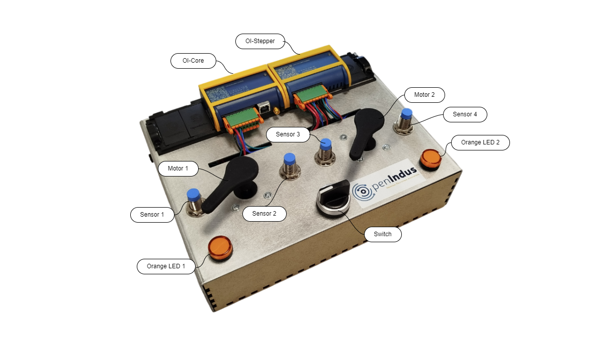
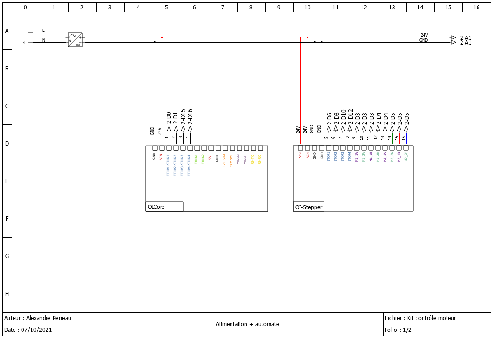
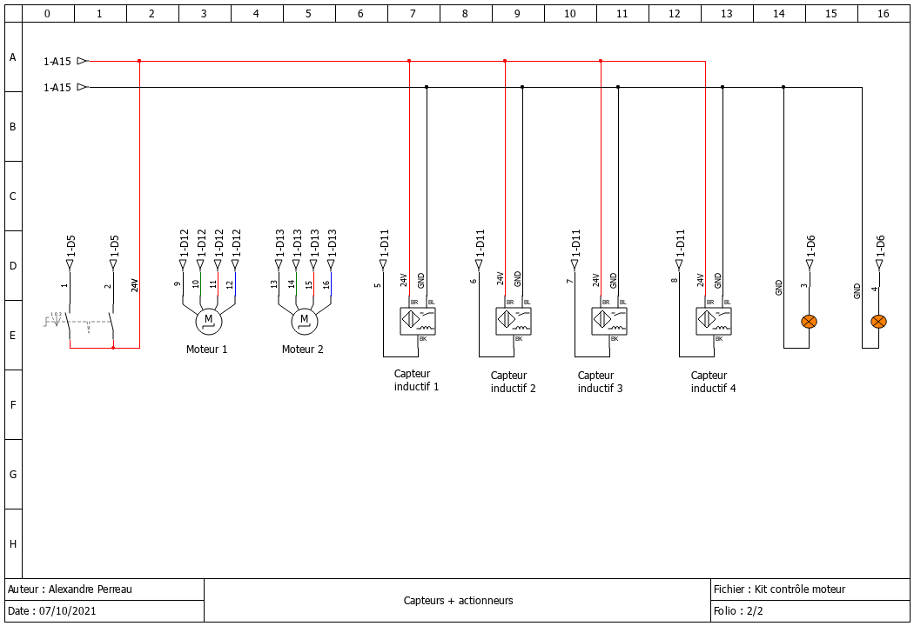

.. _OI-DEMO Motors:

OI-DEMO Motor
====================

.. warning::
    This section is obsolete, we will update it shortly for version 2.X.X.

Goals
-----
* Introducing :ref:`Environment Installation<get_started_oivscodeextension>`
* Introducing Openindus modules : :ref:`OI-Core<OI-Core>` and :ref:`OI-Stepper<oi-stepper>`
* Drive stepper motors
* Manage limit switches

Requirements
------------
* Visual Studio Code
* VSCode Openindus extension (Recommanded)
* SiliconLabs USB Driver installed (CP2102N - USB<->UART)
* Understanding :ref:`Start coding<start_coding-index>` chapter

------------

Description
-----------

Wiring diagrams

Demo kit is wired as described below : 

------------

Source code details
-------------------

* OI Modules instances

    .. code-block:: cpp

        // First, init the master device
        OICore core;

        // Then add slaves devices here :
        OIStepper stepper1;

    These lines should be automatically created while using OpenIndus extension.
    It creates instances for each OI Module found on the OI-Rail.

------------

* Variables declaration

    .. code-block:: cpp

        int mode = 0;
        bool switchevent = false;
        TaskHandle_t xHandle_LED_1 = NULL;
        TaskHandle_t xHandle_LED_2 = NULL;

        MotorDirection_t motor1_dir = FORWARD;
        MotorDirection_t motor2_dir = FORWARD;

    **TaskHandle_t** variables are used to manage task : suspend, run, ...
    **MotorDirection_t** variables store direction of each motor (forward or reverse)

------------

* **Setup()** function

    This function is executed once at startup. Initialisations have to be done here.

    .. code-block:: cpp

        Serial.begin(115200);
        Serial.println(F("Initializing..."));

    Initialise serial interface (USB) at 115200 bauds. Debug message will be displayed on a terminal software configured à 115200 bauds 8-N-1 (8 bits, Parity Even, 1 stop bit).

    .. code-block:: cpp
        
        xTaskCreate(blink_LED_1, "blink_LED_1", 2048, NULL, 1, &xHandle_LED_1);
        vTaskSuspend(xHandle_LED_1);
        xTaskCreate(blink_LED_2, "blink_LED_2", 2048, NULL, 2, &xHandle_LED_2);
        vTaskSuspend(xHandle_LED_2);

    Creation of tasks to manage each Leds.
    These tasks are disable (**vTaskSuspend**) at startup.
    A Led task will be activated while a motor is rotating.

    .. code-block:: cpp

        switch_mode(NULL);

    Call this function to set mode to enable homing at startup working (see below).

    .. code-block:: cpp

        // Reset Stepper limitswitch
        stepper1.detachLimitSwitch(MOTOR_1, DIN_1);
        stepper1.detachLimitSwitch(MOTOR_1, DIN_2);
        stepper1.detachLimitSwitch(MOTOR_2, DIN_3);
        stepper1.detachLimitSwitch(MOTOR_2, DIN_4);

    Each can be attached to limit switched for safety purpose : when a limitswitch is reach, motor will automatically stops.
    These functions are called now, in case of a software reboot of OI-Core while OI-Stepper has been already initialize.
    Detaching all limit switches to enable homing.

    .. code-block:: cpp

        // move motors to their initial position.
        // Set right sensors as limit switches for each motor
        Serial.println(F("Homing motors."));
        stepper1.attachLimitSwitch(MOTOR_1, DIN_1, ACTIVE_HIGH);
        stepper1.attachLimitSwitch(MOTOR_2, DIN_3, ACTIVE_HIGH);
        // blink leds while motor are moving
        vTaskResume(xHandle_LED_1);
        vTaskResume(xHandle_LED_2);
        stepper1.homing(MOTOR_1, 20);
        stepper1.homing(MOTOR_2, 20);
        // wait for homing
        stepper1.wait(MOTOR_1);
        stepper1.wait(MOTOR_2);
        Serial.println(F("Motors at their 0 position."));
        delay(1000);

    **stepper1.attachLimitSwitch()** are used to attach limit switches a motor. When a limit switch is set to true, it stops the motor.

    **vTaskResume(xHandle_LED_x)** as motor will move, Leds have to blink.

    **stepper1.homing()** send motor to its 'homing' position at speed of 20 step/sec.

    **stepper1.wait()** wait motor to reach its position (blocking function)

    .. code-block:: cpp    

        stepper1.detachLimitSwitch(MOTOR_1, DIN_1);
        stepper1.detachLimitSwitch(MOTOR_2, DIN_3);

        // play an animation
        // remind : stepper motor = 200 steps/revolution
        Serial.println(F("Starting animation."));
        stepper1.setMaxSpeed(MOTOR_1, 100);
        stepper1.setMaxSpeed(MOTOR_2, 100);
        stepper1.moveAbsolute(MOTOR_1, 250);
        stepper1.moveAbsolute(MOTOR_2, 250);
        stepper1.wait(MOTOR_1);
        stepper1.wait(MOTOR_2);
        Serial.println(F("MOTOR_1 position :"));
        Serial.println(stepper1.getPosition(MOTOR_1));
        Serial.println(F("MOTOR_2 position :"));
        Serial.println(stepper1.getPosition(MOTOR_2));

        delay(1000);

    **stepper1.detachLimitSwitch()** Disable limit switches , preparing to move more than one revolution. 
    **stepper1.setMaxSpeed()** Set motor speed rotation
    **stepper1.moveAbsolute()** Set absolution position to reach (unit : step)

    **stepper1.wait()** wait motor to reach its position (blocking function)

    Display some debug info with **stepper1.getPosition()** which is the actual position of moto, to confirm that each motor have reach the order.

    wait 1 second before doing an other movement.

    .. code-block:: cpp 

        stepper1.setMaxSpeed(MOTOR_1, 800);
        stepper1.setMaxSpeed(MOTOR_2, 800);
        stepper1.moveRelative(MOTOR_1, 300);
        stepper1.moveRelative(MOTOR_2, -100);
        stepper1.wait(MOTOR_1);
        stepper1.wait(MOTOR_2);
        Serial.println(F("MOTOR_1 position :"));
        Serial.println(stepper1.getPosition(MOTOR_1));
        Serial.println(F("MOTOR_2 position :"));
        Serial.println(stepper1.getPosition(MOTOR_2));

        delay(1000);

    Same sequence as above but with a relative commande.
    **stepper1.moveRelative()** set a relative movement to do (unit : step).

    .. code-block:: cpp 

        stepper1.setAcceleration(MOTOR_1, 2000);
        stepper1.setMaxSpeed(MOTOR_1, 10000);
        stepper1.setMaxSpeed(MOTOR_2, 4000);
        stepper1.moveAbsolute(MOTOR_1, 0);
        stepper1.moveAbsolute(MOTOR_2, 0);
        stepper1.wait(MOTOR_1);
        stepper1.wait(MOTOR_2);
        Serial.println(F("MOTOR_1 position :"));
        Serial.println(stepper1.getPosition(MOTOR_1));
        Serial.println(F("MOTOR_2 position :"));
        Serial.println(stepper1.getPosition(MOTOR_2));

    Same sequence as above but with a higher speed and more steps to run.

    .. code-block:: cpp 

        // Free motors shafts
        stepper1.stop(MOTOR_1, HARD_HIZ);
        stepper1.stop(MOTOR_2, HARD_HIZ);

        // stop playing...
        Serial.println(F("Animation ended."));

    **stepper1.stop(MOTOR_1, HARD_HIZ)** Stops motors with **HARD_HIZ** argument, meaning that motor shaft are free (position is not keept).

    .. code-block:: cpp 

        // stops leds blinking
        vTaskSuspend(xHandle_LED_1);
        vTaskSuspend(xHandle_LED_2);
        // force LEDs off
        core.digitalWrite(DOUT_3, LOW);
        core.digitalWrite(DOUT_4, LOW);

    Stop Leds blinking by suspending their tasks and force them to 0.

    .. code-block:: cpp 

        Serial.println(F("Setting button and limit switches ..."));
        // Allow user switch to drive motors
        core.attachInterrupt(DIN_1, switch_mode, CHANGE_MODE, NULL);
        core.attachInterrupt(DIN_2, switch_mode, CHANGE_MODE, NULL);
        
        // attach sensors as limit switches
        stepper1.attachLimitSwitch(MOTOR_1, DIN_1, ACTIVE_HIGH);
        stepper1.attachLimitSwitch(MOTOR_1, DIN_2, ACTIVE_HIGH);
        stepper1.attachLimitSwitch(MOTOR_2, DIN_3, ACTIVE_HIGH);
        stepper1.attachLimitSwitch(MOTOR_2, DIN_4, ACTIVE_HIGH);

        Serial.println(F("--------------------------------------"));
        Serial.println(F("You can now use switch to move motors."));
        
    
    Demo sequence is terminated.
    user is now allowed to play with the central switch to control motors manually.
    To allow this :

    * **core.attachInterrupt(DIN_1, switch_mode, CHANGE_MODE, NULL)** 
        This function create an interrupt call to **switch_mode()** function when OI-Core[DIN_1] changes state.

    * **core.attachInterrupt(DIN_2, switch_mode, CHANGE_MODE, NULL)** 
        This function create an interrupt call to **switch_mode()** function when OI-Core[DIN_1] changes state.

    * All limit switches are enable
        When a sensor will detect the motor arm, it will stops the motor.

    
------------

* **Loop()** function

    .. code-block:: cpp 

        if (switchevent == true)
            
    Main loop is waiting for a **switchevent**. This variable is update in **switchmode()** interrupt function when the bouton is changing state.

    .. code-block:: cpp 

        // reset event generated by switch interrupt
        switchevent = false;

    **switchevent** is reseted  to allow next event to re-enter in this condition.

    .. code-block:: cpp 

        //Switch on pushed on "left" side
        if (core.digitalRead(DIN_1) == 1 && core.digitalRead(DIN_2) == 0)
        {
            mode = 1;
            stepper1.run(MOTOR_1, motor1_dir, 100);
            stepper1.stop(MOTOR_2);
            vTaskResume(xHandle_LED_1);
            core.digitalWrite(DOUT_4, LOW);
            Serial.println(F("MOTOR_1 position :"));
            Serial.println(stepper1.getPosition(MOTOR_1));
            Serial.println(F("MOTOR_2 position :"));
            Serial.println(stepper1.getPosition(MOTOR_2));        
            // reverse direction of the other motor, for fun
            motor2_dir = reverse_motdir(motor2_dir);

        }

    Reading OI-Core[DIN_1] and OI-Core[DIN_2] inputs to determine on which side the button is pushed.
    If button is pushed on left side, **MOTOR1** will move 100 steps in **motor1_dir** direction.

    LED 
    LED of the other motor is forced to low with *core.digitalWrite(DOUT_4, LOW);* 

    For fun, **MOTOR2** direction is reversed with **reverse_motdir()** function.

    .. code-block:: cpp 

        //Switch on pushed on "left" side
        else if ((core.digitalRead(DIN_1) == 0 && core.digitalRead(DIN_2) == 1))
        {
            mode = 2;
            stepper1.stop(MOTOR_1);
            stepper1.run(MOTOR_2, motor2_dir, 100);
            vTaskResume(xHandle_LED_2);
            core.digitalWrite(DOUT_3, LOW);
            Serial.println(F("MOTOR_1 position :"));
            Serial.println(stepper1.getPosition(MOTOR_1));
            Serial.println(F("MOTOR_2 position :"));
            Serial.println(stepper1.getPosition(MOTOR_2)); 
            // reverse direction of the other motor, for fun
            motor1_dir = reverse_motdir(motor1_dir);
        }

    Reading OI-Core[DIN_1] and OI-Core[DIN_2] inputs to determine on which side the button is pushed.
    If button is pushed on right side, **MOTOR2** will move 100 steps in **motor2_dir** direction.

    LED of the other motor is forced to low with *core.digitalWrite(DOUT_3, LOW);* 

    For fun, **MOTOR1** direction is reversed with **reverse_motdir()** function.

    .. code-block:: cpp 

        //Switch on the middle position (do nothing)
        else
        {
            mode = 0;
            // force motors to stop
            stepper1.stop(MOTOR_1, SOFT_STOP);
            stepper1.stop(MOTOR_2, SOFT_HIZ);
            
            // stop task that blink leds
            vTaskSuspend(xHandle_LED_1);
            vTaskSuspend(xHandle_LED_2);
            // force LEDs off
            core.digitalWrite(DOUT_3, LOW);
            core.digitalWrite(DOUT_4, LOW);
        }
        Serial.print("mode : ");
        Serial.println(mode);

    When button is in the 'middle' position, Leds are stopped (vTaskSuspend) and force to low.
    **MOTOR_1** is stopped with **SOFT_STOP** , that means that its position is held by software, it should be not possible to move it manually.
    **MOTOR_2** is stopped with **SOFT_HIZ** , that means that its position is not held, it should be possible to move it manually.

------------

* **Others functions called in Setup() and Loop() functions**

    * switch_mode()

        .. code-block:: cpp 

            void switch_mode(void*)
            {
                // set switch event flag to true (minimize software interrupt)
                switchevent = true;
                Serial.println(F("Switch mode interrupt detected."));
            }

        This interrupt function must be as small as possible.
        **switchevent** is set to true. This event will be managed in the **Loop()** function.

    * blink_LED_1()

        .. code-block:: cpp 

            void blink_LED_1(void *)
            {
                while (1)
                {
                    core.digitalWrite(DOUT_3, HIGH);
                    delay(50);
                    core.digitalWrite(DOUT_3, LOW);
                    delay(50);
                    core.digitalWrite(DOUT_3, HIGH);
                    delay(50);
                    core.digitalWrite(DOUT_3, LOW);
                    delay(250);
                }
            }

        This function is a task that is suspended or resumed in the **Loop()** function. 
        It is an infinite loop that switch on and off an output (LED1)

    * blink_LED_2()

        .. code-block:: cpp 

            void blink_LED_2(void *)
            {
                while (1)
                {
                    core.digitalWrite(DOUT_4, HIGH);
                    delay(50);
                    core.digitalWrite(DOUT_4, LOW);
                    delay(50);
                    core.digitalWrite(DOUT_4, HIGH);
                    delay(50);
                    core.digitalWrite(DOUT_4, LOW);
                    delay(250);
                }
            }

        This function is a task that is suspended or resumed in the **Loop()** function. 
        It is an infinite loop that switch on and off an output (LED2)

------------

Source code (full)
-------------------

.. code-block:: cpp 

    #include "OpenIndus.h"
    #include "Arduino.h"

    // First, init the master device
    OICore core;

    // Then add slaves devices here :
    OIStepper stepper1;

    int mode = 0;
    bool switchevent = false;
    TaskHandle_t xHandle_LED_1 = NULL;
    TaskHandle_t xHandle_LED_2 = NULL;

    MotorDirection_t motor1_dir = FORWARD;
    MotorDirection_t motor2_dir = FORWARD;

    MotorDirection_t reverse_motdir(MotorDirection_t dir)
    {
        // return opposite motor direction
        if (dir == FORWARD) 
        {
            return REVERSE;
        }
        else
        {
            return FORWARD;
        }
    }

    void switch_mode(void*)
    {
        // set switch event flag to true (minimize software interrupt)
        switchevent = true;
        Serial.println(F("Switch mode interrupt detected."));
    }

    void blink_LED_1 (void *)
    {
        while (1)
        {
            core.digitalWrite(DOUT_3, HIGH);
            delay(50);
            core.digitalWrite(DOUT_3, LOW);
            delay(50);
            core.digitalWrite(DOUT_3, HIGH);
            delay(50);
            core.digitalWrite(DOUT_3, LOW);
            delay(250);
        }
    }

    void blink_LED_2 (void *)
    {
        while (1)
        {
            core.digitalWrite(DOUT_4, HIGH);
            delay(50);
            core.digitalWrite(DOUT_4, LOW);
            delay(50);
            core.digitalWrite(DOUT_4, HIGH);
            delay(50);
            core.digitalWrite(DOUT_4, LOW);
            delay(250);
        }
    }

    void setup()
    {
        Serial.begin(115200);
        Serial.println(F("Initializing..."));
        xTaskCreate(blink_LED_1, "blink_LED_1", 2048, NULL, 1, &xHandle_LED_1);
        vTaskSuspend(xHandle_LED_1);
        xTaskCreate(blink_LED_2, "blink_LED_2", 2048, NULL, 2, &xHandle_LED_2);
        vTaskSuspend(xHandle_LED_2);
        switch_mode(NULL);

        // Reset Stepper limitswitch
        stepper1.detachLimitSwitch(MOTOR_1, DIN_1);
        stepper1.detachLimitSwitch(MOTOR_1, DIN_2);
        stepper1.detachLimitSwitch(MOTOR_2, DIN_3);
        stepper1.detachLimitSwitch(MOTOR_2, DIN_4);

        // move motors to their initial position.
        // Set right sensors as limit switches for each motor
        Serial.println(F("Homing motors."));
        stepper1.attachLimitSwitch(MOTOR_1, DIN_1, ACTIVE_HIGH);
        stepper1.attachLimitSwitch(MOTOR_2, DIN_3, ACTIVE_HIGH);
        // blink leds while motor are moving
        vTaskResume(xHandle_LED_1);
        vTaskResume(xHandle_LED_2);
        stepper1.homing(MOTOR_1, 20);
        stepper1.homing(MOTOR_2, 20);
        // wait for homing
        stepper1.wait(MOTOR_1);
        stepper1.wait(MOTOR_2);
        Serial.println(F("Motors at their 0 position."));
        delay(1000);

        stepper1.detachLimitSwitch(MOTOR_1, DIN_1);
        stepper1.detachLimitSwitch(MOTOR_2, DIN_3);

        // play an animation
        // remind : stepper motor = 200 steps/revolution
        Serial.println(F("Starting animation."));
        stepper1.setMaxSpeed(MOTOR_1, 100);
        stepper1.setMaxSpeed(MOTOR_2, 100);
        stepper1.moveAbsolute(MOTOR_1, 250);
        stepper1.moveAbsolute(MOTOR_2, 250);
        stepper1.wait(MOTOR_1);
        stepper1.wait(MOTOR_2);
        Serial.println(F("MOTOR_1 position :"));
        Serial.println(stepper1.getPosition(MOTOR_1));
        Serial.println(F("MOTOR_2 position :"));
        Serial.println(stepper1.getPosition(MOTOR_2));

        delay(1000);

        stepper1.setMaxSpeed(MOTOR_1, 800);
        stepper1.setMaxSpeed(MOTOR_2, 800);
        stepper1.moveRelative(MOTOR_1, 300);
        stepper1.moveRelative(MOTOR_2, -100);
        stepper1.wait(MOTOR_1);
        stepper1.wait(MOTOR_2);
        Serial.println(F("MOTOR_1 position :"));
        Serial.println(stepper1.getPosition(MOTOR_1));
        Serial.println(F("MOTOR_2 position :"));
        Serial.println(stepper1.getPosition(MOTOR_2));

        delay(1000);

        stepper1.setAcceleration(MOTOR_1, 2000);
        stepper1.setMaxSpeed(MOTOR_1, 10000);
        stepper1.setMaxSpeed(MOTOR_2, 4000);
        stepper1.moveAbsolute(MOTOR_1, 0);
        stepper1.moveAbsolute(MOTOR_2, 0);
        stepper1.wait(MOTOR_1);
        stepper1.wait(MOTOR_2);
        Serial.println(F("MOTOR_1 position :"));
        Serial.println(stepper1.getPosition(MOTOR_1));
        Serial.println(F("MOTOR_2 position :"));
        Serial.println(stepper1.getPosition(MOTOR_2));

        // Free motors shafts
        stepper1.stop(MOTOR_1, HARD_HIZ);
        stepper1.stop(MOTOR_2, HARD_HIZ);

        // stop playing...
        Serial.println(F("Animation ended."));

        // stops leds blinking
        vTaskSuspend(xHandle_LED_1);
        vTaskSuspend(xHandle_LED_2);
        // force LEDs off
        core.digitalWrite(DOUT_3, LOW);
        core.digitalWrite(DOUT_4, LOW);

        Serial.println(F("Setting button and limit switches ..."));
        // Allow user switch to drive motors
        core.attachInterrupt(DIN_1, switch_mode, CHANGE_MODE, NULL);
        core.attachInterrupt(DIN_2, switch_mode, CHANGE_MODE, NULL);
        
        // attach sensors as limit switches
        stepper1.attachLimitSwitch(MOTOR_1, DIN_1, ACTIVE_HIGH);
        stepper1.attachLimitSwitch(MOTOR_1, DIN_2, ACTIVE_HIGH);
        stepper1.attachLimitSwitch(MOTOR_2, DIN_3, ACTIVE_HIGH);
        stepper1.attachLimitSwitch(MOTOR_2, DIN_4, ACTIVE_HIGH);

        Serial.println(F("--------------------------------------"));
        Serial.println(F("You can now use switch to move motors."));

    }

    void loop()
    {
        if (switchevent == true)
        {
            // reset event generated by switch interrupt
            switchevent = false;
            
            //Switch on pushed on "left" side
            if (core.digitalRead(DIN_1) == 1 && core.digitalRead(DIN_2) == 0)
            {
                mode = 1;
                stepper1.run(MOTOR_1, motor1_dir, 100);
                stepper1.stop(MOTOR_2);
                vTaskResume(xHandle_LED_1);
                core.digitalWrite(DOUT_4, LOW);
                Serial.println(F("MOTOR_1 position :"));
                Serial.println(stepper1.getPosition(MOTOR_1));
                Serial.println(F("MOTOR_2 position :"));
                Serial.println(stepper1.getPosition(MOTOR_2));        
                // reverse direction of the other motor, for fun
                motor2_dir = reverse_motdir(motor2_dir);

            }
            //Switch on pushed on "left" side
            else if ((core.digitalRead(DIN_1) == 0 && core.digitalRead(DIN_2) == 1))
            {
                mode = 2;
                stepper1.stop(MOTOR_1);
                stepper1.run(MOTOR_2, motor2_dir, 100);
                vTaskResume(xHandle_LED_2);
                core.digitalWrite(DOUT_3, LOW);
                Serial.println(F("MOTOR_1 position :"));
                Serial.println(stepper1.getPosition(MOTOR_1));
                Serial.println(F("MOTOR_2 position :"));
                Serial.println(stepper1.getPosition(MOTOR_2)); 
                // reverse direction of the other motor, for fun
                motor1_dir = reverse_motdir(motor1_dir);
            }
            //Switch on the middle position (do nothing)
            else
            {
                mode = 0;
                // force motors to stop
                stepper1.stop(MOTOR_1, SOFT_STOP);
                stepper1.stop(MOTOR_2, SOFT_HIZ);
                
                // stop task that blink leds
                vTaskSuspend(xHandle_LED_1);
                vTaskSuspend(xHandle_LED_2);
                // force LEDs off
                core.digitalWrite(DOUT_3, LOW);
                core.digitalWrite(DOUT_4, LOW);
            }
            Serial.print("mode : ");
            Serial.println(mode);
        }
        delay(100);
    }
