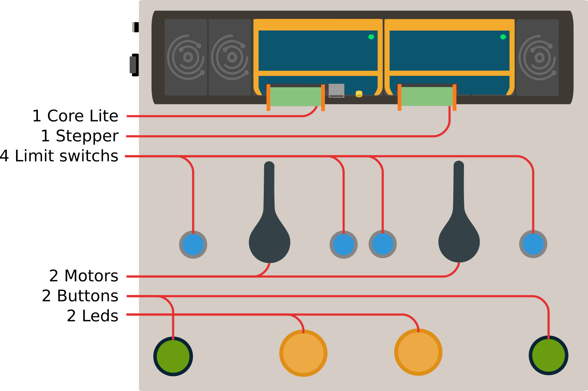
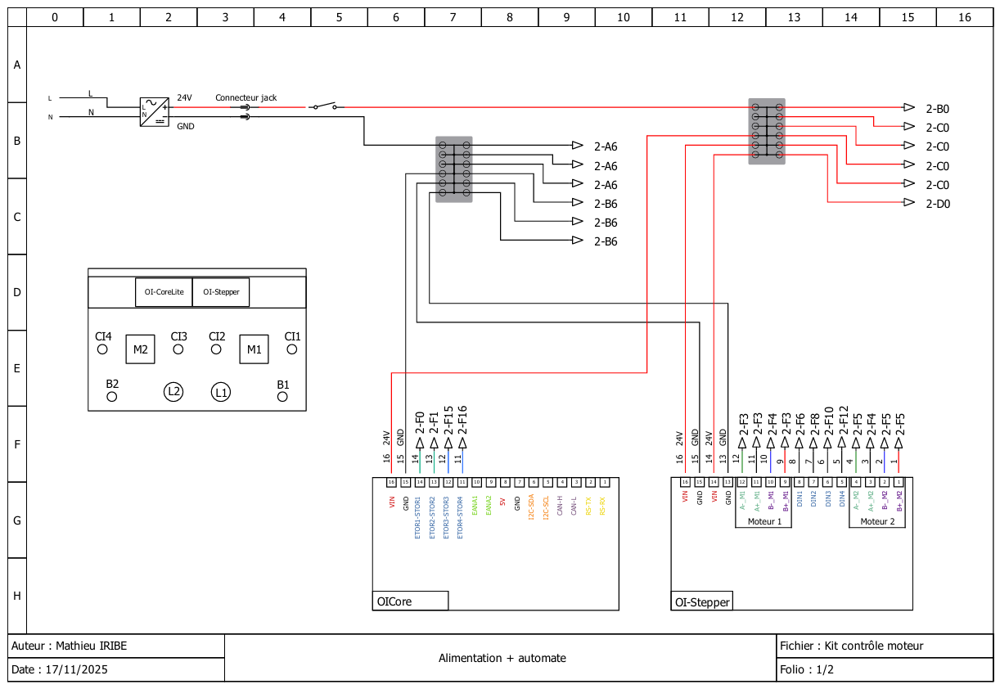
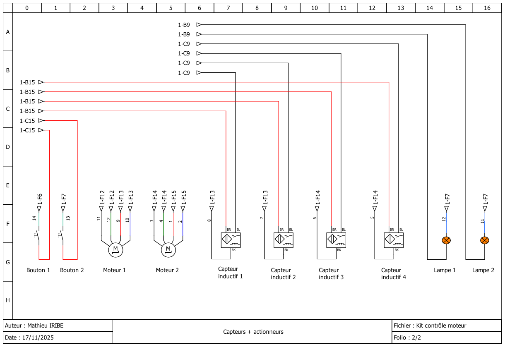

.. _Demo Motors Kit:

Demo Motors Kit
===============

1. Introduction
---------------

Who is this tutorial for?
~~~~~~~~~~~~~~~~~~~~~~~~~

This tutorial is intended for developers and makers who want to learn how to control stepper motors
using the **OI-Demo Motor** kit. Whether you are discovering embedded systems or already familiar
with Arduino-style programming, this guide will walk you through everything step by step.

Prerequisites
~~~~~~~~~~~~~

* Basic knowledge of C++ and Arduino programming
* A computer with Visual Studio Code installed
* The OpenIndus VS Code extension installed - see :ref:`Environment Installation<get_started_oivscodeextension>`
* SiliconLabs USB driver installed (CP2102N - USB↔UART)
* Familiarity with :ref:`Start coding<start_coding-index>`

What will you learn?
~~~~~~~~~~~~~~~~~~~~

* How to test the OI-Demo Motor kit using the companion Android application
* How to use stepper motors (speed, acceleration, ...)
* How to perform homing sequences using limit switches
* How to control two stepper motors interactively with our example
* How to manage LED indicators using FreeRTOS tasks and state variables

------------

2. Discover your kit
--------------------

The Demo Motor kit includes two stepper motors, each with a home and end limit switch.
It also includes two output LEDs and buttons to test the digital I/O features of the OI-Core master module.

|

Download and install the Android app
~~~~~~~~~~~~~~~~~~~~~~~~~~~~~~~~~~~~~

Before writing any code, use the **OpenIndus Demo** Android application to familiarize yourself with the default kit firmware.

Scan the QR code below or follow the link to install the app:

   `OpenIndus Demo on Google Play <https://play.google.com/store/apps/details?id=com.openindus.oidemo>`_

.. note::
    The **OpenIndus Demo** app requires **Bluetooth permissions** to be granted on your Android device.
    Without these permissions, the app cannot connect to the Demo Motors kit. The Bluetooth module
    on the kit remains inactive during the motor initialization and homing sequence, and only becomes
    available once the startup animation completes and the system enters interactive mode.
    Currently, the app is **Android-only**; there is no iOS equivalent available at this time.

Check basic features of the kit
~~~~~~~~~~~~~~~~~~~~~~~~~~~~~~~~~

Once the app is installed and connected to the kit via Bluetooth, you can play with the following
features work correctly before programming:

* **LEDs** - the two output LEDs (left and right) blink when the corresponding motor is running
* **Buttons** - pressing the left and right buttons makes the corresponding motor run, and releasing them stops it
* **Bluetooth** - the app show the motors position in real time and you can change the motor speed with the sliders

Wiring diagram
~~~~~~~~~~~~~~
Theses electical diagrams show how the Core and Stepper modules are connected to the different components of the kit.

By following the connections you can see which pins are used for what purpose. Theses pins will be used in the code later on
to reference each element of the kit.

------------

3. Develop your own project
----------------------------

Introduction to OpenIndus IDE
~~~~~~~~~~~~~~~~~~~~~~~~~~~~~~

OpenIndus projects are developed with **Visual Studio Code** and the **OpenIndus extension**.
The extension handles project creation, compilation, and flashing directly from the editor.

Refer to the :ref:`Environment Installation<get_started_oivscodeextension>` guide to set up your
workspace if you have not done so yet.

Introduction to OpenIndus modules programming
~~~~~~~~~~~~~~~~~~~~~~~~~~~~~~~~~~~~~~~~~~~~~

Once the extension installed and your workspace set up, you can start writing code for the Demo Motor kit.

In the extension launch **"Start a new project"**

 * select OI Core Lite
 * select the parent folder of the project
 * enter the project name (eg: OpenIndus_Demo_Kit)
 * select **"Master"** as the device type
 * choose to use Arduino libraries
 * select the last version available of the OpenIndus library

.. note::
    In the newly created project, we are going to edit the ``main/main.cpp`` file to implement the motor control logic.
    All code examples in this section are excerpts from ``main/main.cpp``. The full source code is available at the end of this page.

The OI-Demo Motor kit uses two OpenIndus modules on a shared OI-Rail bus:

* :ref:`OI-Core<OI-Core>` - the master controller that manages digital I/O and orchestrates the system
* :ref:`OI-Stepper<oi-stepper>` - the stepper motor driver module

In code, each module is declared as a global object. The OpenIndus extension can generate these
declarations automatically by scanning the OI-Rail.

.. code-block:: cpp

    #include "OpenIndus.h"
    #include "Arduino.h"

    // Master device
    OICore core;

    // Slave devices
    OIStepper stepper1;

**Named I/O constants** make the code easier to read and maintain. Instead of scattering raw pin
identifiers throughout the program, declare them once at the top:

.. code-block:: cpp

    // Output LEDs
    const DoutNum_t LEFT_LED_OUT  = DOUT_4;
    const DoutNum_t RIGHT_LED_OUT = DOUT_3;

    // Input buttons (3-position switch)
    const DinNum_t LEFT_BUTTON  = DIN_2;
    const DinNum_t RIGHT_BUTTON = DIN_1;

    // Motor channels
    const MotorNum_t MOTOR_LEFT  = MOTOR_2;
    const MotorNum_t MOTOR_RIGHT = MOTOR_1;

    // Limit switches
    const DinNum_t LEFT_MOTOR_HOME_SWITCH  = DIN_3;
    const DinNum_t LEFT_MOTOR_END_SWITCH   = DIN_4;
    const DinNum_t RIGHT_MOTOR_HOME_SWITCH = DIN_1;
    const DinNum_t RIGHT_MOTOR_END_SWITCH  = DIN_2;

Complete example project
~~~~~~~~~~~~~~~~~~~~~~~~~

This section will cover the code of the example project in detail, explaining the structure and the role of each function. The full source code is available at the end of this page.

Project structure
^^^^^^^^^^^^^^^^^

The project is organized around three logical phases executed in sequence:

1. **Initialization** - motor parameters, LED tasks, homing sequence, and startup animation
2. **Interactive control** - the buttons drives the motors by triggering an interrupt on every state change
3. **Interrupt / event handling** - a lightweight ISR sets a flag; the main loop acts on it

.. list-table::
   :header-rows: 1
   :widths: 30 70

   * - Function
     - Role
   * - ``setup()``
     - Hardware initialization, motor configuration, homing, animation
   * - ``loop()``
     - Arduino main loop: This function is called repeatedly. It reads the ``switchEvent`` flag and drives motors accordingly
   * - ``handleSwitchEvent()``
     - ISR: sets ``switchEvent = true`` (kept minimal on purpose)
   * - ``blinkLedLeftTask()``
     - FreeRTOS task: blinks the left LED when ``leftLedBlinking`` is true
   * - ``blinkLedRightTask()``
     - FreeRTOS task: blinks the right LED when ``rightLedBlinking`` is true
   * - ``changeBlinkingState()``
     - Helper that maps a motor number to the correct blinking flag
   * - ``reverseMotdir()``
     - Returns the opposite ``MotorDirection_t``

Source code details
^^^^^^^^^^^^^^^^^^^

* **Global variables**

    .. code-block:: cpp

        volatile bool switchEvent = false;

        volatile bool leftLedBlinking  = false;
        volatile bool rightLedBlinking = false;

        TaskHandle_t xHandle_LED_1 = NULL;
        TaskHandle_t xHandle_LED_2 = NULL;

        MotorDirection_t motor1Dir = FORWARD;
        MotorDirection_t motor2Dir = FORWARD;

    ``switchEvent`` is marked ``volatile`` because it is written from an interrupt handler and
    read from the main loop - the compiler must not cache it in a register.

------------

* **LED tasks**

    .. code-block:: cpp

        void blinkLedLeftTask(void *)
        {
            while (1)
            {
                bool isBlinking = leftLedBlinking;
                if (isBlinking) {
                    core.digitalWrite(LEFT_LED_OUT, HIGH);
                    delay(50);
                    core.digitalWrite(LEFT_LED_OUT, LOW);
                    delay(50);
                    core.digitalWrite(LEFT_LED_OUT, HIGH);
                    delay(50);
                    core.digitalWrite(LEFT_LED_OUT, LOW);
                    delay(250);
                } else {
                    delay(50);
                }
            }
        }

    When ``isBlinking`` is ``true``, the LED pulses twice and then waits 250 ms before repeating.
    When ``false``, the task simply yields for 50 ms without touching the output.

    ``blinkLedRightTask`` is identical, using ``RIGHT_LED_OUT`` and ``rightLedBlinking``.

    **changeBlinkingState()** provides a clean interface for the rest of the code:

    .. code-block:: cpp

        void changeBlinkingState(MotorNum_t motor, bool state)
        {
            if (motor == MOTOR_LEFT) {
                leftLedBlinking = state;
            } else if (motor == MOTOR_RIGHT) {
                rightLedBlinking = state;
            }
        }

------------

* **Interrupt handler**

    .. code-block:: cpp

        void handleSwitchEvent(void*)
        {
            switchEvent = true;
            Serial.println(F("Switch mode interrupt detected."));
        }

    ISRs must be as short as possible. This function only sets the flag; all logic stays in ``loop()``.

------------

* **setup() - initialization**

    .. code-block:: cpp

        Serial.begin(115200);
        xTaskCreate(blinkLedLeftTask,  "blinkLedLeftTask",  2048, NULL, 1, &xHandle_LED_1);
        xTaskCreate(blinkLedRightTask, "blinkLedRightTask", 2048, NULL, 2, &xHandle_LED_2);

    Two FreeRTOS tasks are created for LED control. Unlike the previous version they are **not**
    suspended at startup - the ``*LedBlinking`` flags (initialized to ``false``) keep them idle.

    Motor parameters are then applied to both motors (see *Configure and drive a motor* section above).

* **setup() - homing sequence**

    .. code-block:: cpp

        // Detach any leftover limit switches from a previous run
        stepper1.detachLimitSwitch(MOTOR_RIGHT, RIGHT_MOTOR_HOME_SWITCH);
        stepper1.detachLimitSwitch(MOTOR_RIGHT, RIGHT_MOTOR_END_SWITCH);
        stepper1.detachLimitSwitch(MOTOR_LEFT,  LEFT_MOTOR_HOME_SWITCH);
        stepper1.detachLimitSwitch(MOTOR_LEFT,  LEFT_MOTOR_END_SWITCH);

        // Attach only the home switches for homing
        stepper1.attachLimitSwitch(MOTOR_RIGHT, RIGHT_MOTOR_HOME_SWITCH, ACTIVE_HIGH);
        stepper1.attachLimitSwitch(MOTOR_LEFT,  LEFT_MOTOR_HOME_SWITCH,  ACTIVE_HIGH);

        changeBlinkingState(MOTOR_RIGHT, true);
        changeBlinkingState(MOTOR_LEFT,  true);

        stepper1.homing(MOTOR_RIGHT, 100);
        stepper1.homing(MOTOR_LEFT,  100);
        stepper1.wait(MOTOR_RIGHT);
        stepper1.wait(MOTOR_LEFT);

    **detachLimitSwitch** is called first to clear any state left over from a previous software
    reboot where OI-Stepper may already have been initialized.

    **attachLimitSwitch(motor, pin, ACTIVE_HIGH)** - when the home sensor goes HIGH, the motor
    stops automatically at its zero position.

    **homing(motor, speed)** - moves the motor toward the home sensor at 100 steps per second.

    **wait(motor)** - await the completion of the current motor movement before executing the next command.

* **setup() - startup animation**

    After homing the motors run a brief demonstration to confirm correct operation:

    .. code-block:: cpp

        // Move to step 250 at low speed
        stepper1.setMaxSpeed(MOTOR_RIGHT, 100);
        stepper1.setMaxSpeed(MOTOR_LEFT,  100);
        stepper1.moveAbsolute(MOTOR_RIGHT, 250);
        stepper1.moveAbsolute(MOTOR_LEFT,  250);
        stepper1.wait(MOTOR_RIGHT);
        stepper1.wait(MOTOR_LEFT);
        delay(1000);

        // Move relatively at medium speed
        stepper1.setMaxSpeed(MOTOR_RIGHT, 700);
        stepper1.setMaxSpeed(MOTOR_LEFT,  700);
        stepper1.moveRelative(MOTOR_RIGHT,  300);
        stepper1.moveRelative(MOTOR_LEFT,  -100);
        stepper1.wait(MOTOR_RIGHT);
        stepper1.wait(MOTOR_LEFT);
        delay(1000);

        // Return to home at higher speed
        stepper1.setAcceleration(MOTOR_RIGHT, 2000);
        stepper1.setMaxSpeed(MOTOR_RIGHT, 750);
        stepper1.setMaxSpeed(MOTOR_LEFT,  750);
        stepper1.moveAbsolute(MOTOR_RIGHT, 0);
        stepper1.moveAbsolute(MOTOR_LEFT,  0);
        stepper1.wait(MOTOR_RIGHT);
        stepper1.wait(MOTOR_LEFT);

        // Release shafts
        stepper1.stop(MOTOR_RIGHT, HARD_HIZ);
        stepper1.stop(MOTOR_LEFT,  HARD_HIZ);

    **setMaxSpeed(motor, steps/s)** - sets the maximum rotation speed in steps per second.
    A stepper motor with 200 full steps per revolution running at 100 steps/s completes
    one revolution every 2 seconds.

    **moveAbsolute(motor, position)** - moves to an absolute step count from the home position.

    **moveRelative(motor, delta)** - moves by a signed number of steps relative to the current position.

    **setAcceleration(motor, steps/s²)** - sets the acceleration ramp. A higher value means quicker
    speed transitions but also more mechanical stress.

    **stop(motor, HARD_HIZ)** - immediately removes power from the coils, letting the shaft spin freely.

* **setup() - attach interrupts and end switches**

    .. code-block:: cpp

        changeBlinkingState(MOTOR_RIGHT, false);
        changeBlinkingState(MOTOR_LEFT,  false);

        core.attachInterrupt(DIN_1, handleSwitchEvent, CHANGE_MODE, NULL);
        core.attachInterrupt(DIN_2, handleSwitchEvent, CHANGE_MODE, NULL);

        // Trigger once to initialize the loop state
        handleSwitchEvent(NULL);

    **core.attachInterrupt(pin, callback, CHANGE_MODE, arg)** - fires ``handleSwitchEvent`` every
    time the switch changes state (pressed or released).

    Calling ``handleSwitchEvent(NULL)`` once at the end of ``setup()`` pre-populates ``switchEvent``
    so the loop immediately reads the switch position on first entry, even before the user touches anything.

------------

* **loop()**

    .. code-block:: cpp

        void loop()
        {
            if (switchEvent == true)
            {
                switchEvent = false;
                bool leftButtonState  = core.digitalRead(LEFT_BUTTON);
                bool rightButtonState = core.digitalRead(RIGHT_BUTTON);

                if (rightButtonState == HIGH && leftButtonState == LOW)
                {
                    // Right side pressed - run MOTOR_RIGHT
                    stepper1.stop(MOTOR_LEFT, SOFT_HIZ);
                    stepper1.run(MOTOR_RIGHT, motor1Dir, 100);
                    changeBlinkingState(MOTOR_RIGHT, true);
                    changeBlinkingState(MOTOR_LEFT,  false);
                    motor2Dir = reverseMotdir(motor2Dir);
                }
                else if (rightButtonState == LOW && leftButtonState == HIGH)
                {
                    // Left side pressed - run MOTOR_LEFT
                    stepper1.stop(MOTOR_RIGHT, SOFT_HIZ);
                    stepper1.run(MOTOR_LEFT, motor2Dir, 100);
                    changeBlinkingState(MOTOR_RIGHT, false);
                    changeBlinkingState(MOTOR_LEFT,  true);
                    motor1Dir = reverseMotdir(motor1Dir);
                }
                else
                {
                    // Middle position - stop both motors
                    stepper1.stop(MOTOR_RIGHT, SOFT_HIZ);
                    stepper1.stop(MOTOR_LEFT,  SOFT_HIZ);
                    changeBlinkingState(MOTOR_RIGHT, false);
                    changeBlinkingState(MOTOR_LEFT,  false);
                }
            }
            delay(100);
        }

    The loop only acts when ``switchEvent`` is set, which happens on every buttons state change.

    **stepper1.run(motor, direction, speed)** - starts continuous rotation at the given speed
    (steps/s). Unlike ``moveAbsolute`` / ``moveRelative``, the motor keeps spinning until
    explicitly stopped.

    **stop(motor, SOFT_HIZ)** - decelerates the motor gracefully and then removes power from the
    coils (shaft free to turn).

    Each time one motor starts, the *other* motor's direction is reversed with ``reverseMotdir()``.
    This means that after you press a button, the next time you press the other button its corresponding
    motor will rotate in the opposite direction - a small visual effect that makes the demo more lively.

------------

Source code (full)
^^^^^^^^^^^^^^^^^^

.. code-block:: cpp

    #include "OpenIndus.h"
    #include "Arduino.h"

    // First, init the master device
    OICore core;

    // Then add slaves devices here :
    OIStepper stepper1;

    // Input and output definitions
    const DoutNum_t LEFT_LED_OUT  = DOUT_4;
    const DoutNum_t RIGHT_LED_OUT = DOUT_3;

    const DinNum_t LEFT_BUTTON  = DIN_2;
    const DinNum_t RIGHT_BUTTON = DIN_1;

    const MotorNum_t MOTOR_LEFT  = MOTOR_2;
    const MotorNum_t MOTOR_RIGHT = MOTOR_1;

    const DinNum_t LEFT_MOTOR_HOME_SWITCH  = DIN_3;
    const DinNum_t LEFT_MOTOR_END_SWITCH   = DIN_4;
    const DinNum_t RIGHT_MOTOR_HOME_SWITCH = DIN_1;
    const DinNum_t RIGHT_MOTOR_END_SWITCH  = DIN_2;

    // event flag
    volatile bool switchEvent = false;

    // blinking state of the leds
    volatile bool leftLedBlinking  = false;
    volatile bool rightLedBlinking = false;

    TaskHandle_t xHandle_LED_1 = NULL;
    TaskHandle_t xHandle_LED_2 = NULL;

    MotorDirection_t motor1Dir = FORWARD;
    MotorDirection_t motor2Dir = FORWARD;

    MotorDirection_t reverseMotdir(MotorDirection_t dir)
    {
        if (dir == FORWARD)
            return REVERSE;
        else
            return FORWARD;
    }

    void handleSwitchEvent(void*)
    {
        switchEvent = true;
        Serial.println(F("Switch mode interrupt detected."));
    }

    void blinkLedLeftTask(void *)
    {
        while (1)
        {
            bool isBlinking = leftLedBlinking;
            if (isBlinking) {
                core.digitalWrite(LEFT_LED_OUT, HIGH);
                delay(50);
                core.digitalWrite(LEFT_LED_OUT, LOW);
                delay(50);
                core.digitalWrite(LEFT_LED_OUT, HIGH);
                delay(50);
                core.digitalWrite(LEFT_LED_OUT, LOW);
                delay(250);
            } else {
                delay(50);
            }
        }
    }

    void blinkLedRightTask(void *)
    {
        while (1)
        {
            bool isBlinking = rightLedBlinking;
            if (isBlinking) {
                core.digitalWrite(RIGHT_LED_OUT, HIGH);
                delay(50);
                core.digitalWrite(RIGHT_LED_OUT, LOW);
                delay(50);
                core.digitalWrite(RIGHT_LED_OUT, HIGH);
                delay(50);
                core.digitalWrite(RIGHT_LED_OUT, LOW);
                delay(250);
            } else {
                delay(50);
            }
        }
    }

    void changeBlinkingState(MotorNum_t motor, bool state)
    {
        if (motor == MOTOR_LEFT) {
            leftLedBlinking = state;
        } else if (motor == MOTOR_RIGHT) {
            rightLedBlinking = state;
        }
    }

    void setup()
    {
        Serial.begin(115200);
        Serial.println(F("Initializing..."));

        xTaskCreate(blinkLedLeftTask,  "blinkLedLeftTask",  2048, NULL, 1, &xHandle_LED_1);
        xTaskCreate(blinkLedRightTask, "blinkLedRightTask", 2048, NULL, 2, &xHandle_LED_2);

        // Set default parameters for stepper motors
        float kvalRun  = 6;
        float kvalHold = 6;
        float kvalDec  = 6;
        float kvalAcc  = 6;
        float intSpeed = 240;
        float stSlope  = 0.0200;
        float fnSlope  = 0.0620;
        uint8_t stepMode = STEP_1_16;

        uint8_t pwmDec = 7;
        uint8_t pwmInt = 2;
        uint8_t vsComp = 0;
        uint8_t igate  = 7;
        uint8_t tcc    = 1;
        uint8_t tboost = 2;
        uint8_t tdt    = 0;
        uint8_t tblank = 2;

        for (MotorNum_t m : {MOTOR_LEFT, MOTOR_RIGHT}) {
            stepper1.setAdvancedParam(m, VM_CONFIG_F_PWM_DEC, &pwmDec);
            stepper1.setAdvancedParam(m, VM_CONFIG_F_PWM_INT, &pwmInt);
            stepper1.setAdvancedParam(m, VM_CONFIG_EN_VSCOMP, &vsComp);
            stepper1.setAdvancedParam(m, VM_KVAL_ACC,         &kvalAcc);
            stepper1.setAdvancedParam(m, VM_KVAL_DEC,         &kvalDec);
            stepper1.setAdvancedParam(m, VM_KVAL_HOLD,        &kvalHold);
            stepper1.setAdvancedParam(m, VM_KVAL_RUN,         &kvalRun);
            stepper1.setAdvancedParam(m, STEP_MODE_STEP_SEL,  &stepMode);
            stepper1.setAdvancedParam(m, VM_INT_SPEED,        &intSpeed);
            stepper1.setAdvancedParam(m, VM_FN_SLP_ACC,       &fnSlope);
            stepper1.setAdvancedParam(m, VM_FN_SLP_DEC,       &fnSlope);
            stepper1.setAdvancedParam(m, VM_ST_SLP,           &stSlope);
            stepper1.setAdvancedParam(m, GATECFG1_IGATE,      &igate);
            stepper1.setAdvancedParam(m, GATECFG1_TCC,        &tcc);
            stepper1.setAdvancedParam(m, GATECFG1_TBOOST,     &tboost);
            stepper1.setAdvancedParam(m, GATECFG2_TDT,        &tdt);
            stepper1.setAdvancedParam(m, GATECFG2_TBLANK,     &tblank);
        }

        // Reset limit switches (in case of software reboot while OI-Stepper was initialized)
        stepper1.detachLimitSwitch(MOTOR_RIGHT, RIGHT_MOTOR_HOME_SWITCH);
        stepper1.detachLimitSwitch(MOTOR_RIGHT, RIGHT_MOTOR_END_SWITCH);
        stepper1.detachLimitSwitch(MOTOR_LEFT,  LEFT_MOTOR_HOME_SWITCH);
        stepper1.detachLimitSwitch(MOTOR_LEFT,  LEFT_MOTOR_END_SWITCH);

        // Homing
        Serial.println(F("Homing motors."));
        stepper1.attachLimitSwitch(MOTOR_RIGHT, RIGHT_MOTOR_HOME_SWITCH, ACTIVE_HIGH);
        stepper1.attachLimitSwitch(MOTOR_LEFT,  LEFT_MOTOR_HOME_SWITCH,  ACTIVE_HIGH);
        changeBlinkingState(MOTOR_RIGHT, true);
        changeBlinkingState(MOTOR_LEFT,  true);
        stepper1.homing(MOTOR_RIGHT, 100);
        stepper1.homing(MOTOR_LEFT,  100);
        stepper1.wait(MOTOR_RIGHT);
        stepper1.wait(MOTOR_LEFT);
        Serial.println(F("Motors at their 0 position."));
        delay(1000);

        stepper1.detachLimitSwitch(MOTOR_RIGHT, RIGHT_MOTOR_HOME_SWITCH);
        stepper1.detachLimitSwitch(MOTOR_LEFT,  LEFT_MOTOR_HOME_SWITCH);

        // Startup animation (stepper motor = 200 steps/revolution)
        Serial.println(F("Starting animation."));
        stepper1.setMaxSpeed(MOTOR_RIGHT, 100);
        stepper1.setMaxSpeed(MOTOR_LEFT,  100);
        stepper1.moveAbsolute(MOTOR_RIGHT, 250);
        stepper1.moveAbsolute(MOTOR_LEFT,  250);
        stepper1.wait(MOTOR_RIGHT);
        stepper1.wait(MOTOR_LEFT);
        Serial.println(stepper1.getPosition(MOTOR_RIGHT));
        Serial.println(stepper1.getPosition(MOTOR_LEFT));
        delay(1000);

        stepper1.setMaxSpeed(MOTOR_RIGHT, 700);
        stepper1.setMaxSpeed(MOTOR_LEFT,  700);
        stepper1.moveRelative(MOTOR_RIGHT,  300);
        stepper1.moveRelative(MOTOR_LEFT,  -100);
        stepper1.wait(MOTOR_RIGHT);
        stepper1.wait(MOTOR_LEFT);
        Serial.println(stepper1.getPosition(MOTOR_RIGHT));
        Serial.println(stepper1.getPosition(MOTOR_LEFT));
        delay(1000);

        stepper1.setAcceleration(MOTOR_RIGHT, 2000);
        stepper1.setMaxSpeed(MOTOR_RIGHT, 750);
        stepper1.setMaxSpeed(MOTOR_LEFT,  750);
        stepper1.moveAbsolute(MOTOR_RIGHT, 0);
        stepper1.moveAbsolute(MOTOR_LEFT,  0);
        stepper1.wait(MOTOR_RIGHT);
        stepper1.wait(MOTOR_LEFT);
        Serial.println(stepper1.getPosition(MOTOR_RIGHT));
        Serial.println(stepper1.getPosition(MOTOR_LEFT));

        stepper1.stop(MOTOR_RIGHT, HARD_HIZ);
        stepper1.stop(MOTOR_LEFT,  HARD_HIZ);
        Serial.println(F("Animation ended."));

        changeBlinkingState(MOTOR_RIGHT, false);
        changeBlinkingState(MOTOR_LEFT,  false);

        Serial.println(F("Setting button and limit switches ..."));
        core.attachInterrupt(DIN_1, handleSwitchEvent, CHANGE_MODE, NULL);
        core.attachInterrupt(DIN_2, handleSwitchEvent, CHANGE_MODE, NULL);

        // Trigger once to initialize the loop state
        handleSwitchEvent(NULL);

        Serial.println(F("--------------------------------------"));
        Serial.println(F("You can now use switch to move motors."));
    }

    void loop()
    {
        if (switchEvent == true)
        {
            switchEvent = false;
            bool leftButtonState  = core.digitalRead(LEFT_BUTTON);
            bool rightButtonState = core.digitalRead(RIGHT_BUTTON);

            if (rightButtonState == HIGH && leftButtonState == LOW)
            {
                stepper1.stop(MOTOR_LEFT, SOFT_HIZ);
                stepper1.run(MOTOR_RIGHT, motor1Dir, 100);
                changeBlinkingState(MOTOR_RIGHT, true);
                changeBlinkingState(MOTOR_LEFT,  false);
                Serial.println(stepper1.getPosition(MOTOR_RIGHT));
                Serial.println(stepper1.getPosition(MOTOR_LEFT));
                motor2Dir = reverseMotdir(motor2Dir);
            }
            else if (rightButtonState == LOW && leftButtonState == HIGH)
            {
                stepper1.stop(MOTOR_RIGHT, SOFT_HIZ);
                stepper1.run(MOTOR_LEFT, motor2Dir, 100);
                changeBlinkingState(MOTOR_RIGHT, false);
                changeBlinkingState(MOTOR_LEFT,  true);
                Serial.println(stepper1.getPosition(MOTOR_RIGHT));
                Serial.println(stepper1.getPosition(MOTOR_LEFT));
                motor1Dir = reverseMotdir(motor1Dir);
            }
            else
            {
                stepper1.stop(MOTOR_RIGHT, SOFT_HIZ);
                stepper1.stop(MOTOR_LEFT,  SOFT_HIZ);
                changeBlinkingState(MOTOR_RIGHT, false);
                changeBlinkingState(MOTOR_LEFT,  false);
            }
        }
        delay(100);
    }
