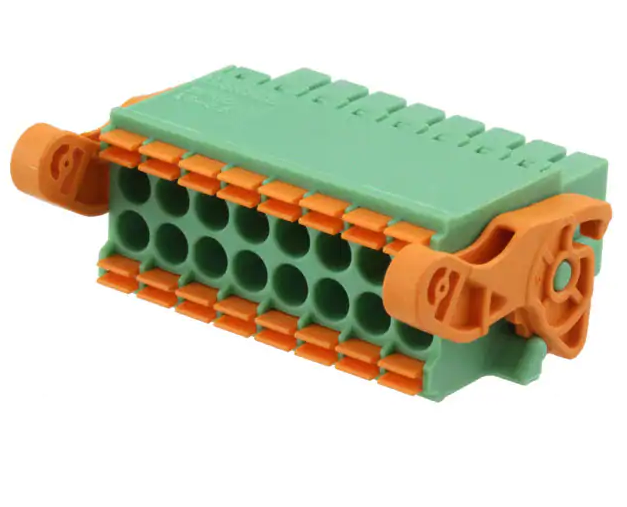

.. _usage_s:

OpenIndus System Generic Usage
==============================

Description
-----------

OpenIndus system is modular and allow you great flexibility. 
This section guide you to build your own system safely and efficiently with OpenIndus modules.

System usage
------------

1. How to wire your system ?
****************************

In all OpenIndus kits we provide you terminal blocks to wire your system easily.

It is a 16 contacts board connector with a pitch of 3.5mm. 
It support wire cross section from 0.2mm² up to 1.5mm².

.. warning:: 
    Do not use wire ferrules with these terminal blocks. 
    Ferrules with insulating collar do not fit properly in the connector, and ferrules without insulating collar get stuck inside the terminal mechanism. 
    The terminal blocks are designed for bare wire connections only.

Wiring steps:

1. Strip the wire insulation over a length of 7 to 8 mm.
2. Press the spring of the terminal block using a flat-head screwdriver, then insert the stripped wire until it is securely held.

Make sure no copper strands are exposed outside the terminal block and that the wire is firmly held.

2. How to put modules on rails
******************************

OpenIndus system use rails for communications between modules. You may wonder how to connect modules and rails together.

.. image:: ../_static/systeme_rail.png
    :width: 500
    :alt: Terminal block
    :align: center

| There are four type of rails depending on your needs and the OpenIndus kit you have:

Rails designed to be chained : 

- Head rail with only one USB-C connector at its tail. 
- Middle rail with two USB-C connectors
- End rail with one USB-C at its head.

.. warning:: 
    USB-C wires are provided with our products to connect your rails. 
    Please use only those wires because they are specific for this usage.

.. DANGER:: 
    Please do not connect OpenIndus rails to a computer or any other devices that do not belong to OpenIndus products. 
    We deny any responsabilities in case of damages.

Single rail :

- Rail with no USB-C connector.

